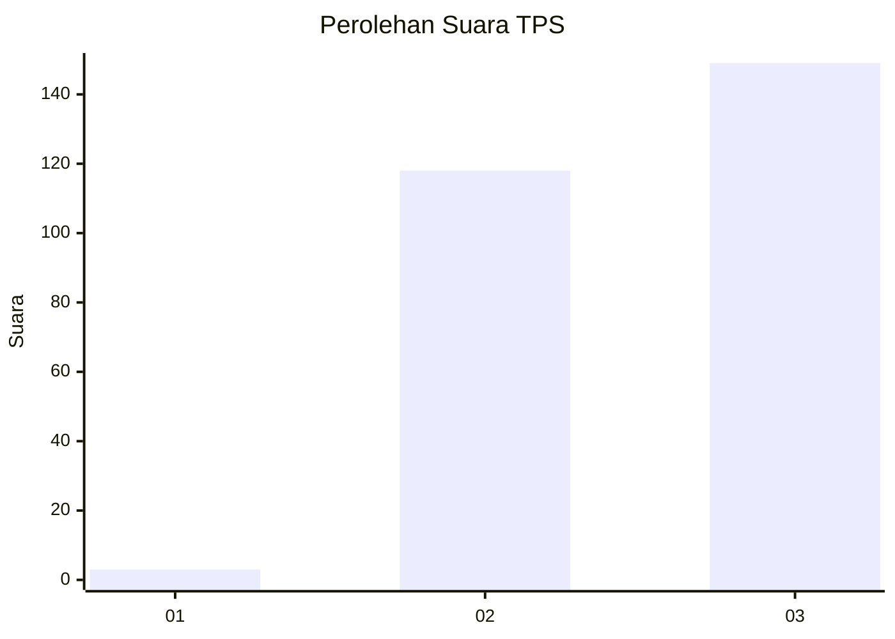
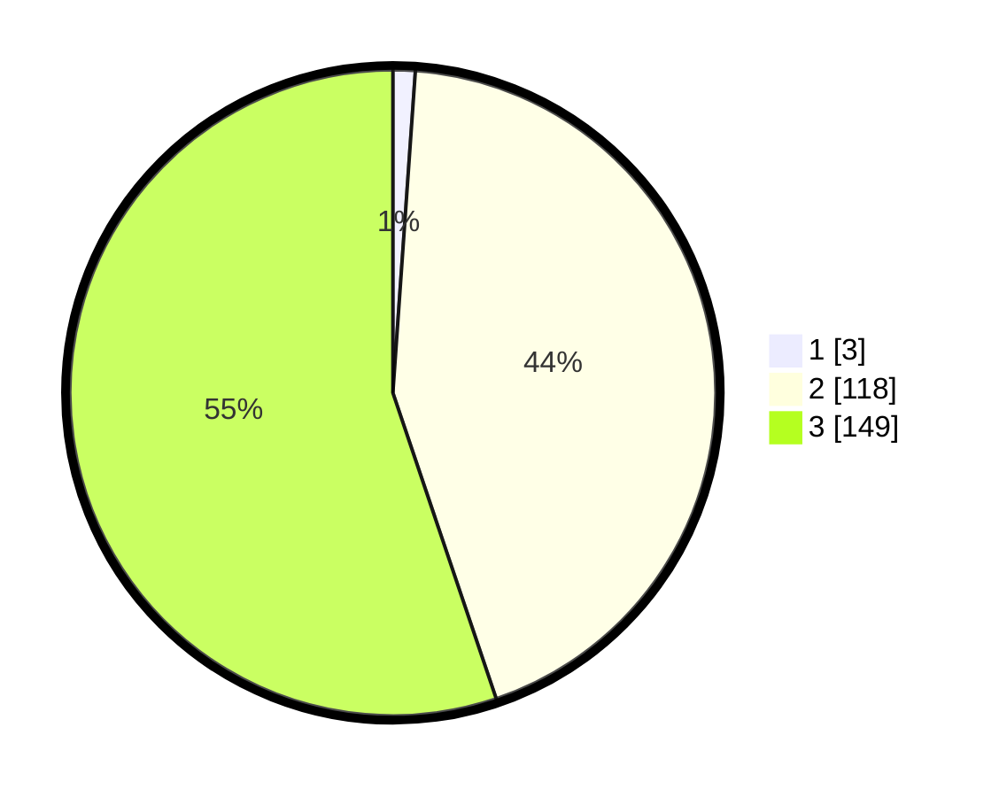

# Hasil

## Grafik

## Tabel

| No. | Nama Paslon    | Suara | Suara (raw) | Persentase |
|:--- |:-------------- | -----:| -----------:| ----------:|
| 1   | ANIES MUHAIMIN | 3     | [3][p-1]    | 1,11       |
| 2   | PRABOWO GIBRAN | 118   | [118][p-2]  | 43,70      |
| 3   | GANJAR MAHFUD  | 149   | [149][p-3]  | 55,19      |

[p-1]: https://github.com/gigit-pemilu/pemilu-2024-51-bali/blob/main/pilpres/hitung-suara/sub/51-bali/sub/03-badung/sub/02-mengwi/sub/1004-kapal/sub/024-tps/sub/paslon-1.txt
[p-2]: https://github.com/gigit-pemilu/pemilu-2024-51-bali/blob/main/pilpres/hitung-suara/sub/51-bali/sub/03-badung/sub/02-mengwi/sub/1004-kapal/sub/024-tps/sub/paslon-2.txt
[p-3]: https://github.com/gigit-pemilu/pemilu-2024-51-bali/blob/main/pilpres/hitung-suara/sub/51-bali/sub/03-badung/sub/02-mengwi/sub/1004-kapal/sub/024-tps/sub/paslon-3.txt

## Foto C Plano

https://sirekap-obj-formc.kpu.go.id/bfdf/pemilu/ppwp/51/03/02/10/04/5103021004024-20240214-213220--8a2ed270-f62b-4bfb-8a7a-d24f38543b36.jpg

https://sirekap-obj-formc.kpu.go.id/bfdf/pemilu/ppwp/51/03/02/10/04/5103021004024-20240214-213408--3a72d741-85e9-45c2-9ebc-07cd7d4aeb69.jpg

https://sirekap-obj-formc.kpu.go.id/bfdf/pemilu/ppwp/51/03/02/10/04/5103021004024-20240214-213547--ef738965-4fe2-4738-a027-f19c5babf448.jpg

## Metadata

| Key        | Value               |
| ---------- | ------------------- |
| Time Stamp | 2024-02-15 12:00:28 |

## DATA PEMILIH TETAP

Jumlah pemilih dalam DPT: **273**.
 * L: **136**.
 * P: **137**.

## DATA PENGGUNA HAK PILIH

Jumlah pengguna hak pilih dalam DPT: **273**.
 * L: **136**.
 * P: **137**.

Jumlah pengguna hak pilih dalam DPTb: **0**.
 * L: **0**.
 * P: **0**.

Jumlah pengguna hak pilih dalam DPK: **0**.
 * L: **0**.
 * P: **0**.

Jumlah pengguna hak pilih: **273**.
 * L: **136**.
 * P: **137**.

## JUMLAH SUARA SAH DAN TIDAK SAH

JUMLAH SELURUH SUARA SAH: **270**.

JUMLAH SUARA TIDAK SAH: **3**.

JUMLAH SELURUH SUARA SAH DAN SUARA TIDAK SAH: **273**.

