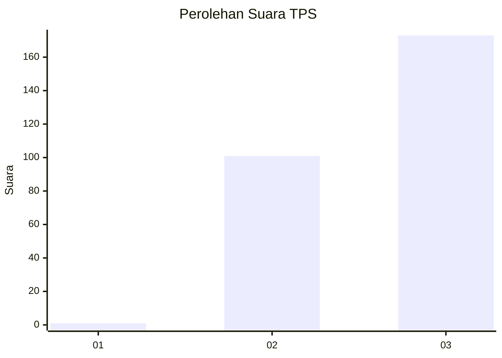
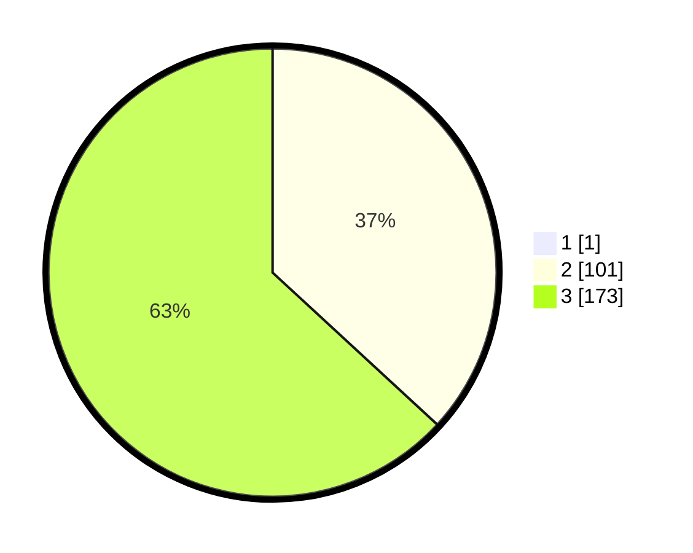

# Hasil

## Grafik

## Tabel

| No. | Nama Paslon    | Suara | Suara (raw) | Persentase |
|:--- |:-------------- | -----:| -----------:| ----------:|
| 1   | ANIES MUHAIMIN | 1     | [1][p-1]    | 0,36       |
| 2   | PRABOWO GIBRAN | 101   | [101][p-2]  | 36,73      |
| 3   | GANJAR MAHFUD  | 173   | [173][p-3]  | 62,91      |

[p-1]: https://github.com/gigit-pemilu/pemilu-2024-51-bali/blob/main/pilpres/hitung-suara/sub/51-bali/sub/03-badung/sub/02-mengwi/sub/1004-kapal/sub/025-tps/sub/paslon-1.txt
[p-2]: https://github.com/gigit-pemilu/pemilu-2024-51-bali/blob/main/pilpres/hitung-suara/sub/51-bali/sub/03-badung/sub/02-mengwi/sub/1004-kapal/sub/025-tps/sub/paslon-2.txt
[p-3]: https://github.com/gigit-pemilu/pemilu-2024-51-bali/blob/main/pilpres/hitung-suara/sub/51-bali/sub/03-badung/sub/02-mengwi/sub/1004-kapal/sub/025-tps/sub/paslon-3.txt

## Foto C Plano

https://sirekap-obj-formc.kpu.go.id/2253/pemilu/ppwp/51/03/02/10/04/5103021004025-20240214-192723--cf04ab8a-a29b-4f9f-b8e9-ab561ad72883.jpg

https://sirekap-obj-formc.kpu.go.id/2253/pemilu/ppwp/51/03/02/10/04/5103021004025-20240214-210817--b81dc9f2-c7f1-4e43-9225-de0e6837dde5.jpg

https://sirekap-obj-formc.kpu.go.id/2253/pemilu/ppwp/51/03/02/10/04/5103021004025-20240214-210908--04f6bebb-d5f5-43e7-b635-7bbb929a9e0b.jpg

## Metadata

| Key        | Value               |
| ---------- | ------------------- |
| Time Stamp | 2024-02-15 00:41:44 |

## DATA PEMILIH TETAP

Jumlah pemilih dalam DPT: **296**.
 * L: **152**.
 * P: **144**.

## DATA PENGGUNA HAK PILIH

Jumlah pengguna hak pilih dalam DPT: **278**.
 * L: **142**.
 * P: **136**.

Jumlah pengguna hak pilih dalam DPTb: **0**.
 * L: **0**.
 * P: **0**.

Jumlah pengguna hak pilih dalam DPK: **2**.
 * L: **1**.
 * P: **1**.

Jumlah pengguna hak pilih: **280**.
 * L: **143**.
 * P: **137**.

## JUMLAH SUARA SAH DAN TIDAK SAH

JUMLAH SELURUH SUARA SAH: **275**.

JUMLAH SUARA TIDAK SAH: **5**.

JUMLAH SELURUH SUARA SAH DAN SUARA TIDAK SAH: **280**.

