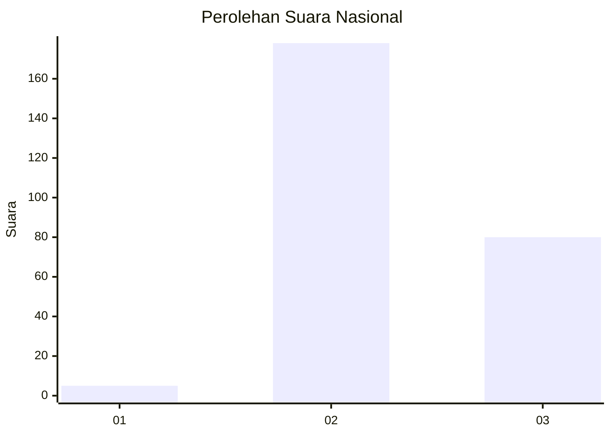

# Hasil

## Grafik

## Tabel

| No. | Nama Paslon    | Suara | Suara (raw) | Persentase |
|:--- |:-------------- | -----:| -----------:| ----------:|
| 1   | ANIES MUHAIMIN | 5     | [5][p-1]    | 1,90       |
| 2   | PRABOWO GIBRAN | 178   | [178][p-2]  | 67,68      |
| 3   | GANJAR MAHFUD  | 80    | [80][p-3]   | 30,42      |

[p-1]: https://github.com/gigit-pemilu/pemilu-2024/blob/main/pilpres/hitung-suara/sub/51-bali/sub/03-badung/sub/02-mengwi/sub/1004-kapal/sub/027-tps/sub/paslon-1.txt
[p-2]: https://github.com/gigit-pemilu/pemilu-2024/blob/main/pilpres/hitung-suara/sub/51-bali/sub/03-badung/sub/02-mengwi/sub/1004-kapal/sub/027-tps/sub/paslon-2.txt
[p-3]: https://github.com/gigit-pemilu/pemilu-2024/blob/main/pilpres/hitung-suara/sub/51-bali/sub/03-badung/sub/02-mengwi/sub/1004-kapal/sub/027-tps/sub/paslon-3.txt

## Foto C Plano

https://sirekap-obj-formc.kpu.go.id/ed93/pemilu/ppwp/51/03/02/10/04/5103021004027-20240220-064232--c0972b38-5140-464f-9e25-01b0cfd0a8ba.jpg

https://sirekap-obj-formc.kpu.go.id/ed93/pemilu/ppwp/51/03/02/10/04/5103021004027-20240219-171237--2f8577b5-edbc-4840-a86b-65eacddf7c3d.jpg

https://sirekap-obj-formc.kpu.go.id/ed93/pemilu/ppwp/51/03/02/10/04/5103021004027-20240219-171423--56c6fe35-8fd1-49fa-a57f-67c560de1bd6.jpg

## Metadata

| Key        | Value               |
| ---------- | ------------------- |
| Time Stamp | 2024-02-24 22:31:28 |

