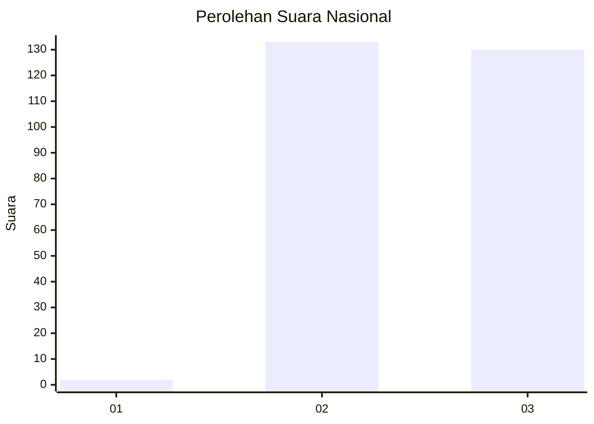
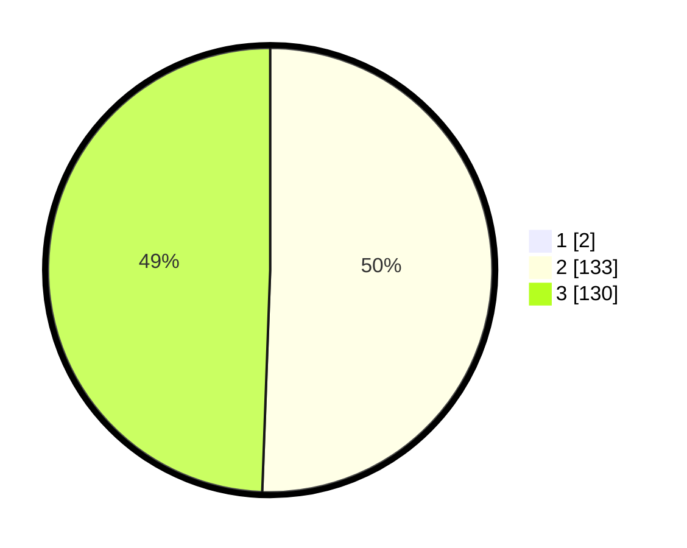

# Hasil

## Grafik

## Tabel

| No. | Nama Paslon    | Suara | Suara (raw) | Persentase |
|:--- |:-------------- | -----:| -----------:| ----------:|
| 1   | ANIES MUHAIMIN | 2     | [2][p-1]    | 0,75       |
| 2   | PRABOWO GIBRAN | 133   | [133][p-2]  | 50,19      |
| 3   | GANJAR MAHFUD  | 130   | [130][p-3]  | 49,06      |

[p-1]: https://github.com/gigit-pemilu/pemilu-2024/blob/main/pilpres/hitung-suara/sub/51-bali/sub/03-badung/sub/02-mengwi/sub/1004-kapal/sub/030-tps/sub/paslon-1.txt
[p-2]: https://github.com/gigit-pemilu/pemilu-2024/blob/main/pilpres/hitung-suara/sub/51-bali/sub/03-badung/sub/02-mengwi/sub/1004-kapal/sub/030-tps/sub/paslon-2.txt
[p-3]: https://github.com/gigit-pemilu/pemilu-2024/blob/main/pilpres/hitung-suara/sub/51-bali/sub/03-badung/sub/02-mengwi/sub/1004-kapal/sub/030-tps/sub/paslon-3.txt

## Foto C Plano

https://sirekap-obj-formc.kpu.go.id/5c06/pemilu/ppwp/51/03/02/10/04/5103021004030-20240218-071322--3756b641-a51f-4fc7-b7db-62b36870dee4.jpg

https://sirekap-obj-formc.kpu.go.id/5c06/pemilu/ppwp/51/03/02/10/04/5103021004030-20240215-020950--ef8574a3-5178-4dc7-b014-bdf1c8805970.jpg

https://sirekap-obj-formc.kpu.go.id/5c06/pemilu/ppwp/51/03/02/10/04/5103021004030-20240216-070037--1a94c5e6-b4b4-47bd-b631-3fd6dfdf7893.jpg

## Metadata

| Key        | Value               |
| ---------- | ------------------- |
| Time Stamp | 2024-02-19 06:16:00 |

