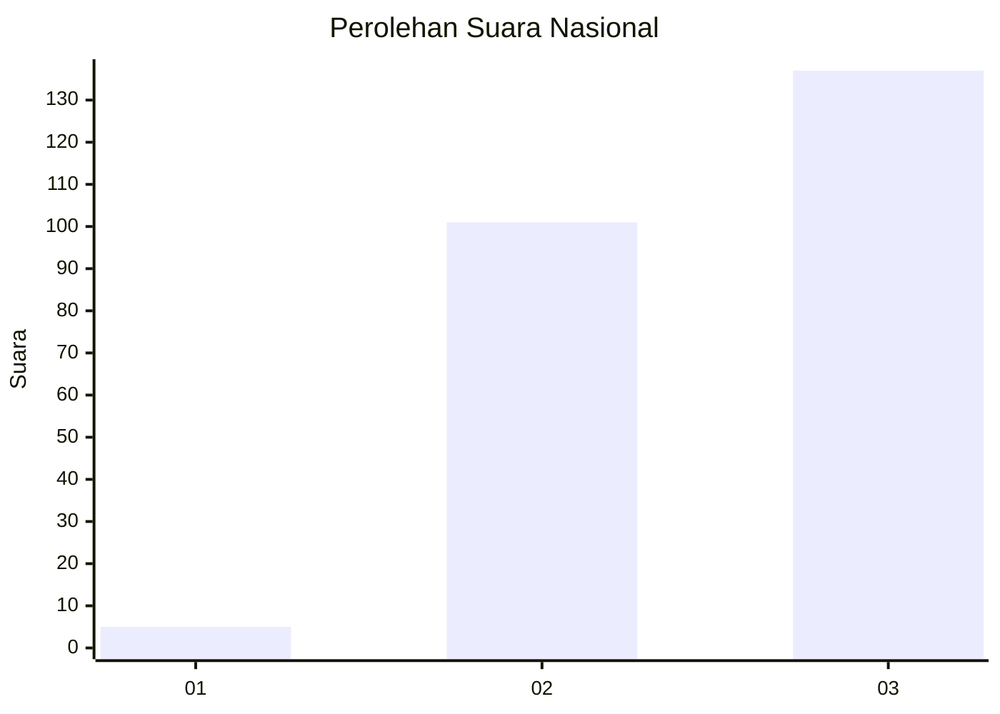
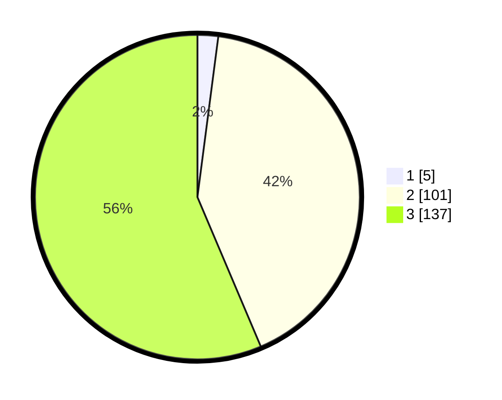

# Hasil

## Grafik

## Tabel

| No. | Nama Paslon    | Suara | Suara (raw) | Persentase |
|:--- |:-------------- | -----:| -----------:| ----------:|
| 1   | ANIES MUHAIMIN | 5     | [5][p-1]    | 2,06       |
| 2   | PRABOWO GIBRAN | 101   | [101][p-2]  | 41,56      |
| 3   | GANJAR MAHFUD  | 137   | [137][p-3]  | 56,38      |

[p-1]: https://github.com/gigit-pemilu/pemilu-2024/blob/main/pilpres/hitung-suara/sub/51-bali/sub/03-badung/sub/02-mengwi/sub/1004-kapal/sub/031-tps/sub/paslon-1.txt
[p-2]: https://github.com/gigit-pemilu/pemilu-2024/blob/main/pilpres/hitung-suara/sub/51-bali/sub/03-badung/sub/02-mengwi/sub/1004-kapal/sub/031-tps/sub/paslon-2.txt
[p-3]: https://github.com/gigit-pemilu/pemilu-2024/blob/main/pilpres/hitung-suara/sub/51-bali/sub/03-badung/sub/02-mengwi/sub/1004-kapal/sub/031-tps/sub/paslon-3.txt

## Foto C Plano

https://sirekap-obj-formc.kpu.go.id/b1e0/pemilu/ppwp/51/03/02/10/04/5103021004031-20240217-211644--40f7315f-884e-4085-acdb-145d40965cb7.jpg

https://sirekap-obj-formc.kpu.go.id/b1e0/pemilu/ppwp/51/03/02/10/04/5103021004031-20240217-212456--779da677-8103-4620-8f2d-fc08937616c1.jpg

https://sirekap-obj-formc.kpu.go.id/b1e0/pemilu/ppwp/51/03/02/10/04/5103021004031-20240217-212011--cb5d68f7-2c39-4a25-b894-7c83f7bccd06.jpg

## Metadata

| Key        | Value               |
| ---------- | ------------------- |
| Time Stamp | 2024-02-24 22:31:28 |

