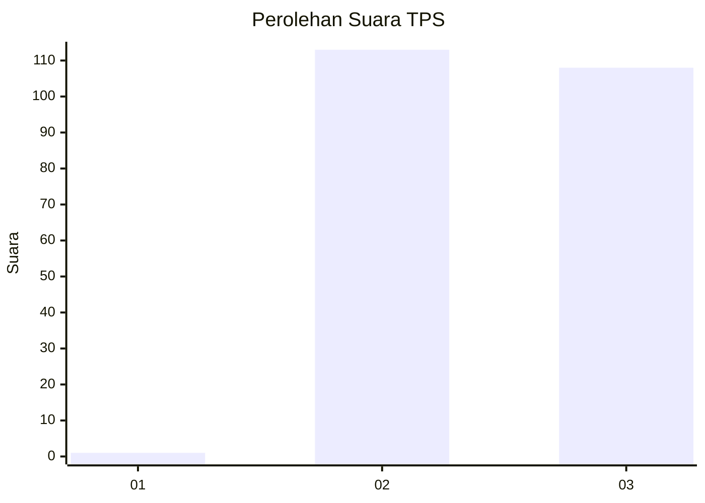
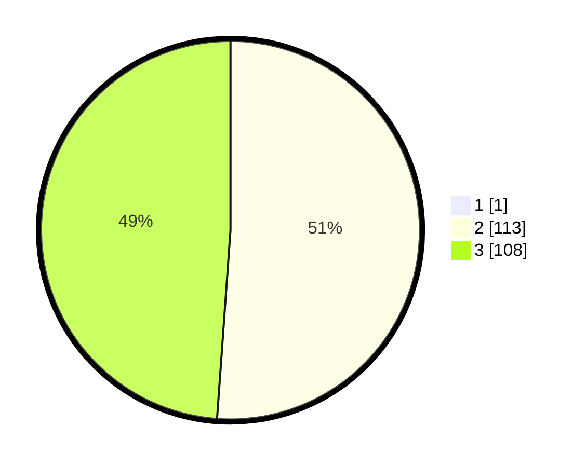

# Hasil

## Grafik

## Tabel

| No. | Nama Paslon    | Suara | Suara (raw) | Persentase |
|:--- |:-------------- | -----:| -----------:| ----------:|
| 1   | ANIES MUHAIMIN | 1     | [1][p-1]    | 0,45       |
| 2   | PRABOWO GIBRAN | 113   | [113][p-2]  | 50,90      |
| 3   | GANJAR MAHFUD  | 108   | [108][p-3]  | 48,65      |

[p-1]: https://github.com/gigit-pemilu/pemilu-2024-51-bali/blob/main/pilpres/hitung-suara/sub/51-bali/sub/03-badung/sub/02-mengwi/sub/1004-kapal/sub/034-tps/sub/paslon-1.txt
[p-2]: https://github.com/gigit-pemilu/pemilu-2024-51-bali/blob/main/pilpres/hitung-suara/sub/51-bali/sub/03-badung/sub/02-mengwi/sub/1004-kapal/sub/034-tps/sub/paslon-2.txt
[p-3]: https://github.com/gigit-pemilu/pemilu-2024-51-bali/blob/main/pilpres/hitung-suara/sub/51-bali/sub/03-badung/sub/02-mengwi/sub/1004-kapal/sub/034-tps/sub/paslon-3.txt

## Foto C Plano

https://sirekap-obj-formc.kpu.go.id/26c6/pemilu/ppwp/51/03/02/10/04/5103021004034-20240214-224139--07a079ab-7f51-467a-a3df-2b50e724931a.jpg

https://sirekap-obj-formc.kpu.go.id/26c6/pemilu/ppwp/51/03/02/10/04/5103021004034-20240214-224340--4d531ab0-f8a2-4d19-96de-ff6240ea782b.jpg

https://sirekap-obj-formc.kpu.go.id/26c6/pemilu/ppwp/51/03/02/10/04/5103021004034-20240214-224456--7863bceb-c098-46e0-81e9-c70c2ca7e331.jpg

## Metadata

| Key        | Value               |
| ---------- | ------------------- |
| Time Stamp | 2024-02-24 22:31:28 |

