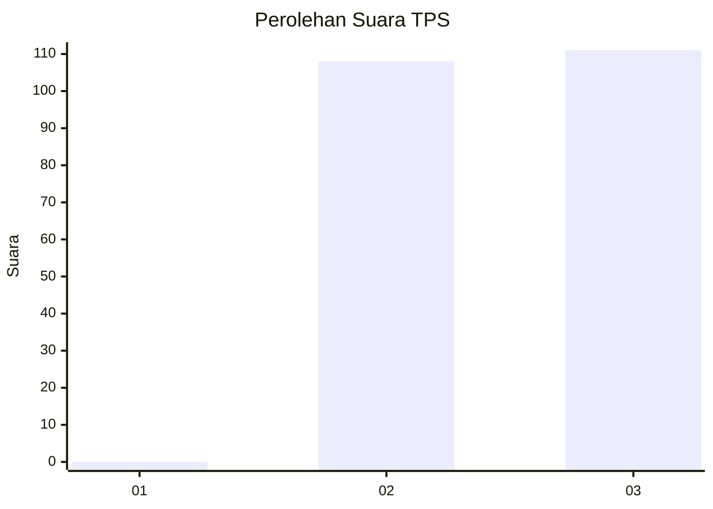
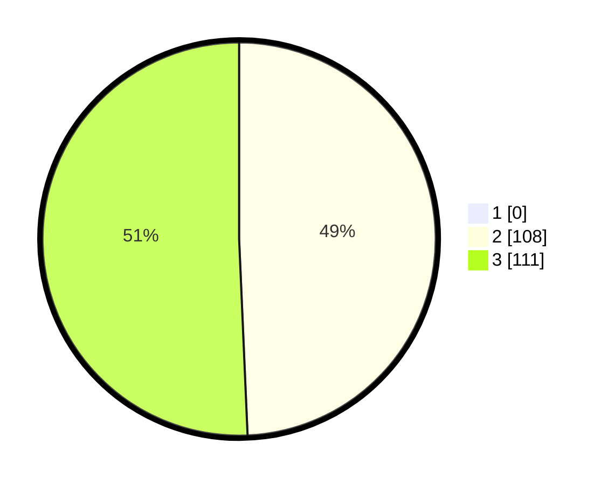

# Hasil

## Grafik

## Tabel

| No. | Nama Paslon    | Suara | Suara (raw) | Persentase |
|:--- |:-------------- | -----:| -----------:| ----------:|
| 1   | ANIES MUHAIMIN | 0     | [0][p-1]    | 0,00       |
| 2   | PRABOWO GIBRAN | 108   | [108][p-2]  | 49,32      |
| 3   | GANJAR MAHFUD  | 111   | [111][p-3]  | 50,68      |

[p-1]: https://github.com/gigit-pemilu/pemilu-2024-51-bali/blob/main/pilpres/hitung-suara/sub/51-bali/sub/03-badung/sub/02-mengwi/sub/1004-kapal/sub/035-tps/sub/paslon-1.txt
[p-2]: https://github.com/gigit-pemilu/pemilu-2024-51-bali/blob/main/pilpres/hitung-suara/sub/51-bali/sub/03-badung/sub/02-mengwi/sub/1004-kapal/sub/035-tps/sub/paslon-2.txt
[p-3]: https://github.com/gigit-pemilu/pemilu-2024-51-bali/blob/main/pilpres/hitung-suara/sub/51-bali/sub/03-badung/sub/02-mengwi/sub/1004-kapal/sub/035-tps/sub/paslon-3.txt

## Foto C Plano

https://sirekap-obj-formc.kpu.go.id/ec7f/pemilu/ppwp/51/03/02/10/04/5103021004035-20240214-211720--7e9de317-eaec-47ec-9302-f7d1f5cb3b2a.jpg

https://sirekap-obj-formc.kpu.go.id/ec7f/pemilu/ppwp/51/03/02/10/04/5103021004035-20240214-211731--91850bb6-6e0c-4ee5-a9a0-34db15e249cc.jpg

https://sirekap-obj-formc.kpu.go.id/ec7f/pemilu/ppwp/51/03/02/10/04/5103021004035-20240214-211738--3a6a0558-bb9a-42fd-b0e1-ab84f8f4fc7a.jpg

## Metadata

| Key        | Value               |
| ---------- | ------------------- |
| Time Stamp | 2024-02-24 22:31:28 |

