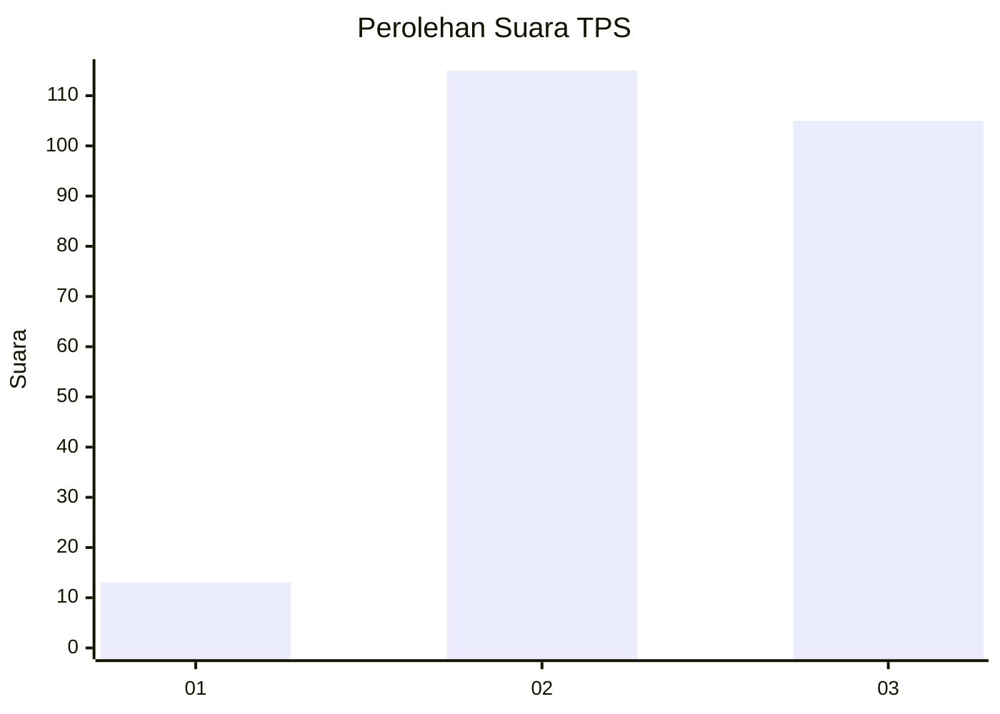
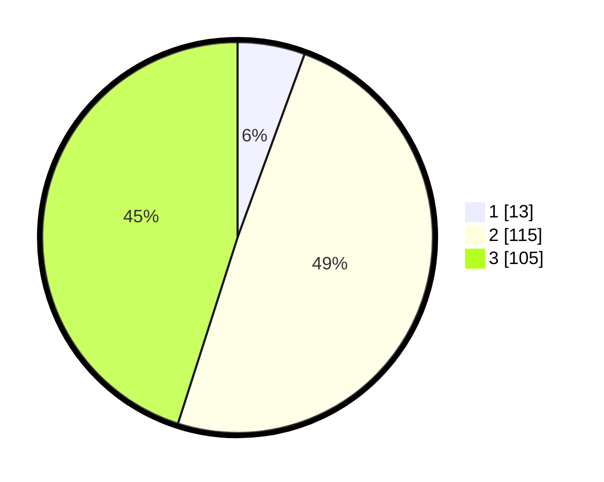

# Hasil

## Grafik

## Tabel

| No. | Nama Paslon    | Suara | Suara (raw) | Persentase |
|:--- |:-------------- | -----:| -----------:| ----------:|
| 1   | ANIES MUHAIMIN | 13    | [13][p-1]   | 5,58       |
| 2   | PRABOWO GIBRAN | 115   | [115][p-2]  | 49,36      |
| 3   | GANJAR MAHFUD  | 105   | [105][p-3]  | 45,06      |

[p-1]: https://github.com/gigit-pemilu/pemilu-2024-51-bali/blob/main/pilpres/hitung-suara/sub/51-bali/sub/03-badung/sub/02-mengwi/sub/1005-sempidi/sub/001-tps/sub/paslon-1.txt
[p-2]: https://github.com/gigit-pemilu/pemilu-2024-51-bali/blob/main/pilpres/hitung-suara/sub/51-bali/sub/03-badung/sub/02-mengwi/sub/1005-sempidi/sub/001-tps/sub/paslon-2.txt
[p-3]: https://github.com/gigit-pemilu/pemilu-2024-51-bali/blob/main/pilpres/hitung-suara/sub/51-bali/sub/03-badung/sub/02-mengwi/sub/1005-sempidi/sub/001-tps/sub/paslon-3.txt

## Foto C Plano

https://sirekap-obj-formc.kpu.go.id/e388/pemilu/ppwp/51/03/02/10/05/5103021005001-20240215-001349--d89c9568-6509-4bcc-bdcb-a15e311e76d9.jpg

https://sirekap-obj-formc.kpu.go.id/e388/pemilu/ppwp/51/03/02/10/05/5103021005001-20240215-001540--73b675f8-6df3-4c78-a3b7-3f0aa9911d4b.jpg

https://sirekap-obj-formc.kpu.go.id/e388/pemilu/ppwp/51/03/02/10/05/5103021005001-20240215-001646--8f138eb1-fc9b-4d8d-9c28-97c8277d151f.jpg

## Metadata

| Key        | Value               |
| ---------- | ------------------- |
| Time Stamp | 2024-02-21 13:00:00 |

## DATA PEMILIH TETAP

Jumlah pemilih dalam DPT: **293**.
 * L: **145**.
 * P: **148**.

## DATA PENGGUNA HAK PILIH

Jumlah pengguna hak pilih dalam DPT: **233**.
 * L: **115**.
 * P: **118**.

Jumlah pengguna hak pilih dalam DPTb: **4**.
 * L: **0**.
 * P: **4**.

Jumlah pengguna hak pilih dalam DPK: **5**.
 * L: **4**.
 * P: **1**.

Jumlah pengguna hak pilih: **242**.
 * L: **119**.
 * P: **123**.

## JUMLAH SUARA SAH DAN TIDAK SAH

JUMLAH SELURUH SUARA SAH: **233**.

JUMLAH SUARA TIDAK SAH: **9**.

JUMLAH SELURUH SUARA SAH DAN SUARA TIDAK SAH: **242**.

