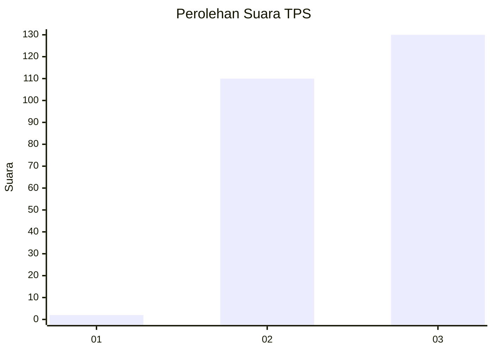
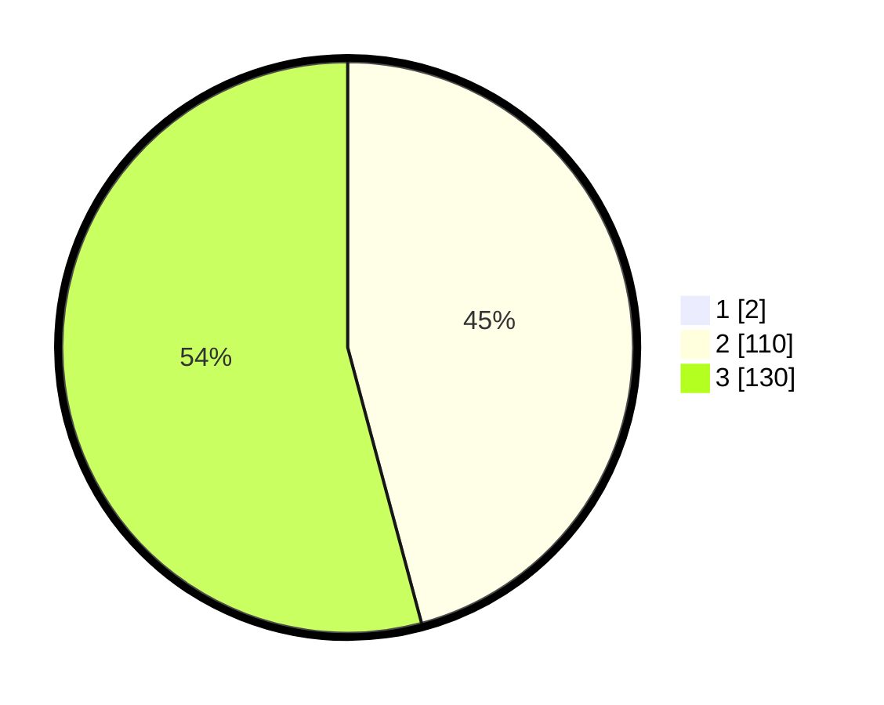

# Hasil

## Grafik

## Tabel

| No. | Nama Paslon    | Suara | Suara (raw) | Persentase |
|:--- |:-------------- | -----:| -----------:| ----------:|
| 1   | ANIES MUHAIMIN | 2     | [2][p-1]    | 0,83       |
| 2   | PRABOWO GIBRAN | 110   | [110][p-2]  | 45,45      |
| 3   | GANJAR MAHFUD  | 130   | [130][p-3]  | 53,72      |

[p-1]: https://github.com/gigit-pemilu/pemilu-2024-51-bali/blob/main/pilpres/hitung-suara/sub/51-bali/sub/03-badung/sub/02-mengwi/sub/1005-sempidi/sub/003-tps/sub/paslon-1.txt
[p-2]: https://github.com/gigit-pemilu/pemilu-2024-51-bali/blob/main/pilpres/hitung-suara/sub/51-bali/sub/03-badung/sub/02-mengwi/sub/1005-sempidi/sub/003-tps/sub/paslon-2.txt
[p-3]: https://github.com/gigit-pemilu/pemilu-2024-51-bali/blob/main/pilpres/hitung-suara/sub/51-bali/sub/03-badung/sub/02-mengwi/sub/1005-sempidi/sub/003-tps/sub/paslon-3.txt

## Foto C Plano

https://sirekap-obj-formc.kpu.go.id/6837/pemilu/ppwp/51/03/02/10/05/5103021005003-20240215-004740--7c17dda0-cf53-402e-875b-8cb6445df4e7.jpg

https://sirekap-obj-formc.kpu.go.id/6837/pemilu/ppwp/51/03/02/10/05/5103021005003-20240215-004933--81abf7f1-0bec-4948-a75e-c1c23ce78933.jpg

https://sirekap-obj-formc.kpu.go.id/6837/pemilu/ppwp/51/03/02/10/05/5103021005003-20240215-005138--444e0463-1280-4c17-b23d-7f9fcdefa430.jpg

## Metadata

| Key        | Value               |
| ---------- | ------------------- |
| Time Stamp | 2024-02-24 22:31:28 |

