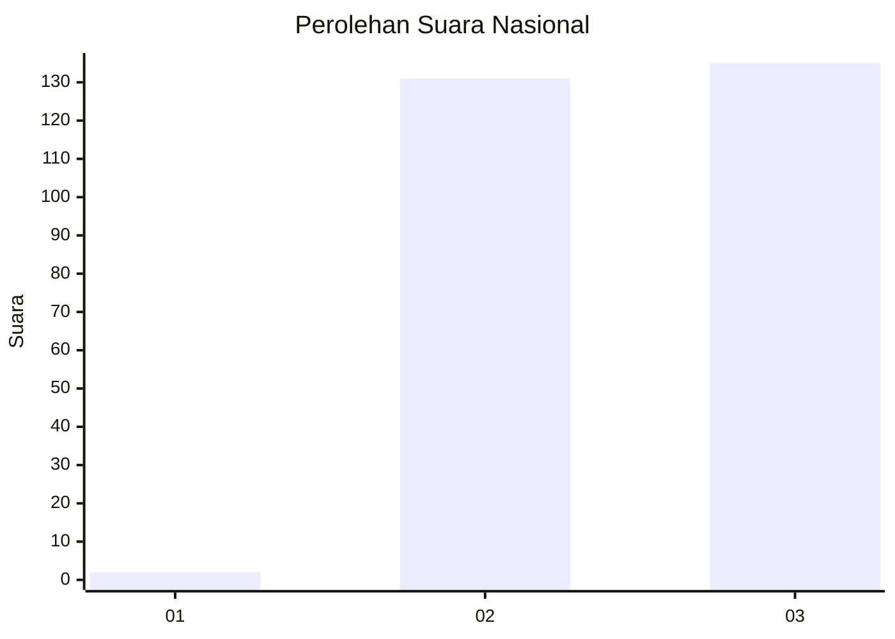
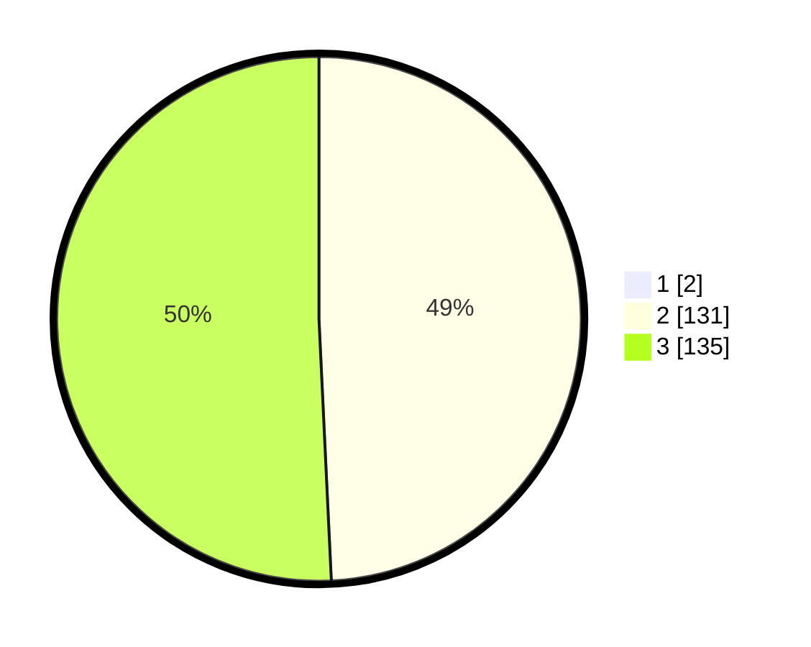

# Hasil

## Grafik

## Tabel

| No. | Nama Paslon    | Suara | Suara (raw) | Persentase |
|:--- |:-------------- | -----:| -----------:| ----------:|
| 1   | ANIES MUHAIMIN | 2     | [2][p-1]    | 0,75       |
| 2   | PRABOWO GIBRAN | 131   | [131][p-2]  | 48,88      |
| 3   | GANJAR MAHFUD  | 135   | [135][p-3]  | 50,37      |

[p-1]: https://github.com/gigit-pemilu/pemilu-2024/blob/main/pilpres/hitung-suara/sub/51-bali/sub/03-badung/sub/02-mengwi/sub/1005-sempidi/sub/004-tps/sub/paslon-1.txt
[p-2]: https://github.com/gigit-pemilu/pemilu-2024/blob/main/pilpres/hitung-suara/sub/51-bali/sub/03-badung/sub/02-mengwi/sub/1005-sempidi/sub/004-tps/sub/paslon-2.txt
[p-3]: https://github.com/gigit-pemilu/pemilu-2024/blob/main/pilpres/hitung-suara/sub/51-bali/sub/03-badung/sub/02-mengwi/sub/1005-sempidi/sub/004-tps/sub/paslon-3.txt

## Foto C Plano

https://sirekap-obj-formc.kpu.go.id/00a6/pemilu/ppwp/51/03/02/10/05/5103021005004-20240215-001457--c261e866-fb94-457d-bd36-fc3536c92eb7.jpg

https://sirekap-obj-formc.kpu.go.id/00a6/pemilu/ppwp/51/03/02/10/05/5103021005004-20240215-001611--ba88f553-eb4c-495a-9fc3-9152d664ec35.jpg

https://sirekap-obj-formc.kpu.go.id/00a6/pemilu/ppwp/51/03/02/10/05/5103021005004-20240215-001722--eff01c85-7cc4-4f49-a3db-bb84762bbc9a.jpg

## Metadata

| Key        | Value               |
| ---------- | ------------------- |
| Time Stamp | 2024-02-24 22:31:28 |

