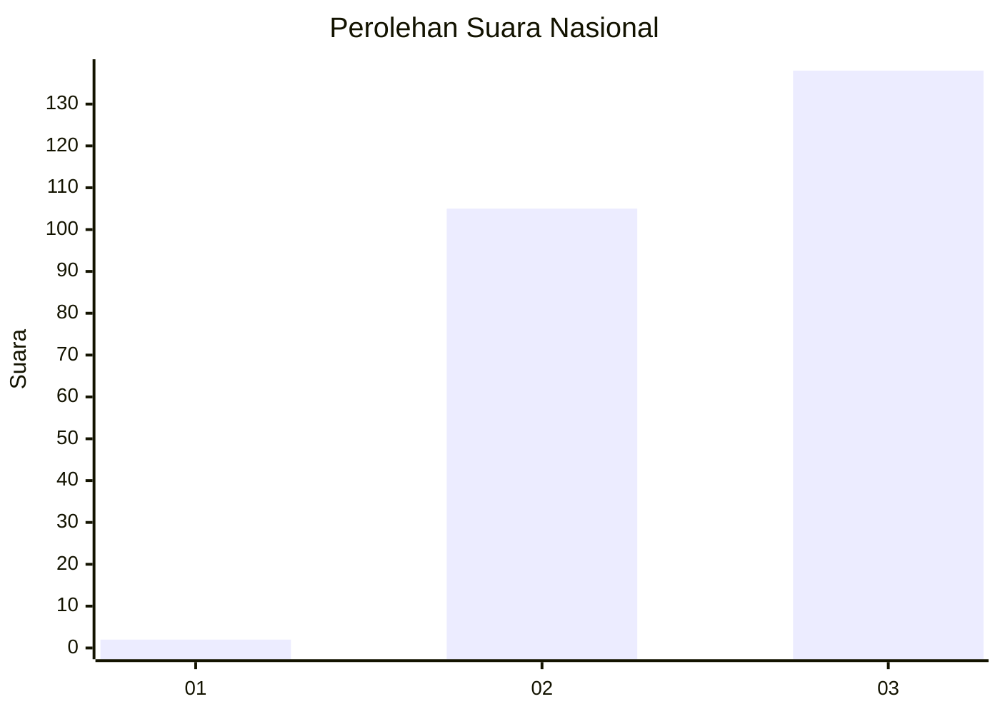
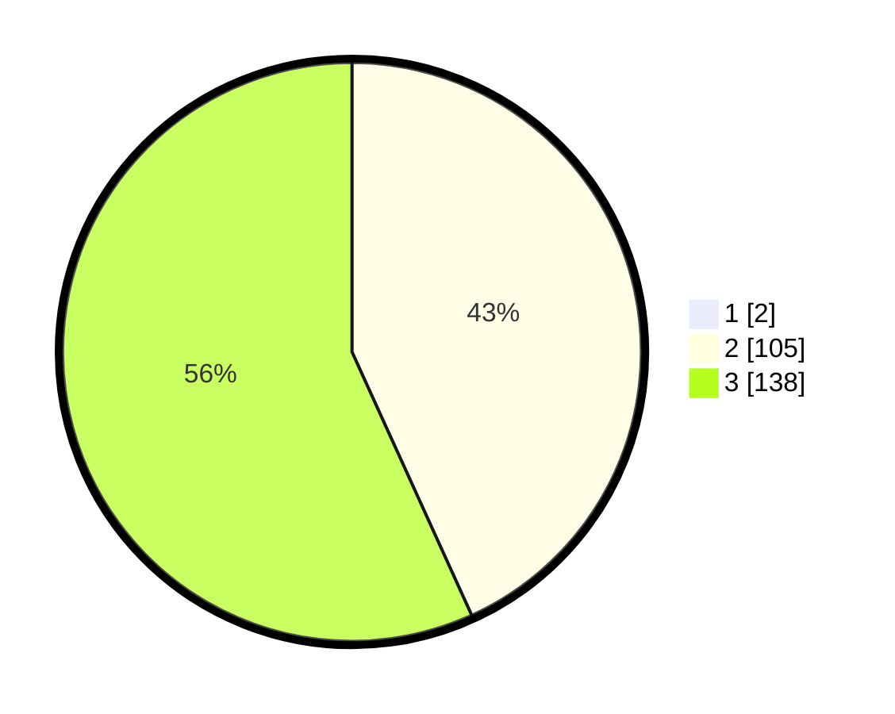

# Hasil

## Grafik

## Tabel

| No. | Nama Paslon    | Suara | Suara (raw) | Persentase |
|:--- |:-------------- | -----:| -----------:| ----------:|
| 1   | ANIES MUHAIMIN | 2     | [2][p-1]    | 0,82       |
| 2   | PRABOWO GIBRAN | 105   | [105][p-2]  | 42,86      |
| 3   | GANJAR MAHFUD  | 138   | [138][p-3]  | 56,33      |

[p-1]: https://github.com/gigit-pemilu/pemilu-2024/blob/main/pilpres/hitung-suara/sub/51-bali/sub/03-badung/sub/02-mengwi/sub/1005-sempidi/sub/005-tps/sub/paslon-1.txt
[p-2]: https://github.com/gigit-pemilu/pemilu-2024/blob/main/pilpres/hitung-suara/sub/51-bali/sub/03-badung/sub/02-mengwi/sub/1005-sempidi/sub/005-tps/sub/paslon-2.txt
[p-3]: https://github.com/gigit-pemilu/pemilu-2024/blob/main/pilpres/hitung-suara/sub/51-bali/sub/03-badung/sub/02-mengwi/sub/1005-sempidi/sub/005-tps/sub/paslon-3.txt

## Foto C Plano

https://sirekap-obj-formc.kpu.go.id/31f2/pemilu/ppwp/51/03/02/10/05/5103021005005-20240214-211955--e8bc9803-58a4-415b-9723-abd13b0dd49f.jpg

https://sirekap-obj-formc.kpu.go.id/31f2/pemilu/ppwp/51/03/02/10/05/5103021005005-20240214-212102--ea099085-e2d2-4e1c-8012-047e66a7128b.jpg

https://sirekap-obj-formc.kpu.go.id/31f2/pemilu/ppwp/51/03/02/10/05/5103021005005-20240214-202521--5256d7d6-ce76-4afb-9046-9414258574f3.jpg

## Metadata

| Key        | Value               |
| ---------- | ------------------- |
| Time Stamp | 2024-02-21 12:00:00 |

## DATA PEMILIH TETAP

Jumlah pemilih dalam DPT: **251**.
 * L: **123**.
 * P: **128**.

## DATA PENGGUNA HAK PILIH

Jumlah pengguna hak pilih dalam DPT: **240**.
 * L: **121**.
 * P: **119**.

Jumlah pengguna hak pilih dalam DPTb: **1**.
 * L: **0**.
 * P: **1**.

Jumlah pengguna hak pilih dalam DPK: **6**.
 * L: **2**.
 * P: **4**.

Jumlah pengguna hak pilih: **247**.
 * L: **123**.
 * P: **124**.

## JUMLAH SUARA SAH DAN TIDAK SAH

JUMLAH SELURUH SUARA SAH: **245**.

JUMLAH SUARA TIDAK SAH: **2**.

JUMLAH SELURUH SUARA SAH DAN SUARA TIDAK SAH: **247**.

