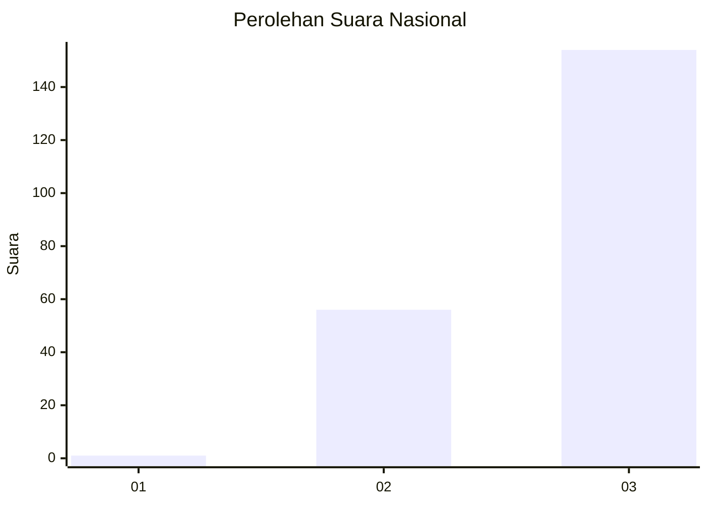
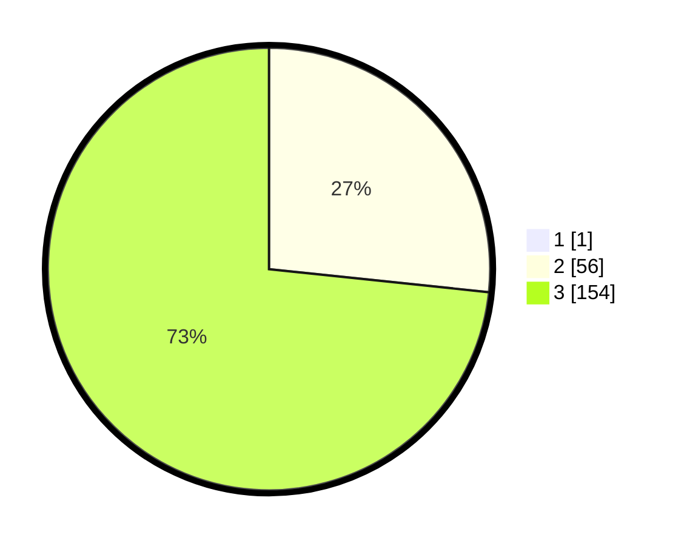

# Hasil

## Grafik

## Tabel

| No. | Nama Paslon    | Suara | Suara (raw) | Persentase |
|:--- |:-------------- | -----:| -----------:| ----------:|
| 1   | ANIES MUHAIMIN | 1     | [1][p-1]    | 0,47       |
| 2   | PRABOWO GIBRAN | 56    | [56][p-2]   | 26,54      |
| 3   | GANJAR MAHFUD  | 154   | [154][p-3]  | 72,99      |

[p-1]: https://github.com/gigit-pemilu/pemilu-2024/blob/main/pilpres/hitung-suara/sub/51-bali/sub/03-badung/sub/02-mengwi/sub/1005-sempidi/sub/011-tps/sub/paslon-1.txt
[p-2]: https://github.com/gigit-pemilu/pemilu-2024/blob/main/pilpres/hitung-suara/sub/51-bali/sub/03-badung/sub/02-mengwi/sub/1005-sempidi/sub/011-tps/sub/paslon-2.txt
[p-3]: https://github.com/gigit-pemilu/pemilu-2024/blob/main/pilpres/hitung-suara/sub/51-bali/sub/03-badung/sub/02-mengwi/sub/1005-sempidi/sub/011-tps/sub/paslon-3.txt

## Foto C Plano

https://sirekap-obj-formc.kpu.go.id/0cdb/pemilu/ppwp/51/03/02/10/05/5103021005011-20240214-232103--dd2a45c7-8187-44d8-bcda-8f4d8b17177e.jpg

https://sirekap-obj-formc.kpu.go.id/0cdb/pemilu/ppwp/51/03/02/10/05/5103021005011-20240214-232732--168f6417-0c96-460b-a2e4-683cefe31b39.jpg

https://sirekap-obj-formc.kpu.go.id/0cdb/pemilu/ppwp/51/03/02/10/05/5103021005011-20240214-233136--942884ea-1422-4ebb-828c-6036e8abde0a.jpg

## Metadata

| Key        | Value               |
| ---------- | ------------------- |
| Time Stamp | 2024-02-19 06:16:00 |

