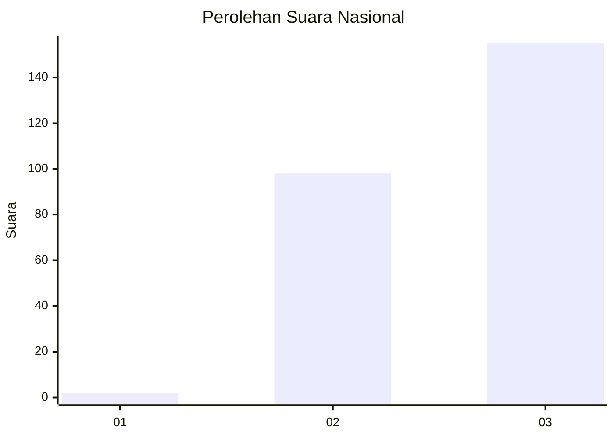
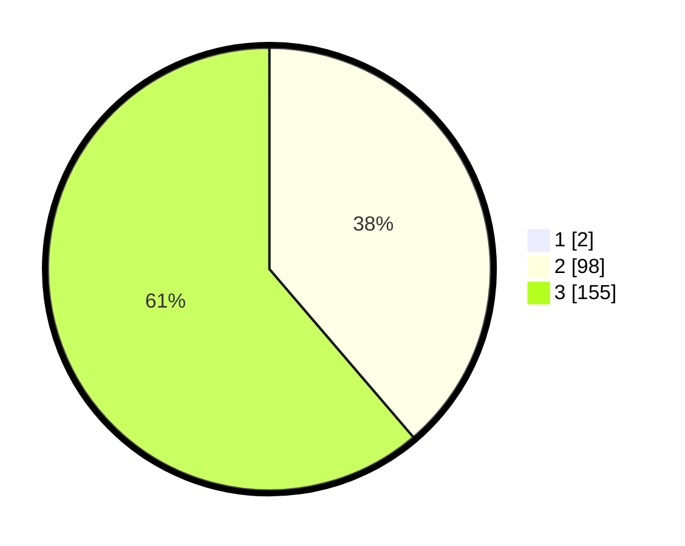

# Hasil

## Grafik

## Tabel

| No. | Nama Paslon    | Suara | Suara (raw) | Persentase |
|:--- |:-------------- | -----:| -----------:| ----------:|
| 1   | ANIES MUHAIMIN | 2     | [2][p-1]    | 0,78       |
| 2   | PRABOWO GIBRAN | 98    | [98][p-2]   | 38,43      |
| 3   | GANJAR MAHFUD  | 155   | [155][p-3]  | 60,78      |

[p-1]: https://github.com/gigit-pemilu/pemilu-2024/blob/main/pilpres/hitung-suara/sub/51-bali/sub/03-badung/sub/02-mengwi/sub/1005-sempidi/sub/016-tps/sub/paslon-1.txt
[p-2]: https://github.com/gigit-pemilu/pemilu-2024/blob/main/pilpres/hitung-suara/sub/51-bali/sub/03-badung/sub/02-mengwi/sub/1005-sempidi/sub/016-tps/sub/paslon-2.txt
[p-3]: https://github.com/gigit-pemilu/pemilu-2024/blob/main/pilpres/hitung-suara/sub/51-bali/sub/03-badung/sub/02-mengwi/sub/1005-sempidi/sub/016-tps/sub/paslon-3.txt

## Foto C Plano

https://sirekap-obj-formc.kpu.go.id/22fc/pemilu/ppwp/51/03/02/10/05/5103021005016-20240214-201450--f06c9246-c0a1-47e8-8e76-bfcc6fb6e393.jpg

https://sirekap-obj-formc.kpu.go.id/22fc/pemilu/ppwp/51/03/02/10/05/5103021005016-20240214-201456--6e5c4e03-3eba-4c09-8fc3-4b4ba1e38860.jpg

https://sirekap-obj-formc.kpu.go.id/22fc/pemilu/ppwp/51/03/02/10/05/5103021005016-20240214-201502--398f3965-67f4-43cb-b6b8-14afa94ac495.jpg

## Metadata

| Key        | Value               |
| ---------- | ------------------- |
| Time Stamp | 2024-02-24 22:31:28 |

