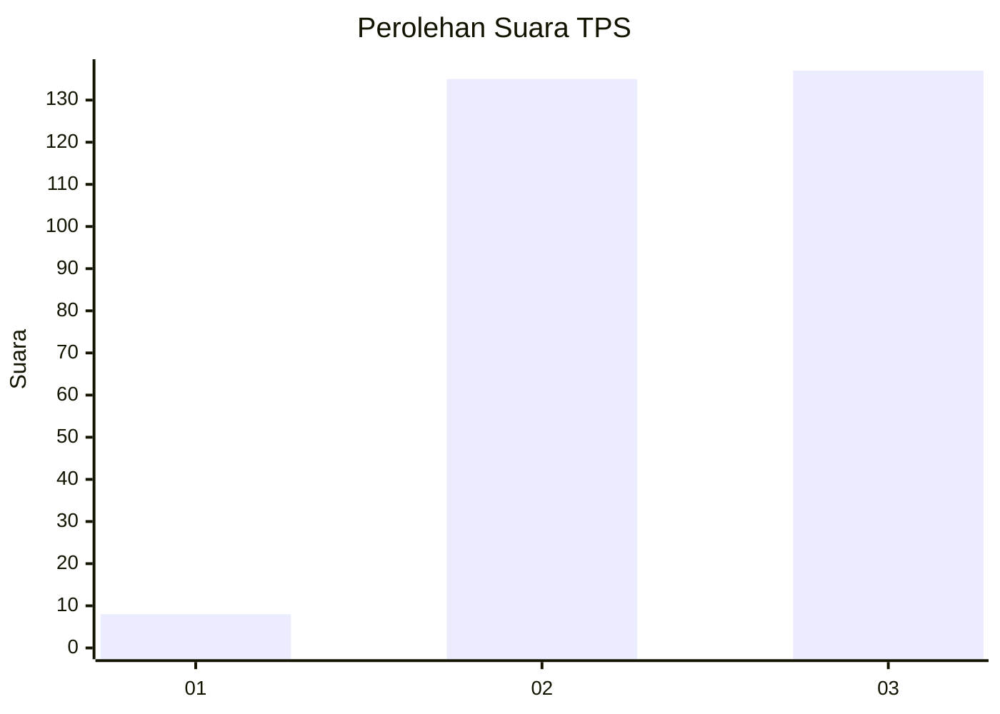
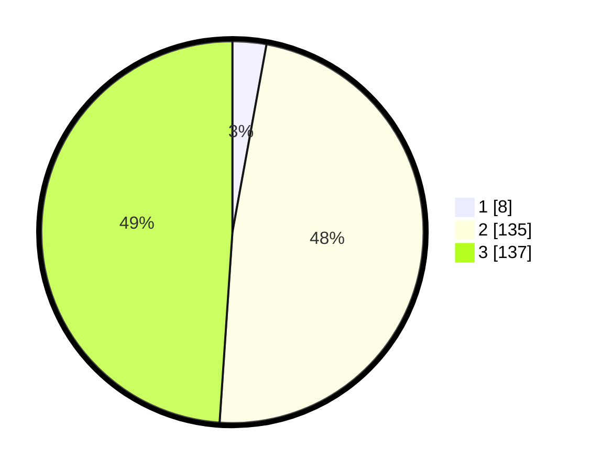

# Hasil

## Grafik

## Tabel

| No. | Nama Paslon    | Suara | Suara (raw) | Persentase |
|:--- |:-------------- | -----:| -----------:| ----------:|
| 1   | ANIES MUHAIMIN | 8     | [8][p-1]    | 2,86       |
| 2   | PRABOWO GIBRAN | 135   | [135][p-2]  | 48,21      |
| 3   | GANJAR MAHFUD  | 137   | [137][p-3]  | 48,93      |

[p-1]: https://github.com/gigit-pemilu/pemilu-2024-51-bali/blob/main/pilpres/hitung-suara/sub/51-bali/sub/03-badung/sub/02-mengwi/sub/1005-sempidi/sub/020-tps/sub/paslon-1.txt
[p-2]: https://github.com/gigit-pemilu/pemilu-2024-51-bali/blob/main/pilpres/hitung-suara/sub/51-bali/sub/03-badung/sub/02-mengwi/sub/1005-sempidi/sub/020-tps/sub/paslon-2.txt
[p-3]: https://github.com/gigit-pemilu/pemilu-2024-51-bali/blob/main/pilpres/hitung-suara/sub/51-bali/sub/03-badung/sub/02-mengwi/sub/1005-sempidi/sub/020-tps/sub/paslon-3.txt

## Foto C Plano

https://sirekap-obj-formc.kpu.go.id/9486/pemilu/ppwp/51/03/02/10/05/5103021005020-20240214-160101--612c912b-955a-441d-81d1-b39cc89fe8ca.jpg

https://sirekap-obj-formc.kpu.go.id/9486/pemilu/ppwp/51/03/02/10/05/5103021005020-20240216-134825--3193e115-551f-4d79-a029-f4c6bc9f0ddb.jpg

https://sirekap-obj-formc.kpu.go.id/9486/pemilu/ppwp/51/03/02/10/05/5103021005020-20240216-134838--88966f4c-9b55-48e3-95d6-50915c784112.jpg

## Metadata

| Key        | Value               |
| ---------- | ------------------- |
| Time Stamp | 2024-02-24 22:31:28 |

