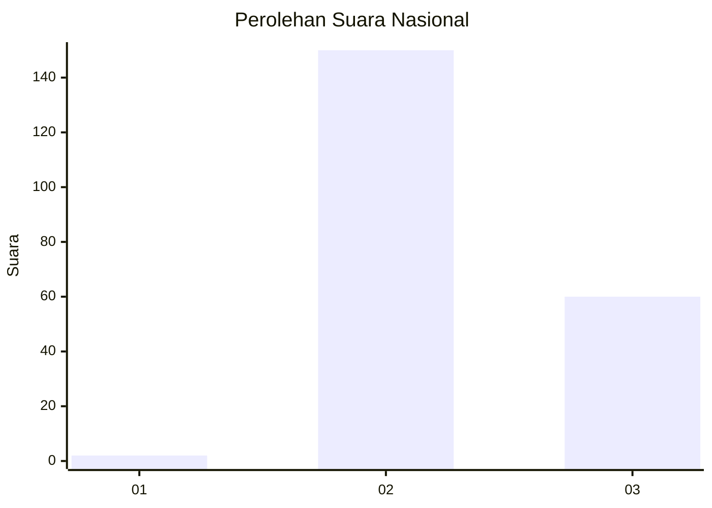
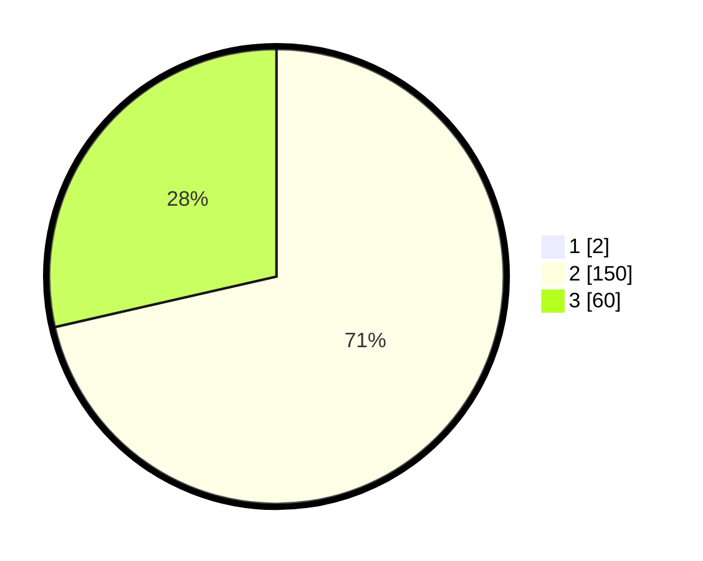

# Hasil

## Grafik

## Tabel

| No. | Nama Paslon    | Suara | Suara (raw) | Persentase |
|:--- |:-------------- | -----:| -----------:| ----------:|
| 1   | ANIES MUHAIMIN | 2     | [2][p-1]    | 0,94       |
| 2   | PRABOWO GIBRAN | 150   | [150][p-2]  | 70,75      |
| 3   | GANJAR MAHFUD  | 60    | [60][p-3]   | 28,30      |

[p-1]: https://github.com/gigit-pemilu/pemilu-2024/blob/main/pilpres/hitung-suara/sub/51-bali/sub/03-badung/sub/02-mengwi/sub/1014-abianbase/sub/001-tps/sub/paslon-1.txt
[p-2]: https://github.com/gigit-pemilu/pemilu-2024/blob/main/pilpres/hitung-suara/sub/51-bali/sub/03-badung/sub/02-mengwi/sub/1014-abianbase/sub/001-tps/sub/paslon-2.txt
[p-3]: https://github.com/gigit-pemilu/pemilu-2024/blob/main/pilpres/hitung-suara/sub/51-bali/sub/03-badung/sub/02-mengwi/sub/1014-abianbase/sub/001-tps/sub/paslon-3.txt

## Foto C Plano

https://sirekap-obj-formc.kpu.go.id/b304/pemilu/ppwp/51/03/02/10/14/5103021014001-20240214-185015--817f74f5-7e43-444e-b815-9a62b7fd5cbb.jpg

https://sirekap-obj-formc.kpu.go.id/b304/pemilu/ppwp/51/03/02/10/14/5103021014001-20240214-185018--9537768f-7b76-45aa-b95a-dc487b169b7c.jpg

https://sirekap-obj-formc.kpu.go.id/b304/pemilu/ppwp/51/03/02/10/14/5103021014001-20240214-185020--edee38fa-958d-4f55-aa4c-c9c2a72c7cba.jpg

## Metadata

| Key        | Value               |
| ---------- | ------------------- |
| Time Stamp | 2024-02-21 10:00:00 |

## DATA PEMILIH TETAP

Jumlah pemilih dalam DPT: **237**.
 * L: **120**.
 * P: **117**.

## DATA PENGGUNA HAK PILIH

Jumlah pengguna hak pilih dalam DPT: **192**.
 * L: **95**.
 * P: **97**.

Jumlah pengguna hak pilih dalam DPTb: **5**.
 * L: **0**.
 * P: **5**.

Jumlah pengguna hak pilih dalam DPK: **19**.
 * L: **11**.
 * P: **8**.

Jumlah pengguna hak pilih: **216**.
 * L: **106**.
 * P: **110**.

## JUMLAH SUARA SAH DAN TIDAK SAH

JUMLAH SELURUH SUARA SAH: **212**.

JUMLAH SUARA TIDAK SAH: **4**.

JUMLAH SELURUH SUARA SAH DAN SUARA TIDAK SAH: **216**.

