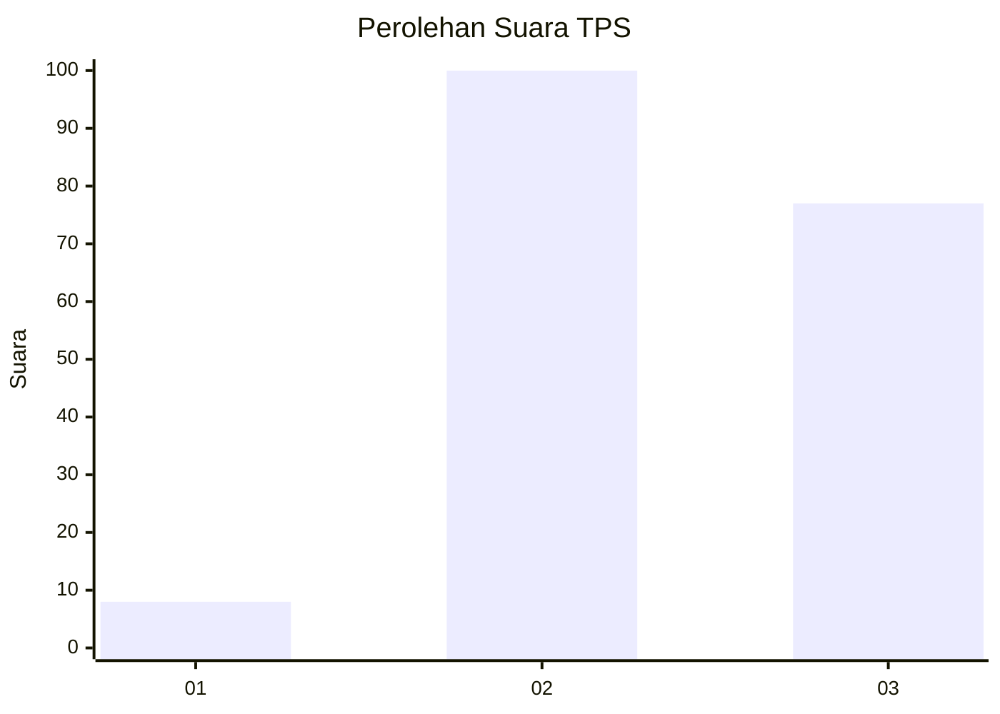
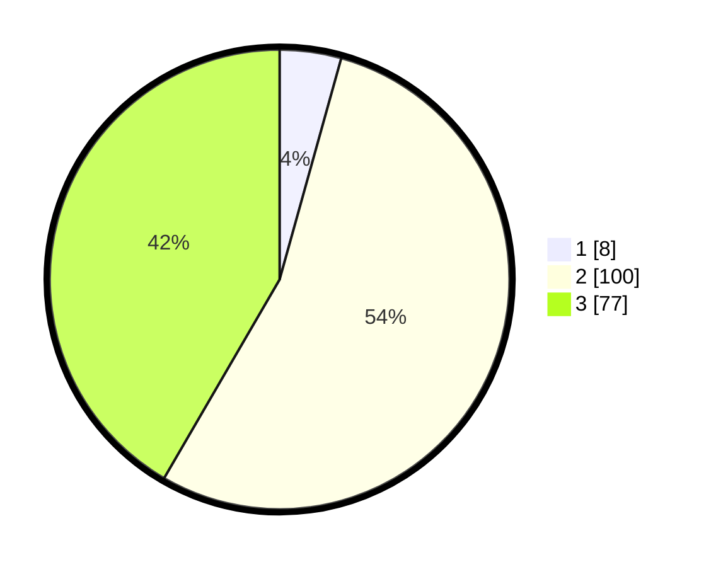

# Hasil

## Grafik

## Tabel

| No. | Nama Paslon    | Suara | Suara (raw) | Persentase |
|:--- |:-------------- | -----:| -----------:| ----------:|
| 1   | ANIES MUHAIMIN | 8     | [8][p-1]    | 4,32       |
| 2   | PRABOWO GIBRAN | 100   | [100][p-2]  | 54,05      |
| 3   | GANJAR MAHFUD  | 77    | [77][p-3]   | 41,62      |

[p-1]: https://github.com/gigit-pemilu/pemilu-2024-51-bali/blob/main/pilpres/hitung-suara/sub/51-bali/sub/03-badung/sub/02-mengwi/sub/1014-abianbase/sub/002-tps/sub/paslon-1.txt
[p-2]: https://github.com/gigit-pemilu/pemilu-2024-51-bali/blob/main/pilpres/hitung-suara/sub/51-bali/sub/03-badung/sub/02-mengwi/sub/1014-abianbase/sub/002-tps/sub/paslon-2.txt
[p-3]: https://github.com/gigit-pemilu/pemilu-2024-51-bali/blob/main/pilpres/hitung-suara/sub/51-bali/sub/03-badung/sub/02-mengwi/sub/1014-abianbase/sub/002-tps/sub/paslon-3.txt

## Foto C Plano

https://sirekap-obj-formc.kpu.go.id/927f/pemilu/ppwp/51/03/02/10/14/5103021014002-20240214-200633--88f58e3d-573d-4d9a-9f72-787565eef259.jpg

https://sirekap-obj-formc.kpu.go.id/927f/pemilu/ppwp/51/03/02/10/14/5103021014002-20240214-190942--c5408d81-8755-40d5-a6a7-68aa19176d38.jpg

https://sirekap-obj-formc.kpu.go.id/927f/pemilu/ppwp/51/03/02/10/14/5103021014002-20240214-190948--c2452823-ac57-47d1-baed-b0d61429fb35.jpg

## Metadata

| Key        | Value               |
| ---------- | ------------------- |
| Time Stamp | 2024-02-14 21:46:01 |

## DATA PEMILIH TETAP

Jumlah pemilih dalam DPT: **231**.
 * L: **107**.
 * P: **124**.

## DATA PENGGUNA HAK PILIH

Jumlah pengguna hak pilih dalam DPT: **180**.
 * L: **79**.
 * P: **101**.

Jumlah pengguna hak pilih dalam DPTb: **6**.
 * L: **2**.
 * P: **4**.

Jumlah pengguna hak pilih dalam DPK: **1**.
 * L: **0**.
 * P: **1**.

Jumlah pengguna hak pilih: **187**.
 * L: **81**.
 * P: **106**.

## JUMLAH SUARA SAH DAN TIDAK SAH

JUMLAH SELURUH SUARA SAH: **185**.

JUMLAH SUARA TIDAK SAH: **2**.

JUMLAH SELURUH SUARA SAH DAN SUARA TIDAK SAH: **187**.

