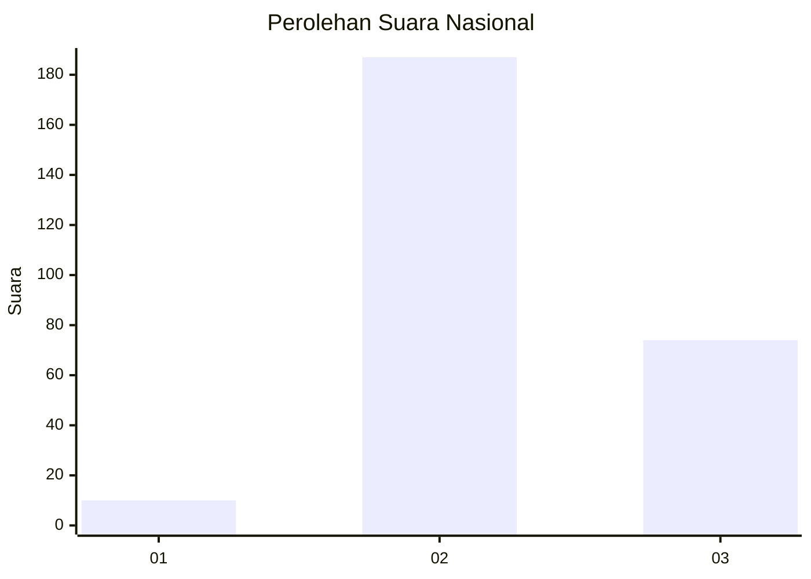
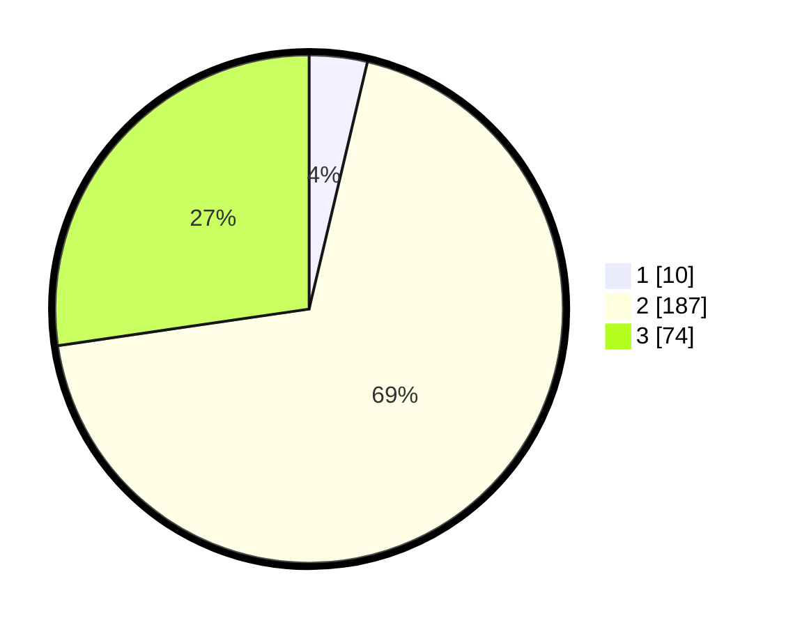

# Hasil

## Grafik

## Tabel

| No. | Nama Paslon    | Suara | Suara (raw) | Persentase |
|:--- |:-------------- | -----:| -----------:| ----------:|
| 1   | ANIES MUHAIMIN | 10    | [10][p-1]   | 3,69       |
| 2   | PRABOWO GIBRAN | 187   | [187][p-2]  | 69,00      |
| 3   | GANJAR MAHFUD  | 74    | [74][p-3]   | 27,31      |

[p-1]: https://github.com/gigit-pemilu/pemilu-2024/blob/main/pilpres/hitung-suara/sub/51-bali/sub/03-badung/sub/02-mengwi/sub/1014-abianbase/sub/006-tps/sub/paslon-1.txt
[p-2]: https://github.com/gigit-pemilu/pemilu-2024/blob/main/pilpres/hitung-suara/sub/51-bali/sub/03-badung/sub/02-mengwi/sub/1014-abianbase/sub/006-tps/sub/paslon-2.txt
[p-3]: https://github.com/gigit-pemilu/pemilu-2024/blob/main/pilpres/hitung-suara/sub/51-bali/sub/03-badung/sub/02-mengwi/sub/1014-abianbase/sub/006-tps/sub/paslon-3.txt

## Foto C Plano

https://sirekap-obj-formc.kpu.go.id/e96e/pemilu/ppwp/51/03/02/10/14/5103021014006-20240214-223835--7b68f2e8-76e6-4b81-a885-7a2b44df7107.jpg

https://sirekap-obj-formc.kpu.go.id/e96e/pemilu/ppwp/51/03/02/10/14/5103021014006-20240214-224008--8d2ea01d-e6ce-4cbc-9599-37dda83bcf33.jpg

https://sirekap-obj-formc.kpu.go.id/e96e/pemilu/ppwp/51/03/02/10/14/5103021014006-20240214-224106--10b193b6-df31-43d3-9132-ff7901c27f9e.jpg

## Metadata

| Key        | Value               |
| ---------- | ------------------- |
| Time Stamp | 2024-02-25 12:00:00 |

