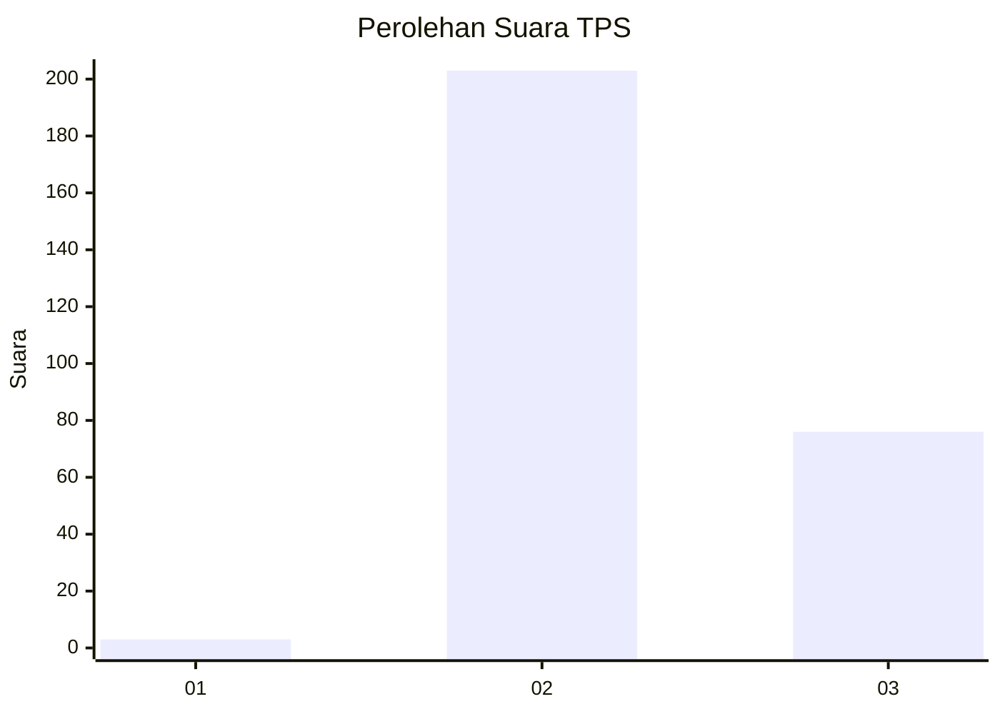
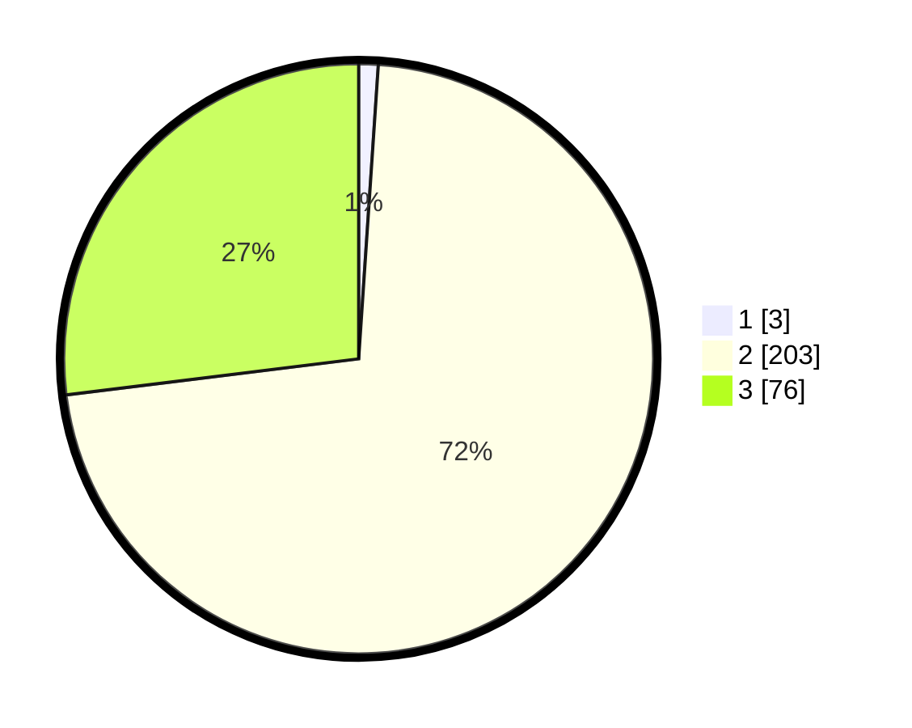

# Hasil

## Grafik

## Tabel

| No. | Nama Paslon    | Suara | Suara (raw) | Persentase |
|:--- |:-------------- | -----:| -----------:| ----------:|
| 1   | ANIES MUHAIMIN | 3     | [3][p-1]    | 1,06       |
| 2   | PRABOWO GIBRAN | 203   | [203][p-2]  | 71,99      |
| 3   | GANJAR MAHFUD  | 76    | [76][p-3]   | 26,95      |

[p-1]: https://github.com/gigit-pemilu/pemilu-2024-51-bali/blob/main/pilpres/hitung-suara/sub/51-bali/sub/03-badung/sub/02-mengwi/sub/1014-abianbase/sub/007-tps/sub/paslon-1.txt
[p-2]: https://github.com/gigit-pemilu/pemilu-2024-51-bali/blob/main/pilpres/hitung-suara/sub/51-bali/sub/03-badung/sub/02-mengwi/sub/1014-abianbase/sub/007-tps/sub/paslon-2.txt
[p-3]: https://github.com/gigit-pemilu/pemilu-2024-51-bali/blob/main/pilpres/hitung-suara/sub/51-bali/sub/03-badung/sub/02-mengwi/sub/1014-abianbase/sub/007-tps/sub/paslon-3.txt

## Foto C Plano

https://sirekap-obj-formc.kpu.go.id/3949/pemilu/ppwp/51/03/02/10/14/5103021014007-20240219-182916--5fe5ee05-73a0-4b4d-9172-291a27dbf476.jpg

https://sirekap-obj-formc.kpu.go.id/3949/pemilu/ppwp/51/03/02/10/14/5103021014007-20240219-182958--23b52d41-fe74-4ad5-961f-427677ebd972.jpg

https://sirekap-obj-formc.kpu.go.id/3949/pemilu/ppwp/51/03/02/10/14/5103021014007-20240219-183214--3c6511e4-5494-4ae6-ac43-e6142a4cc9f1.jpg

## Metadata

| Key        | Value               |
| ---------- | ------------------- |
| Time Stamp | 2024-02-24 22:31:28 |

## DATA PEMILIH TETAP

Jumlah pemilih dalam DPT: **294**.
 * L: **150**.
 * P: **144**.

## DATA PENGGUNA HAK PILIH

Jumlah pengguna hak pilih dalam DPT: **286**.
 * L: **147**.
 * P: **139**.

Jumlah pengguna hak pilih dalam DPTb: **3**.
 * L: **1**.
 * P: **2**.

Jumlah pengguna hak pilih dalam DPK: **7**.
 * L: **2**.
 * P: **5**.

Jumlah pengguna hak pilih: **296**.
 * L: **150**.
 * P: **146**.

## JUMLAH SUARA SAH DAN TIDAK SAH

JUMLAH SELURUH SUARA SAH: **282**.

JUMLAH SUARA TIDAK SAH: **16**.

JUMLAH SELURUH SUARA SAH DAN SUARA TIDAK SAH: **298**.

