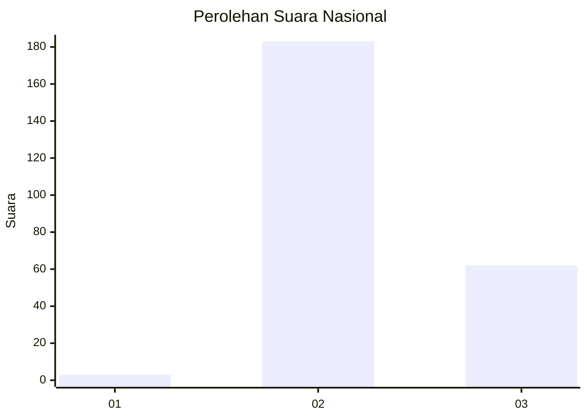
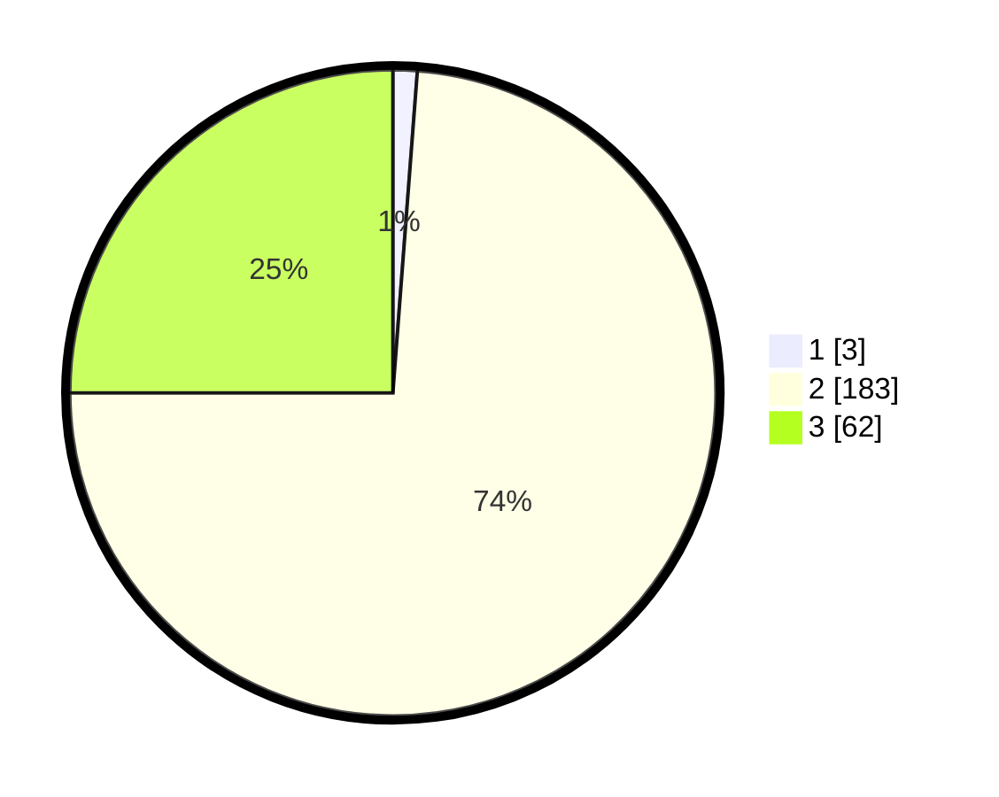

# Hasil

## Grafik

## Tabel

| No. | Nama Paslon    | Suara | Suara (raw) | Persentase |
|:--- |:-------------- | -----:| -----------:| ----------:|
| 1   | ANIES MUHAIMIN | 3     | [3][p-1]    | 1,21       |
| 2   | PRABOWO GIBRAN | 183   | [183][p-2]  | 73,79      |
| 3   | GANJAR MAHFUD  | 62    | [62][p-3]   | 25,00      |

[p-1]: https://github.com/gigit-pemilu/pemilu-2024/blob/main/pilpres/hitung-suara/sub/51-bali/sub/03-badung/sub/02-mengwi/sub/1014-abianbase/sub/008-tps/sub/paslon-1.txt
[p-2]: https://github.com/gigit-pemilu/pemilu-2024/blob/main/pilpres/hitung-suara/sub/51-bali/sub/03-badung/sub/02-mengwi/sub/1014-abianbase/sub/008-tps/sub/paslon-2.txt
[p-3]: https://github.com/gigit-pemilu/pemilu-2024/blob/main/pilpres/hitung-suara/sub/51-bali/sub/03-badung/sub/02-mengwi/sub/1014-abianbase/sub/008-tps/sub/paslon-3.txt

## Foto C Plano

https://sirekap-obj-formc.kpu.go.id/89ba/pemilu/ppwp/51/03/02/10/14/5103021014008-20240214-212248--8b01cd18-7fa9-49f3-96bd-467a815b1e85.jpg

https://sirekap-obj-formc.kpu.go.id/89ba/pemilu/ppwp/51/03/02/10/14/5103021014008-20240214-212303--69fe2869-820e-4e25-8bc7-071761082176.jpg

https://sirekap-obj-formc.kpu.go.id/89ba/pemilu/ppwp/51/03/02/10/14/5103021014008-20240214-212309--3bf3dd81-fddb-478c-9690-638e511f3951.jpg

## Metadata

| Key        | Value               |
| ---------- | ------------------- |
| Time Stamp | 2024-02-24 22:31:28 |

## DATA PEMILIH TETAP

Jumlah pemilih dalam DPT: **296**.
 * L: **154**.
 * P: **142**.

## DATA PENGGUNA HAK PILIH

Jumlah pengguna hak pilih dalam DPT: **243**.
 * L: **126**.
 * P: **117**.

Jumlah pengguna hak pilih dalam DPTb: **6**.
 * L: **3**.
 * P: **3**.

Jumlah pengguna hak pilih dalam DPK: **2**.
 * L: **1**.
 * P: **1**.

Jumlah pengguna hak pilih: **251**.
 * L: **130**.
 * P: **121**.

## JUMLAH SUARA SAH DAN TIDAK SAH

JUMLAH SELURUH SUARA SAH: **248**.

JUMLAH SUARA TIDAK SAH: **3**.

JUMLAH SELURUH SUARA SAH DAN SUARA TIDAK SAH: **251**.

