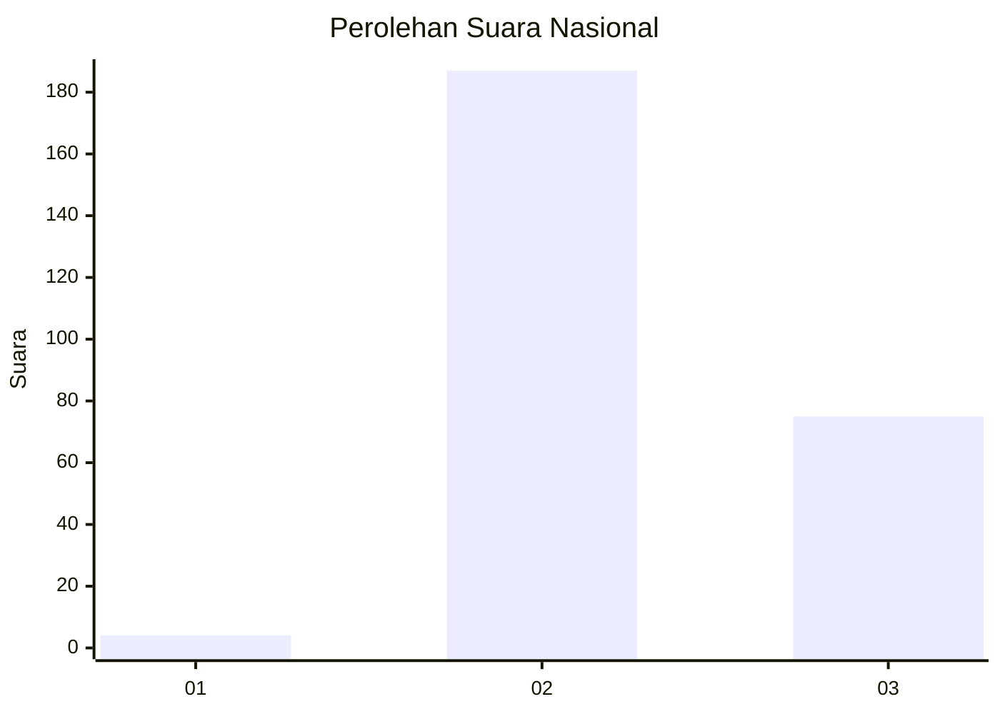
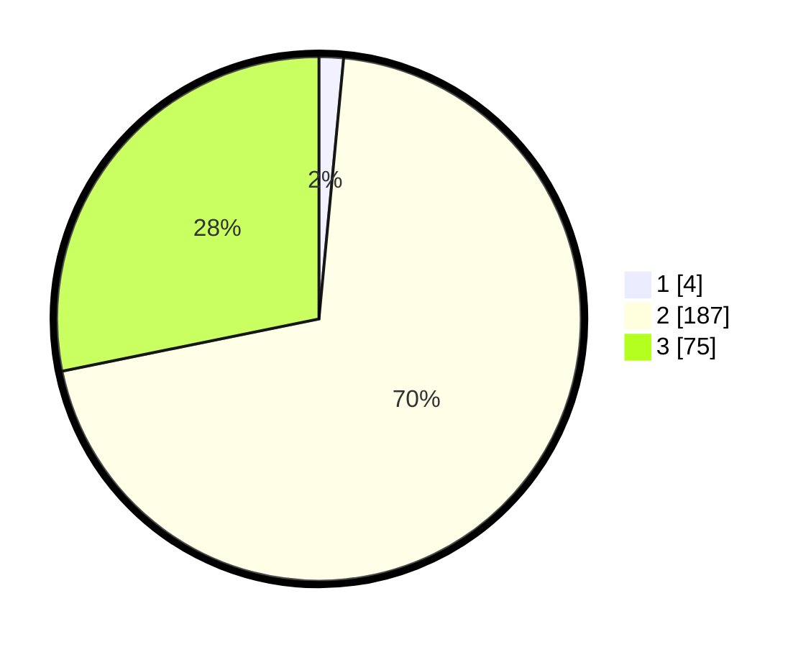

# Hasil

## Grafik

## Tabel

| No. | Nama Paslon    | Suara | Suara (raw) | Persentase |
|:--- |:-------------- | -----:| -----------:| ----------:|
| 1   | ANIES MUHAIMIN | 4     | [4][p-1]    | 1,50       |
| 2   | PRABOWO GIBRAN | 187   | [187][p-2]  | 70,30      |
| 3   | GANJAR MAHFUD  | 75    | [75][p-3]   | 28,20      |

[p-1]: https://github.com/gigit-pemilu/pemilu-2024/blob/main/pilpres/hitung-suara/sub/51-bali/sub/03-badung/sub/02-mengwi/sub/1014-abianbase/sub/010-tps/sub/paslon-1.txt
[p-2]: https://github.com/gigit-pemilu/pemilu-2024/blob/main/pilpres/hitung-suara/sub/51-bali/sub/03-badung/sub/02-mengwi/sub/1014-abianbase/sub/010-tps/sub/paslon-2.txt
[p-3]: https://github.com/gigit-pemilu/pemilu-2024/blob/main/pilpres/hitung-suara/sub/51-bali/sub/03-badung/sub/02-mengwi/sub/1014-abianbase/sub/010-tps/sub/paslon-3.txt

## Foto C Plano

https://sirekap-obj-formc.kpu.go.id/7e48/pemilu/ppwp/51/03/02/10/14/5103021014010-20240214-194250--e1692ee1-a141-4504-aa29-ff3678fe9905.jpg

https://sirekap-obj-formc.kpu.go.id/7e48/pemilu/ppwp/51/03/02/10/14/5103021014010-20240216-155320--78c7c0a2-4f0a-4cf0-bd01-e7a55b3c06be.jpg

https://sirekap-obj-formc.kpu.go.id/7e48/pemilu/ppwp/51/03/02/10/14/5103021014010-20240216-155749--b683cf32-649b-4f4f-9f5f-3181c934418c.jpg

## Metadata

| Key        | Value               |
| ---------- | ------------------- |
| Time Stamp | 2024-02-24 22:31:28 |

## DATA PEMILIH TETAP

Jumlah pemilih dalam DPT: **300**.
 * L: **158**.
 * P: **142**.

## DATA PENGGUNA HAK PILIH

Jumlah pengguna hak pilih dalam DPT: **264**.
 * L: **142**.
 * P: **122**.

Jumlah pengguna hak pilih dalam DPTb: **6**.
 * L: **4**.
 * P: **2**.

Jumlah pengguna hak pilih dalam DPK: **1**.
 * L: **1**.
 * P: **0**.

Jumlah pengguna hak pilih: **271**.
 * L: **147**.
 * P: **124**.

## JUMLAH SUARA SAH DAN TIDAK SAH

JUMLAH SELURUH SUARA SAH: **266**.

JUMLAH SUARA TIDAK SAH: **5**.

JUMLAH SELURUH SUARA SAH DAN SUARA TIDAK SAH: **271**.

