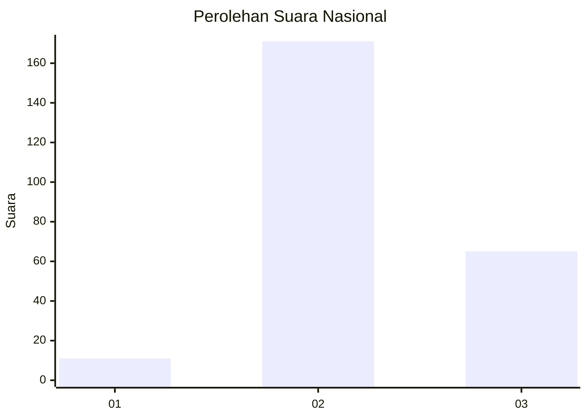

# Hasil

## Grafik

## Tabel

| No. | Nama Paslon    | Suara | Suara (raw) | Persentase |
|:--- |:-------------- | -----:| -----------:| ----------:|
| 1   | ANIES MUHAIMIN | 11    | [11][p-1]   | 4,45       |
| 2   | PRABOWO GIBRAN | 171   | [171][p-2]  | 69,23      |
| 3   | GANJAR MAHFUD  | 65    | [65][p-3]   | 26,32      |

[p-1]: https://github.com/gigit-pemilu/pemilu-2024/blob/main/pilpres/hitung-suara/sub/51-bali/sub/03-badung/sub/02-mengwi/sub/1014-abianbase/sub/012-tps/sub/paslon-1.txt
[p-2]: https://github.com/gigit-pemilu/pemilu-2024/blob/main/pilpres/hitung-suara/sub/51-bali/sub/03-badung/sub/02-mengwi/sub/1014-abianbase/sub/012-tps/sub/paslon-2.txt
[p-3]: https://github.com/gigit-pemilu/pemilu-2024/blob/main/pilpres/hitung-suara/sub/51-bali/sub/03-badung/sub/02-mengwi/sub/1014-abianbase/sub/012-tps/sub/paslon-3.txt

## Foto C Plano

https://sirekap-obj-formc.kpu.go.id/425a/pemilu/ppwp/51/03/02/10/14/5103021014012-20240218-204041--a7cf9108-8f68-4635-8295-c39042fdee63.jpg

https://sirekap-obj-formc.kpu.go.id/425a/pemilu/ppwp/51/03/02/10/14/5103021014012-20240218-203534--830bc761-7fa6-41ab-8ba4-24042319ed03.jpg

https://sirekap-obj-formc.kpu.go.id/425a/pemilu/ppwp/51/03/02/10/14/5103021014012-20240218-204121--846b7609-d46b-4cb0-9c0c-54b3d1339320.jpg

## Metadata

| Key        | Value               |
| ---------- | ------------------- |
| Time Stamp | 2024-02-24 22:31:28 |

