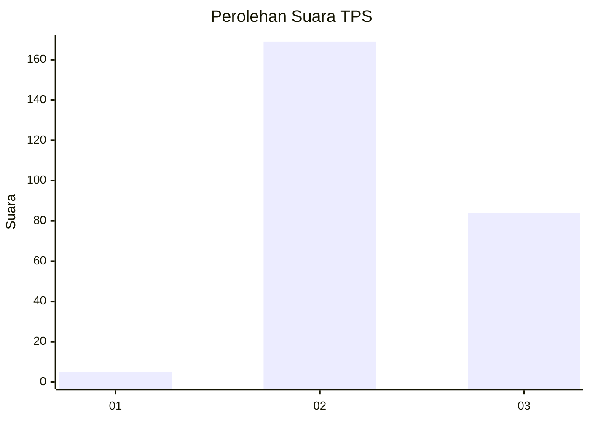
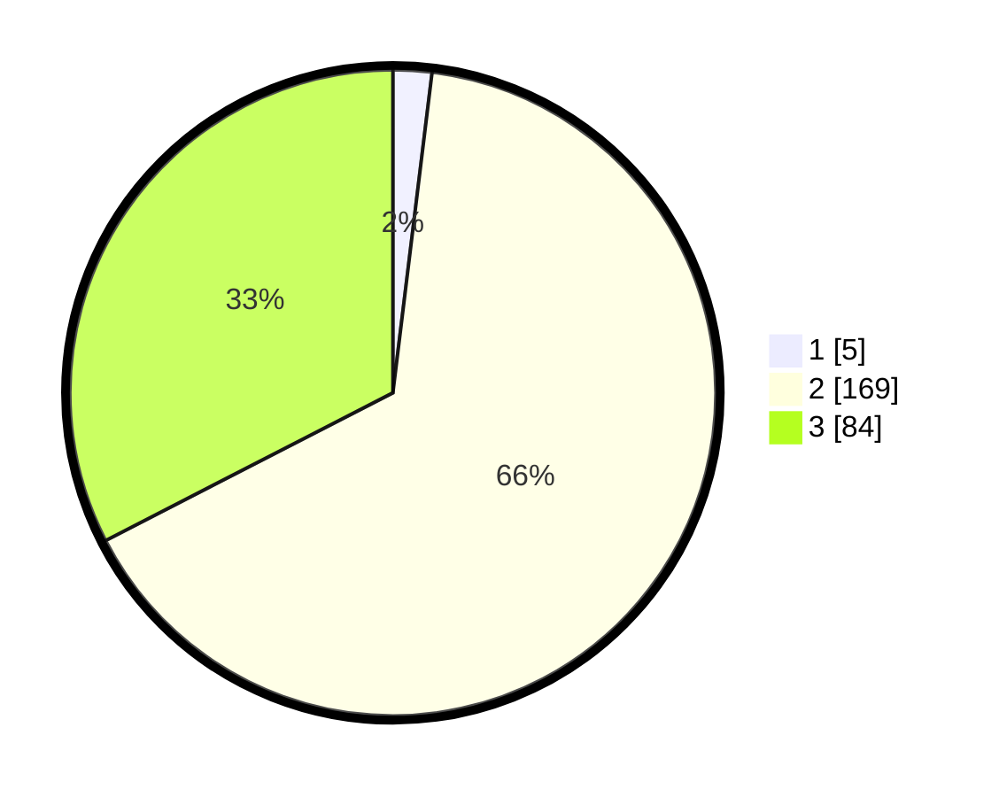

# Hasil

## Grafik

## Tabel

| No. | Nama Paslon    | Suara | Suara (raw) | Persentase |
|:--- |:-------------- | -----:| -----------:| ----------:|
| 1   | ANIES MUHAIMIN | 5     | [5][p-1]    | 1,94       |
| 2   | PRABOWO GIBRAN | 169   | [169][p-2]  | 65,50      |
| 3   | GANJAR MAHFUD  | 84    | [84][p-3]   | 32,56      |

[p-1]: https://github.com/gigit-pemilu/pemilu-2024-51-bali/blob/main/pilpres/hitung-suara/sub/51-bali/sub/03-badung/sub/02-mengwi/sub/1014-abianbase/sub/013-tps/sub/paslon-1.txt
[p-2]: https://github.com/gigit-pemilu/pemilu-2024-51-bali/blob/main/pilpres/hitung-suara/sub/51-bali/sub/03-badung/sub/02-mengwi/sub/1014-abianbase/sub/013-tps/sub/paslon-2.txt
[p-3]: https://github.com/gigit-pemilu/pemilu-2024-51-bali/blob/main/pilpres/hitung-suara/sub/51-bali/sub/03-badung/sub/02-mengwi/sub/1014-abianbase/sub/013-tps/sub/paslon-3.txt

## Foto C Plano

https://sirekap-obj-formc.kpu.go.id/6f92/pemilu/ppwp/51/03/02/10/14/5103021014013-20240223-073958--37ab7b75-2766-4a03-b8b7-211b1aa2d0c4.jpg

https://sirekap-obj-formc.kpu.go.id/6f92/pemilu/ppwp/51/03/02/10/14/5103021014013-20240215-005242--73edf075-cdd6-497b-89ed-c19d15b97df5.jpg

https://sirekap-obj-formc.kpu.go.id/6f92/pemilu/ppwp/51/03/02/10/14/5103021014013-20240218-075151--13425cf7-18a6-4a4e-9cf7-8d4b81d1d7e4.jpg

## Metadata

| Key        | Value               |
| ---------- | ------------------- |
| Time Stamp | 2024-02-24 22:31:28 |

