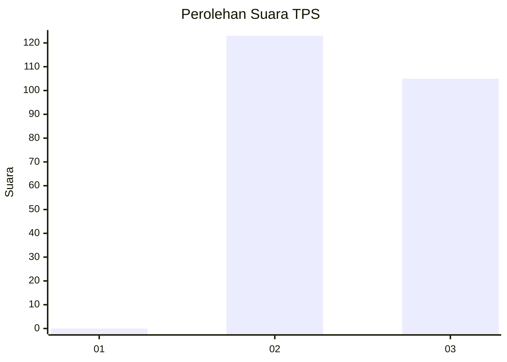
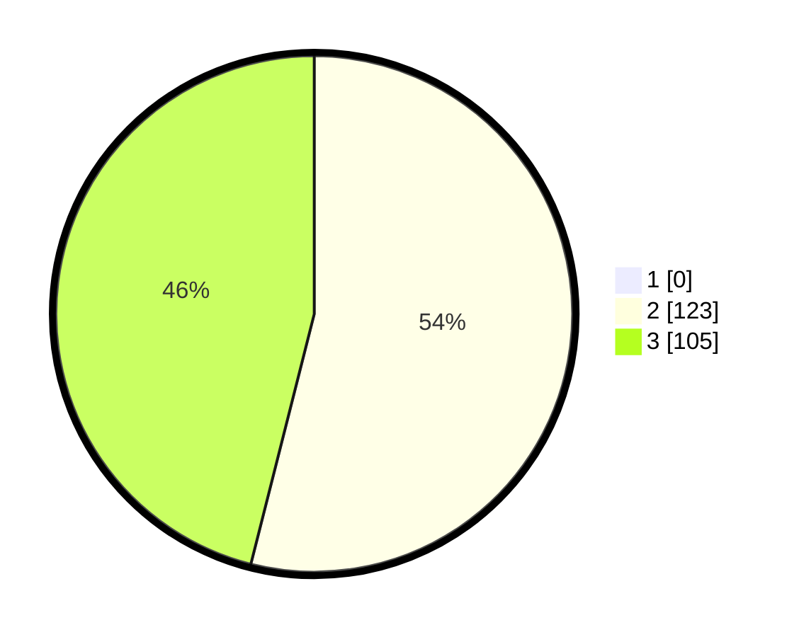

# Hasil

## Grafik

## Tabel

| No. | Nama Paslon    | Suara | Suara (raw) | Persentase |
|:--- |:-------------- | -----:| -----------:| ----------:|
| 1   | ANIES MUHAIMIN | 0     | [0][p-1]    | 0,00       |
| 2   | PRABOWO GIBRAN | 123   | [123][p-2]  | 53,95      |
| 3   | GANJAR MAHFUD  | 105   | [105][p-3]  | 46,05      |

[p-1]: https://github.com/gigit-pemilu/pemilu-2024-51-bali/blob/main/pilpres/hitung-suara/sub/51-bali/sub/03-badung/sub/02-mengwi/sub/1014-abianbase/sub/016-tps/sub/paslon-1.txt
[p-2]: https://github.com/gigit-pemilu/pemilu-2024-51-bali/blob/main/pilpres/hitung-suara/sub/51-bali/sub/03-badung/sub/02-mengwi/sub/1014-abianbase/sub/016-tps/sub/paslon-2.txt
[p-3]: https://github.com/gigit-pemilu/pemilu-2024-51-bali/blob/main/pilpres/hitung-suara/sub/51-bali/sub/03-badung/sub/02-mengwi/sub/1014-abianbase/sub/016-tps/sub/paslon-3.txt

## Foto C Plano

https://sirekap-obj-formc.kpu.go.id/56fd/pemilu/ppwp/51/03/02/10/14/5103021014016-20240214-132800--a104385e-02f0-450c-940a-365aa7db1df1.jpg

https://sirekap-obj-formc.kpu.go.id/56fd/pemilu/ppwp/51/03/02/10/14/5103021014016-20240214-132920--3fdf2140-c5c8-4757-ab7b-0e9a884bb495.jpg

https://sirekap-obj-formc.kpu.go.id/56fd/pemilu/ppwp/51/03/02/10/14/5103021014016-20240214-131656--eead5cfa-f5aa-4c11-803a-72bee85b9e9c.jpg

## Metadata

| Key        | Value               |
| ---------- | ------------------- |
| Time Stamp | 2024-02-14 21:46:01 |

## DATA PEMILIH TETAP

Jumlah pemilih dalam DPT: **235**.
 * L: **107**.
 * P: **128**.

## DATA PENGGUNA HAK PILIH

Jumlah pengguna hak pilih dalam DPT: **221**.
 * L: **99**.
 * P: **122**.

Jumlah pengguna hak pilih dalam DPTb: **1**.
 * L: **0**.
 * P: **1**.

Jumlah pengguna hak pilih dalam DPK: **7**.
 * L: **3**.
 * P: **4**.

Jumlah pengguna hak pilih: **229**.
 * L: **102**.
 * P: **127**.

## JUMLAH SUARA SAH DAN TIDAK SAH

JUMLAH SELURUH SUARA SAH: **228**.

JUMLAH SUARA TIDAK SAH: **1**.

JUMLAH SELURUH SUARA SAH DAN SUARA TIDAK SAH: **229**.

