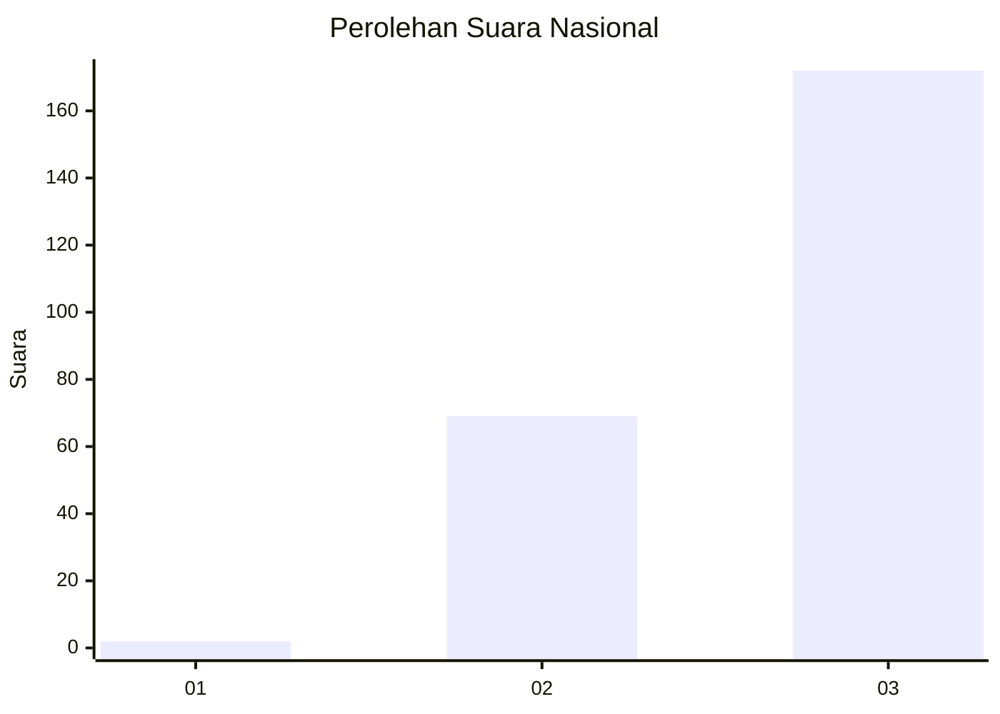
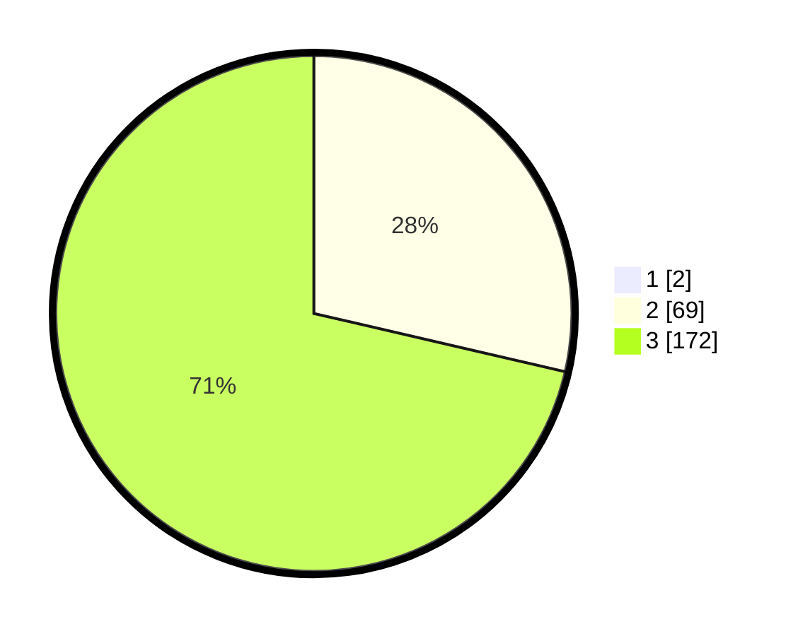

# Hasil

## Grafik

## Tabel

| No. | Nama Paslon    | Suara | Suara (raw) | Persentase |
|:--- |:-------------- | -----:| -----------:| ----------:|
| 1   | ANIES MUHAIMIN | 2     | [2][p-1]    | 0,82       |
| 2   | PRABOWO GIBRAN | 69    | [69][p-2]   | 28,40      |
| 3   | GANJAR MAHFUD  | 172   | [172][p-3]  | 70,78      |

[p-1]: https://github.com/gigit-pemilu/pemilu-2024/blob/main/pilpres/hitung-suara/sub/51-bali/sub/03-badung/sub/02-mengwi/sub/1014-abianbase/sub/018-tps/sub/paslon-1.txt
[p-2]: https://github.com/gigit-pemilu/pemilu-2024/blob/main/pilpres/hitung-suara/sub/51-bali/sub/03-badung/sub/02-mengwi/sub/1014-abianbase/sub/018-tps/sub/paslon-2.txt
[p-3]: https://github.com/gigit-pemilu/pemilu-2024/blob/main/pilpres/hitung-suara/sub/51-bali/sub/03-badung/sub/02-mengwi/sub/1014-abianbase/sub/018-tps/sub/paslon-3.txt

## Foto C Plano

https://sirekap-obj-formc.kpu.go.id/285c/pemilu/ppwp/51/03/02/10/14/5103021014018-20240214-231328--2794a1fc-50b8-47b7-8313-42f5b30134ec.jpg

https://sirekap-obj-formc.kpu.go.id/285c/pemilu/ppwp/51/03/02/10/14/5103021014018-20240214-230509--00362b38-1cca-4447-bc41-2b2f4416d909.jpg

https://sirekap-obj-formc.kpu.go.id/285c/pemilu/ppwp/51/03/02/10/14/5103021014018-20240214-230518--3dfeed9d-c921-4fe3-b993-7817f5df1c04.jpg

## Metadata

| Key        | Value               |
| ---------- | ------------------- |
| Time Stamp | 2024-02-24 22:31:28 |

