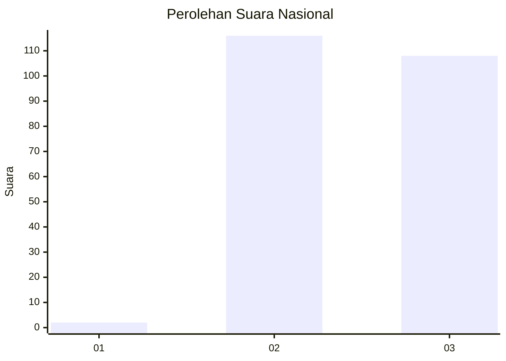
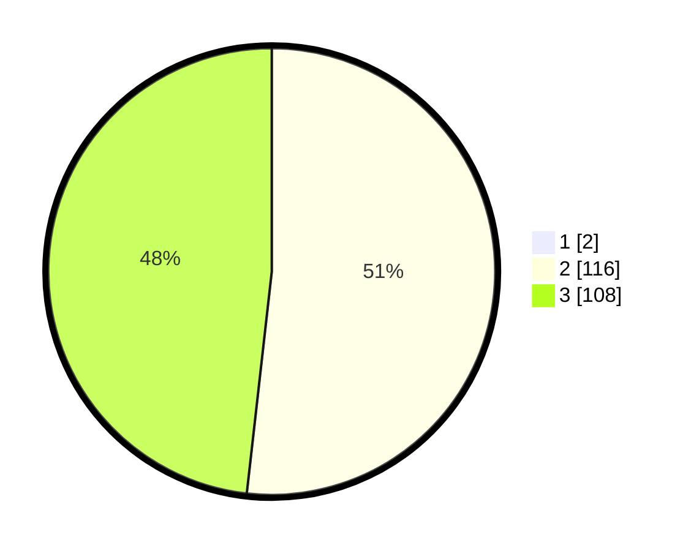

# Hasil

## Grafik

## Tabel

| No. | Nama Paslon    | Suara | Suara (raw) | Persentase |
|:--- |:-------------- | -----:| -----------:| ----------:|
| 1   | ANIES MUHAIMIN | 2     | [2][p-1]    | 0,88       |
| 2   | PRABOWO GIBRAN | 116   | [116][p-2]  | 51,33      |
| 3   | GANJAR MAHFUD  | 108   | [108][p-3]  | 47,79      |

[p-1]: https://github.com/gigit-pemilu/pemilu-2024/blob/main/pilpres/hitung-suara/sub/51-bali/sub/03-badung/sub/02-mengwi/sub/1014-abianbase/sub/020-tps/sub/paslon-1.txt
[p-2]: https://github.com/gigit-pemilu/pemilu-2024/blob/main/pilpres/hitung-suara/sub/51-bali/sub/03-badung/sub/02-mengwi/sub/1014-abianbase/sub/020-tps/sub/paslon-2.txt
[p-3]: https://github.com/gigit-pemilu/pemilu-2024/blob/main/pilpres/hitung-suara/sub/51-bali/sub/03-badung/sub/02-mengwi/sub/1014-abianbase/sub/020-tps/sub/paslon-3.txt

## Foto C Plano

https://sirekap-obj-formc.kpu.go.id/612e/pemilu/ppwp/51/03/02/10/14/5103021014020-20240215-021337--11356d20-5095-434a-baff-a0165f5c2168.jpg

https://sirekap-obj-formc.kpu.go.id/612e/pemilu/ppwp/51/03/02/10/14/5103021014020-20240215-021012--7830706d-4083-4b34-9da0-982efbc680d6.jpg

https://sirekap-obj-formc.kpu.go.id/612e/pemilu/ppwp/51/03/02/10/14/5103021014020-20240215-021148--39b478ae-ad34-4ae3-aa92-750c5389081e.jpg

## Metadata

| Key        | Value               |
| ---------- | ------------------- |
| Time Stamp | 2024-02-26 17:00:04 |

