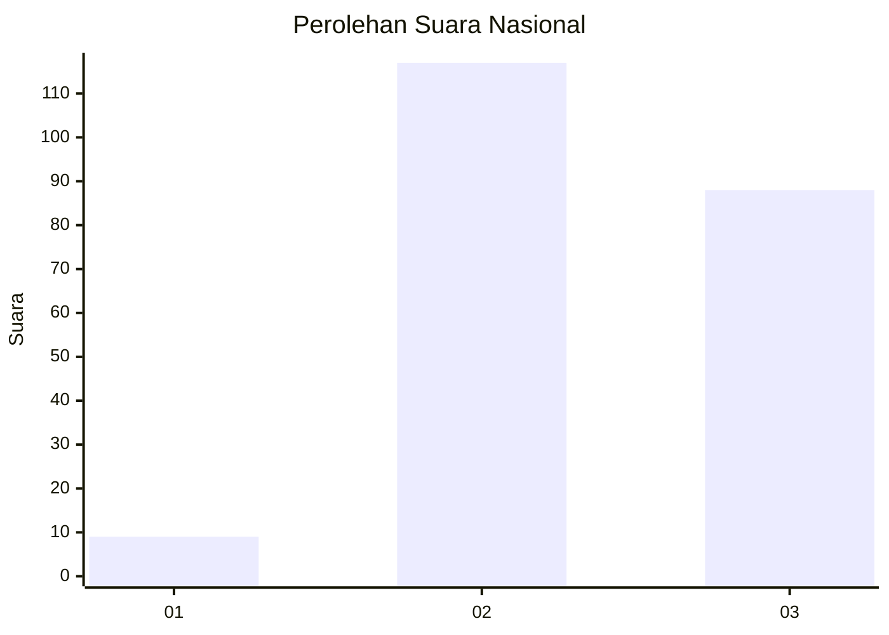
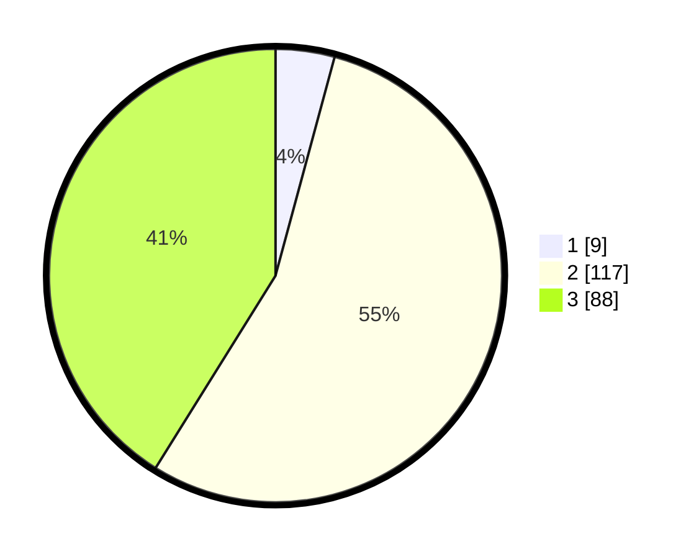

# Hasil

## Grafik

## Tabel

| No. | Nama Paslon    | Suara | Suara (raw) | Persentase |
|:--- |:-------------- | -----:| -----------:| ----------:|
| 1   | ANIES MUHAIMIN | 9     | [9][p-1]    | 4,21       |
| 2   | PRABOWO GIBRAN | 117   | [117][p-2]  | 54,67      |
| 3   | GANJAR MAHFUD  | 88    | [88][p-3]   | 41,12      |

[p-1]: https://github.com/gigit-pemilu/pemilu-2024/blob/main/pilpres/hitung-suara/sub/51-bali/sub/03-badung/sub/02-mengwi/sub/1015-sading/sub/003-tps/sub/paslon-1.txt
[p-2]: https://github.com/gigit-pemilu/pemilu-2024/blob/main/pilpres/hitung-suara/sub/51-bali/sub/03-badung/sub/02-mengwi/sub/1015-sading/sub/003-tps/sub/paslon-2.txt
[p-3]: https://github.com/gigit-pemilu/pemilu-2024/blob/main/pilpres/hitung-suara/sub/51-bali/sub/03-badung/sub/02-mengwi/sub/1015-sading/sub/003-tps/sub/paslon-3.txt

## Foto C Plano

https://sirekap-obj-formc.kpu.go.id/a188/pemilu/ppwp/51/03/02/10/15/5103021015003-20240214-212231--21a246b5-c527-4d90-b31b-b11fe3c0d216.jpg

https://sirekap-obj-formc.kpu.go.id/a188/pemilu/ppwp/51/03/02/10/15/5103021015003-20240214-212330--59b6514e-9e60-4d2b-9077-d0977fff564c.jpg

https://sirekap-obj-formc.kpu.go.id/a188/pemilu/ppwp/51/03/02/10/15/5103021015003-20240214-212434--020313e6-7724-4f68-bd73-7efcfb44556e.jpg

## Metadata

| Key        | Value               |
| ---------- | ------------------- |
| Time Stamp | 2024-02-15 00:41:44 |

## DATA PEMILIH TETAP

Jumlah pemilih dalam DPT: **231**.
 * L: **109**.
 * P: **122**.

## DATA PENGGUNA HAK PILIH

Jumlah pengguna hak pilih dalam DPT: **210**.
 * L: **103**.
 * P: **107**.

Jumlah pengguna hak pilih dalam DPTb: **0**.
 * L: **0**.
 * P: **0**.

Jumlah pengguna hak pilih dalam DPK: **7**.
 * L: **2**.
 * P: **5**.

Jumlah pengguna hak pilih: **217**.
 * L: **105**.
 * P: **112**.

## JUMLAH SUARA SAH DAN TIDAK SAH

JUMLAH SELURUH SUARA SAH: **214**.

JUMLAH SUARA TIDAK SAH: **3**.

JUMLAH SELURUH SUARA SAH DAN SUARA TIDAK SAH: **217**.

