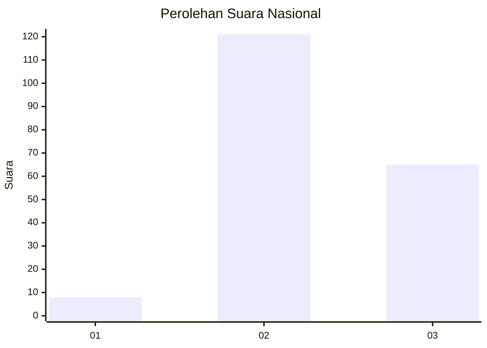
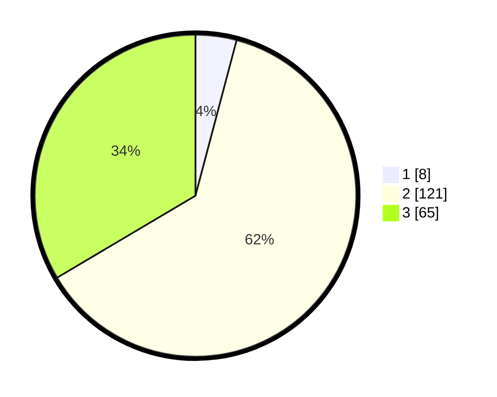

# Hasil

## Grafik

## Tabel

| No. | Nama Paslon    | Suara | Suara (raw) | Persentase |
|:--- |:-------------- | -----:| -----------:| ----------:|
| 1   | ANIES MUHAIMIN | 8     | [8][p-1]    | 4,12       |
| 2   | PRABOWO GIBRAN | 121   | [121][p-2]  | 62,37      |
| 3   | GANJAR MAHFUD  | 65    | [65][p-3]   | 33,51      |

[p-1]: https://github.com/gigit-pemilu/pemilu-2024/blob/main/pilpres/hitung-suara/sub/51-bali/sub/03-badung/sub/02-mengwi/sub/1015-sading/sub/004-tps/sub/paslon-1.txt
[p-2]: https://github.com/gigit-pemilu/pemilu-2024/blob/main/pilpres/hitung-suara/sub/51-bali/sub/03-badung/sub/02-mengwi/sub/1015-sading/sub/004-tps/sub/paslon-2.txt
[p-3]: https://github.com/gigit-pemilu/pemilu-2024/blob/main/pilpres/hitung-suara/sub/51-bali/sub/03-badung/sub/02-mengwi/sub/1015-sading/sub/004-tps/sub/paslon-3.txt

## Foto C Plano

https://sirekap-obj-formc.kpu.go.id/66da/pemilu/ppwp/51/03/02/10/15/5103021015004-20240214-131958--3840ad8e-e208-420e-8673-a453a4e5de91.jpg

https://sirekap-obj-formc.kpu.go.id/66da/pemilu/ppwp/51/03/02/10/15/5103021015004-20240214-130724--e9be69c2-e544-48b1-9cd2-97618982c292.jpg

https://sirekap-obj-formc.kpu.go.id/66da/pemilu/ppwp/51/03/02/10/15/5103021015004-20240214-130805--7491e064-4ec4-4523-be91-4366b8458372.jpg

## Metadata

| Key        | Value               |
| ---------- | ------------------- |
| Time Stamp | 2024-02-14 21:46:01 |

## DATA PEMILIH TETAP

Jumlah pemilih dalam DPT: **213**.
 * L: **105**.
 * P: **108**.

## DATA PENGGUNA HAK PILIH

Jumlah pengguna hak pilih dalam DPT: **192**.
 * L: **92**.
 * P: **100**.

Jumlah pengguna hak pilih dalam DPTb: **5**.
 * L: **1**.
 * P: **4**.

Jumlah pengguna hak pilih dalam DPK: **0**.
 * L: **0**.
 * P: **0**.

Jumlah pengguna hak pilih: **197**.
 * L: **93**.
 * P: **104**.

## JUMLAH SUARA SAH DAN TIDAK SAH

JUMLAH SELURUH SUARA SAH: **194**.

JUMLAH SUARA TIDAK SAH: **3**.

JUMLAH SELURUH SUARA SAH DAN SUARA TIDAK SAH: **197**.

