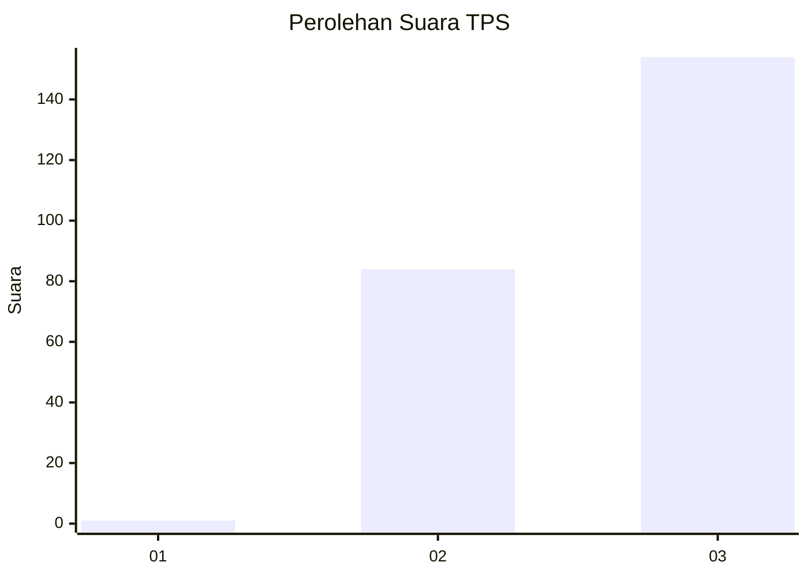
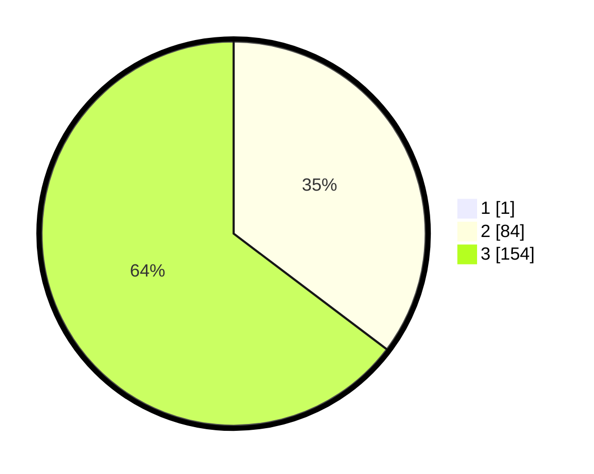

# Hasil

## Grafik

## Tabel

| No. | Nama Paslon    | Suara | Suara (raw) | Persentase |
|:--- |:-------------- | -----:| -----------:| ----------:|
| 1   | ANIES MUHAIMIN | 1     | [1][p-1]    | 0,42       |
| 2   | PRABOWO GIBRAN | 84    | [84][p-2]   | 35,15      |
| 3   | GANJAR MAHFUD  | 154   | [154][p-3]  | 64,44      |

[p-1]: https://github.com/gigit-pemilu/pemilu-2024-51-bali/blob/main/pilpres/hitung-suara/sub/51-bali/sub/03-badung/sub/02-mengwi/sub/1015-sading/sub/006-tps/sub/paslon-1.txt
[p-2]: https://github.com/gigit-pemilu/pemilu-2024-51-bali/blob/main/pilpres/hitung-suara/sub/51-bali/sub/03-badung/sub/02-mengwi/sub/1015-sading/sub/006-tps/sub/paslon-2.txt
[p-3]: https://github.com/gigit-pemilu/pemilu-2024-51-bali/blob/main/pilpres/hitung-suara/sub/51-bali/sub/03-badung/sub/02-mengwi/sub/1015-sading/sub/006-tps/sub/paslon-3.txt

## Foto C Plano

https://sirekap-obj-formc.kpu.go.id/3d75/pemilu/ppwp/51/03/02/10/15/5103021015006-20240215-000014--4aed88a0-0868-4e41-9f46-16ebcca1646e.jpg

https://sirekap-obj-formc.kpu.go.id/3d75/pemilu/ppwp/51/03/02/10/15/5103021015006-20240215-000142--34bbc0db-08fc-4d9a-be61-d3c40e667cfe.jpg

https://sirekap-obj-formc.kpu.go.id/3d75/pemilu/ppwp/51/03/02/10/15/5103021015006-20240215-000326--ecd4a1f8-fb23-429d-8c3a-e9ce4255f603.jpg

## Metadata

| Key        | Value               |
| ---------- | ------------------- |
| Time Stamp | 2024-02-20 13:00:00 |

## DATA PEMILIH TETAP

Jumlah pemilih dalam DPT: **260**.
 * L: **121**.
 * P: **139**.

## DATA PENGGUNA HAK PILIH

Jumlah pengguna hak pilih dalam DPT: **240**.
 * L: **112**.
 * P: **128**.

Jumlah pengguna hak pilih dalam DPTb: **2**.
 * L: **2**.
 * P: **0**.

Jumlah pengguna hak pilih dalam DPK: **1**.
 * L: **1**.
 * P: **0**.

Jumlah pengguna hak pilih: **243**.
 * L: **115**.
 * P: **128**.

## JUMLAH SUARA SAH DAN TIDAK SAH

JUMLAH SELURUH SUARA SAH: **236**.

JUMLAH SUARA TIDAK SAH: **7**.

JUMLAH SELURUH SUARA SAH DAN SUARA TIDAK SAH: **243**.

