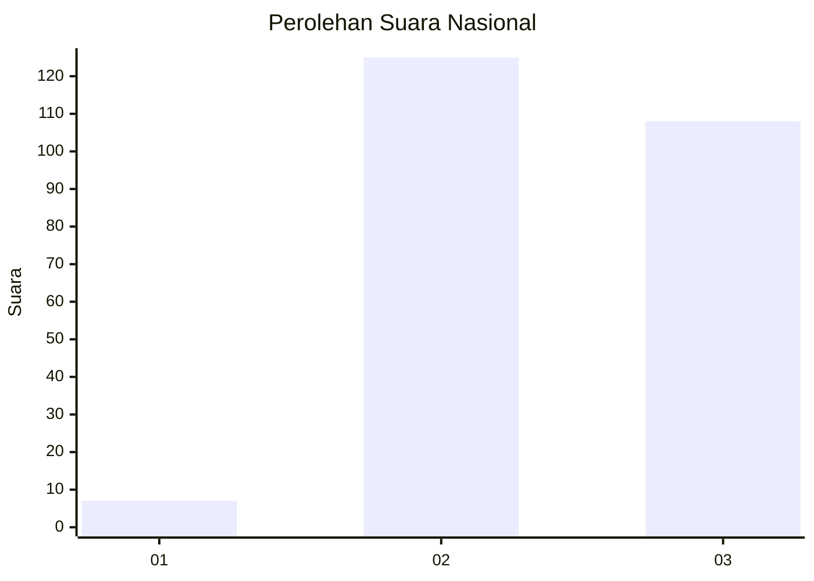
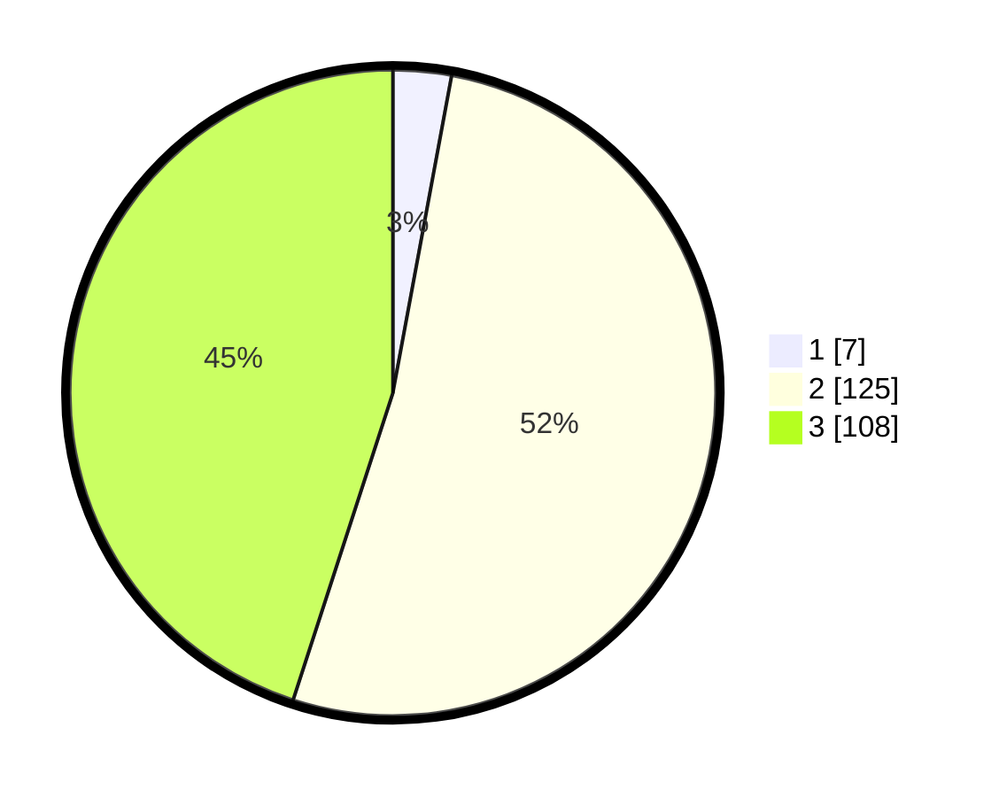

# Hasil

## Grafik

## Tabel

| No. | Nama Paslon    | Suara | Suara (raw) | Persentase |
|:--- |:-------------- | -----:| -----------:| ----------:|
| 1   | ANIES MUHAIMIN | 7     | [7][p-1]    | 2,92       |
| 2   | PRABOWO GIBRAN | 125   | [125][p-2]  | 52,08      |
| 3   | GANJAR MAHFUD  | 108   | [108][p-3]  | 45,00      |

[p-1]: https://github.com/gigit-pemilu/pemilu-2024/blob/main/pilpres/hitung-suara/sub/51-bali/sub/03-badung/sub/02-mengwi/sub/1015-sading/sub/008-tps/sub/paslon-1.txt
[p-2]: https://github.com/gigit-pemilu/pemilu-2024/blob/main/pilpres/hitung-suara/sub/51-bali/sub/03-badung/sub/02-mengwi/sub/1015-sading/sub/008-tps/sub/paslon-2.txt
[p-3]: https://github.com/gigit-pemilu/pemilu-2024/blob/main/pilpres/hitung-suara/sub/51-bali/sub/03-badung/sub/02-mengwi/sub/1015-sading/sub/008-tps/sub/paslon-3.txt

## Foto C Plano

https://sirekap-obj-formc.kpu.go.id/621a/pemilu/ppwp/51/03/02/10/15/5103021015008-20240214-213926--4707177b-762e-46ef-bd8c-c831a634e0d1.jpg

https://sirekap-obj-formc.kpu.go.id/621a/pemilu/ppwp/51/03/02/10/15/5103021015008-20240214-214324--bb470ca3-c711-441e-aabe-f9a2cdfa181b.jpg

https://sirekap-obj-formc.kpu.go.id/621a/pemilu/ppwp/51/03/02/10/15/5103021015008-20240214-214445--f4336590-9a19-480d-95cc-4e4225372668.jpg

## Metadata

| Key        | Value               |
| ---------- | ------------------- |
| Time Stamp | 2024-02-15 15:30:25 |

