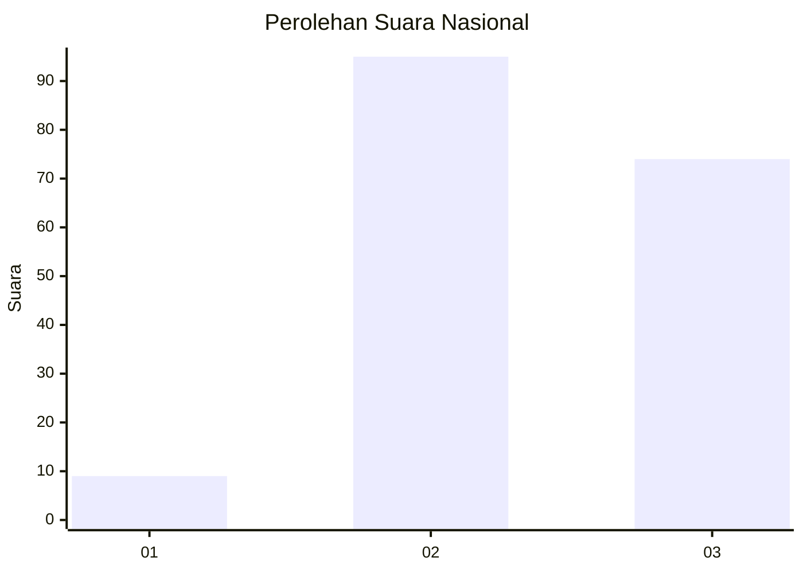
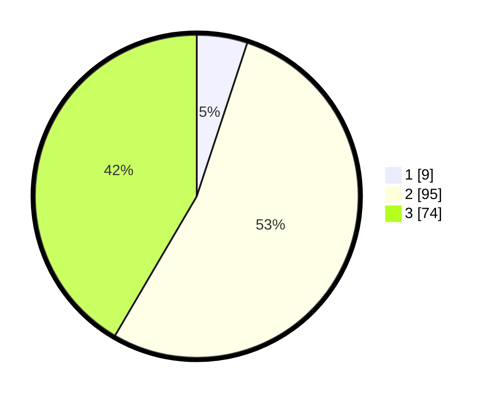

# Hasil

## Grafik

## Tabel

| No. | Nama Paslon    | Suara | Suara (raw) | Persentase |
|:--- |:-------------- | -----:| -----------:| ----------:|
| 1   | ANIES MUHAIMIN | 9     | [9][p-1]    | 5,06       |
| 2   | PRABOWO GIBRAN | 95    | [95][p-2]   | 53,37      |
| 3   | GANJAR MAHFUD  | 74    | [74][p-3]   | 41,57      |

[p-1]: https://github.com/gigit-pemilu/pemilu-2024/blob/main/pilpres/hitung-suara/sub/51-bali/sub/03-badung/sub/02-mengwi/sub/1015-sading/sub/010-tps/sub/paslon-1.txt
[p-2]: https://github.com/gigit-pemilu/pemilu-2024/blob/main/pilpres/hitung-suara/sub/51-bali/sub/03-badung/sub/02-mengwi/sub/1015-sading/sub/010-tps/sub/paslon-2.txt
[p-3]: https://github.com/gigit-pemilu/pemilu-2024/blob/main/pilpres/hitung-suara/sub/51-bali/sub/03-badung/sub/02-mengwi/sub/1015-sading/sub/010-tps/sub/paslon-3.txt

## Foto C Plano

https://sirekap-obj-formc.kpu.go.id/718e/pemilu/ppwp/51/03/02/10/15/5103021015010-20240214-212800--7dc8f572-a3bc-408a-ad57-67231199adee.jpg

https://sirekap-obj-formc.kpu.go.id/718e/pemilu/ppwp/51/03/02/10/15/5103021015010-20240214-231503--d6826bf2-bc86-4aec-aa9c-49d3debf4dbe.jpg

https://sirekap-obj-formc.kpu.go.id/718e/pemilu/ppwp/51/03/02/10/15/5103021015010-20240214-231655--1cb25350-3eeb-427f-a789-f755c3997189.jpg

## Metadata

| Key        | Value               |
| ---------- | ------------------- |
| Time Stamp | 2024-02-15 12:00:28 |

