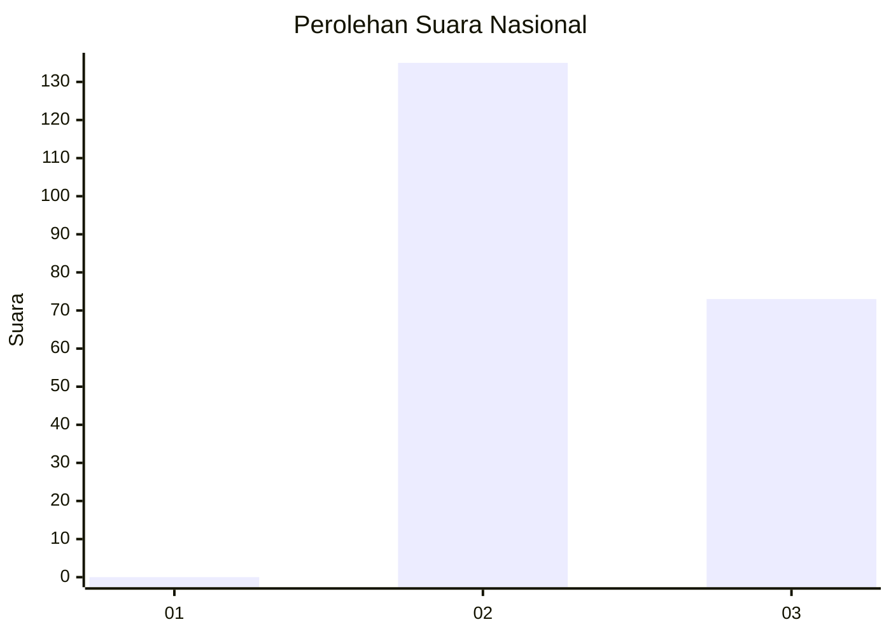
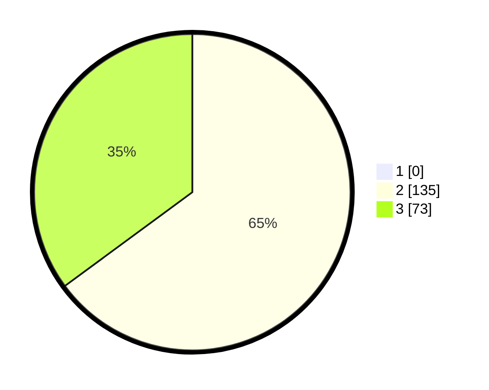

# Hasil

## Grafik

## Tabel

| No. | Nama Paslon    | Suara | Suara (raw) | Persentase |
|:--- |:-------------- | -----:| -----------:| ----------:|
| 1   | ANIES MUHAIMIN | 0     | [0][p-1]    | 0,00       |
| 2   | PRABOWO GIBRAN | 135   | [135][p-2]  | 64,90      |
| 3   | GANJAR MAHFUD  | 73    | [73][p-3]   | 35,10      |

[p-1]: https://github.com/gigit-pemilu/pemilu-2024/blob/main/pilpres/hitung-suara/sub/51-bali/sub/03-badung/sub/02-mengwi/sub/1015-sading/sub/011-tps/sub/paslon-1.txt
[p-2]: https://github.com/gigit-pemilu/pemilu-2024/blob/main/pilpres/hitung-suara/sub/51-bali/sub/03-badung/sub/02-mengwi/sub/1015-sading/sub/011-tps/sub/paslon-2.txt
[p-3]: https://github.com/gigit-pemilu/pemilu-2024/blob/main/pilpres/hitung-suara/sub/51-bali/sub/03-badung/sub/02-mengwi/sub/1015-sading/sub/011-tps/sub/paslon-3.txt

## Foto C Plano

https://sirekap-obj-formc.kpu.go.id/a3e0/pemilu/ppwp/51/03/02/10/15/5103021015011-20240215-105240--faffcb8f-055f-4c44-bb8f-687f57c240f5.jpg

https://sirekap-obj-formc.kpu.go.id/a3e0/pemilu/ppwp/51/03/02/10/15/5103021015011-20240215-105308--58bef292-1cbb-4428-8c2b-60d8bd66aeed.jpg

https://sirekap-obj-formc.kpu.go.id/a3e0/pemilu/ppwp/51/03/02/10/15/5103021015011-20240215-105258--0e1baa72-3ab9-4d11-af5b-8e89d7266da1.jpg

## Metadata

| Key        | Value               |
| ---------- | ------------------- |
| Time Stamp | 2024-02-21 12:00:00 |

## DATA PEMILIH TETAP

Jumlah pemilih dalam DPT: **227**.
 * L: **109**.
 * P: **118**.

## DATA PENGGUNA HAK PILIH

Jumlah pengguna hak pilih dalam DPT: **210**.
 * L: **100**.
 * P: **110**.

Jumlah pengguna hak pilih dalam DPTb: **1**.
 * L: **1**.
 * P: **0**.

Jumlah pengguna hak pilih dalam DPK: **211**.
 * L: **101**.
 * P: **110**.

Jumlah pengguna hak pilih: **211**.
 * L: **101**.
 * P: **110**.

## JUMLAH SUARA SAH DAN TIDAK SAH

JUMLAH SELURUH SUARA SAH: **208**.

JUMLAH SUARA TIDAK SAH: **3**.

JUMLAH SELURUH SUARA SAH DAN SUARA TIDAK SAH: **211**.

