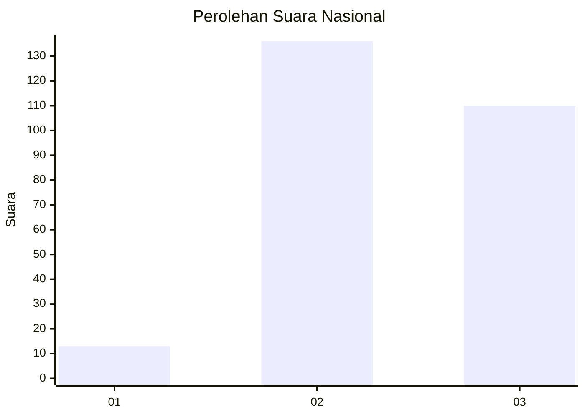
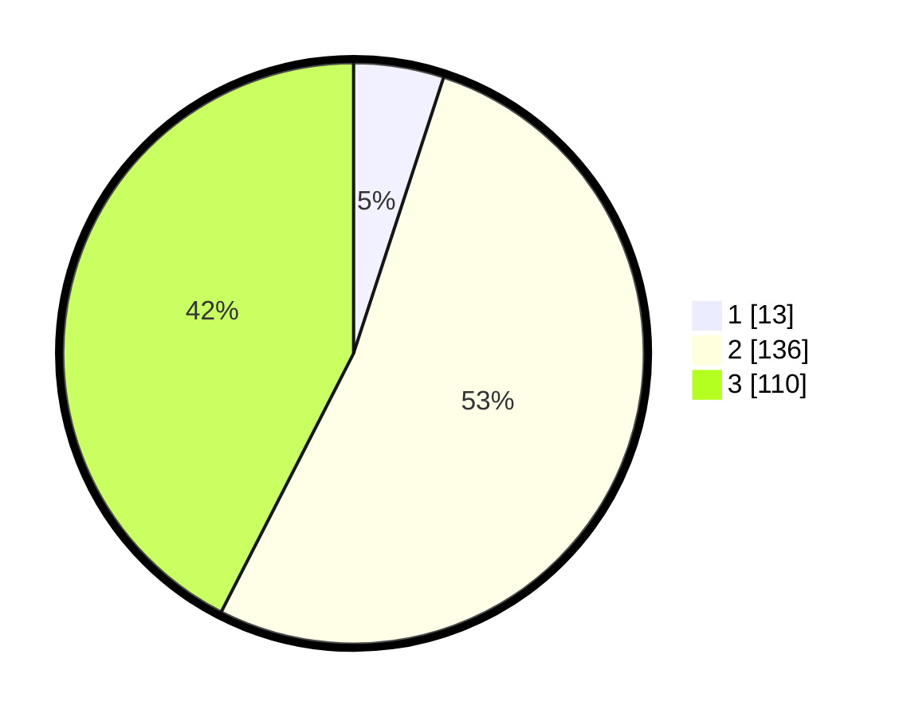

# Hasil

## Grafik

## Tabel

| No. | Nama Paslon    | Suara | Suara (raw) | Persentase |
|:--- |:-------------- | -----:| -----------:| ----------:|
| 1   | ANIES MUHAIMIN | 13    | [13][p-1]   | 5,02       |
| 2   | PRABOWO GIBRAN | 136   | [136][p-2]  | 52,51      |
| 3   | GANJAR MAHFUD  | 110   | [110][p-3]  | 42,47      |

[p-1]: https://github.com/gigit-pemilu/pemilu-2024/blob/main/pilpres/hitung-suara/sub/51-bali/sub/03-badung/sub/02-mengwi/sub/1015-sading/sub/015-tps/sub/paslon-1.txt
[p-2]: https://github.com/gigit-pemilu/pemilu-2024/blob/main/pilpres/hitung-suara/sub/51-bali/sub/03-badung/sub/02-mengwi/sub/1015-sading/sub/015-tps/sub/paslon-2.txt
[p-3]: https://github.com/gigit-pemilu/pemilu-2024/blob/main/pilpres/hitung-suara/sub/51-bali/sub/03-badung/sub/02-mengwi/sub/1015-sading/sub/015-tps/sub/paslon-3.txt

## Foto C Plano

https://sirekap-obj-formc.kpu.go.id/2463/pemilu/ppwp/51/03/02/10/15/5103021015015-20240215-034129--4649851a-8395-4841-aa30-d6f523ba2eb8.jpg

https://sirekap-obj-formc.kpu.go.id/2463/pemilu/ppwp/51/03/02/10/15/5103021015015-20240215-034355--2512e29a-c504-4b19-9213-c2adb18020a8.jpg

## Metadata

| Key        | Value               |
| ---------- | ------------------- |
| Time Stamp | 2024-02-24 22:31:28 |

