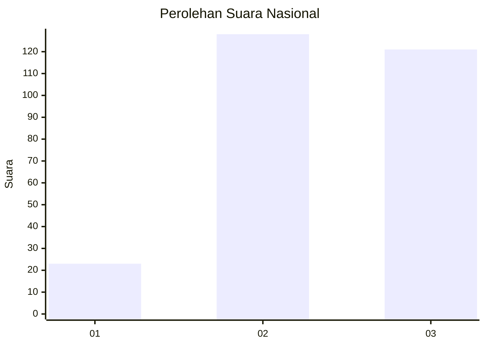
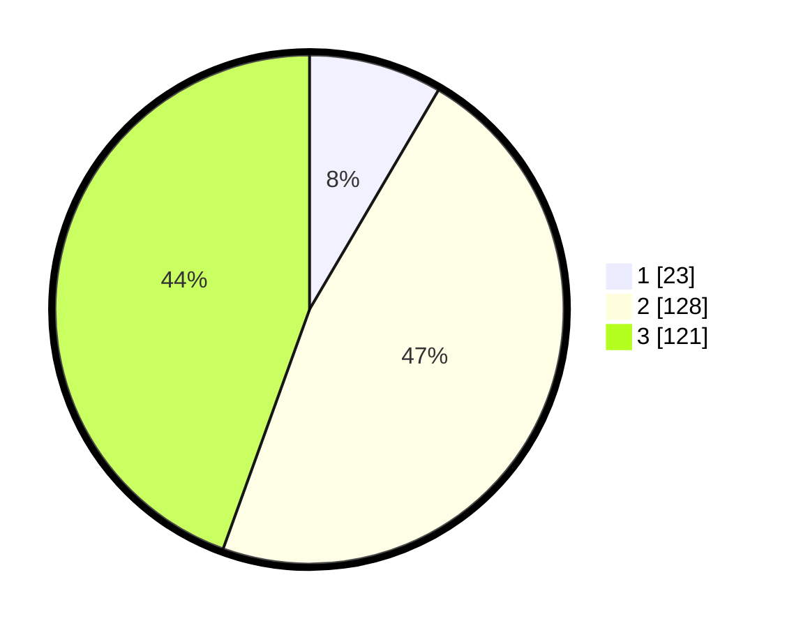

# Hasil

## Grafik

## Tabel

| No. | Nama Paslon    | Suara | Suara (raw) | Persentase |
|:--- |:-------------- | -----:| -----------:| ----------:|
| 1   | ANIES MUHAIMIN | 23    | [23][p-1]   | 8,46       |
| 2   | PRABOWO GIBRAN | 128   | [128][p-2]  | 47,06      |
| 3   | GANJAR MAHFUD  | 121   | [121][p-3]  | 44,49      |

[p-1]: https://github.com/gigit-pemilu/pemilu-2024/blob/main/pilpres/hitung-suara/sub/51-bali/sub/03-badung/sub/02-mengwi/sub/1015-sading/sub/016-tps/sub/paslon-1.txt
[p-2]: https://github.com/gigit-pemilu/pemilu-2024/blob/main/pilpres/hitung-suara/sub/51-bali/sub/03-badung/sub/02-mengwi/sub/1015-sading/sub/016-tps/sub/paslon-2.txt
[p-3]: https://github.com/gigit-pemilu/pemilu-2024/blob/main/pilpres/hitung-suara/sub/51-bali/sub/03-badung/sub/02-mengwi/sub/1015-sading/sub/016-tps/sub/paslon-3.txt

## Foto C Plano

https://sirekap-obj-formc.kpu.go.id/e3a4/pemilu/ppwp/51/03/02/10/15/5103021015016-20240214-211938--afb2672b-c0fa-4ccf-8c09-5d688599d145.jpg

https://sirekap-obj-formc.kpu.go.id/e3a4/pemilu/ppwp/51/03/02/10/15/5103021015016-20240214-211950--6560cb9e-080b-4023-9579-2cea1cd4280f.jpg

https://sirekap-obj-formc.kpu.go.id/e3a4/pemilu/ppwp/51/03/02/10/15/5103021015016-20240214-211959--b8e1287b-26e7-4fac-81c6-537795c6f1fc.jpg

## Metadata

| Key        | Value               |
| ---------- | ------------------- |
| Time Stamp | 2024-02-24 22:31:28 |

## DATA PEMILIH TETAP

Jumlah pemilih dalam DPT: **294**.
 * L: **145**.
 * P: **149**.

## DATA PENGGUNA HAK PILIH

Jumlah pengguna hak pilih dalam DPT: **265**.
 * L: **129**.
 * P: **136**.

Jumlah pengguna hak pilih dalam DPTb: **7**.
 * L: **4**.
 * P: **3**.

Jumlah pengguna hak pilih dalam DPK: **0**.
 * L: **0**.
 * P: **0**.

Jumlah pengguna hak pilih: **272**.
 * L: **133**.
 * P: **139**.

## JUMLAH SUARA SAH DAN TIDAK SAH

JUMLAH SELURUH SUARA SAH: **272**.

JUMLAH SUARA TIDAK SAH: **0**.

JUMLAH SELURUH SUARA SAH DAN SUARA TIDAK SAH: **272**.

