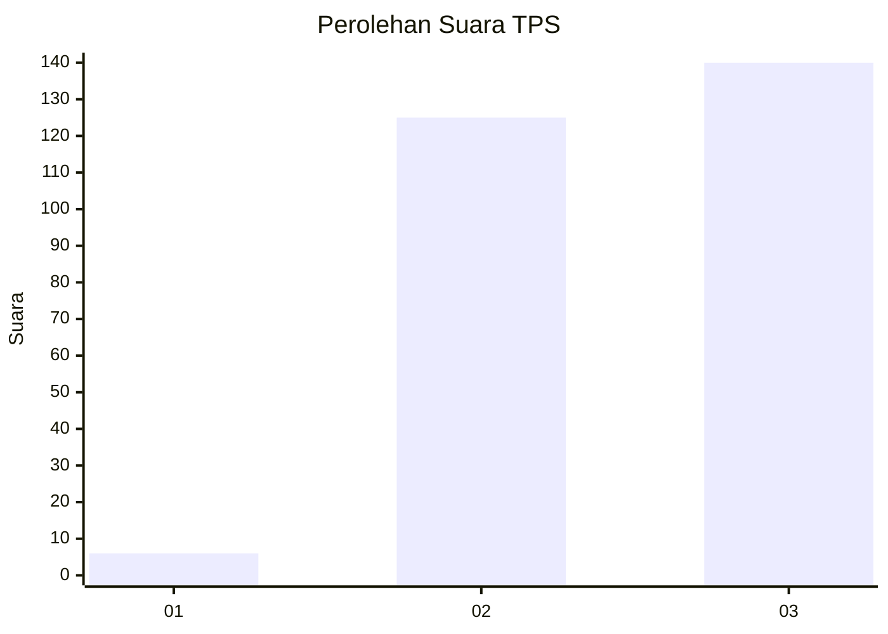
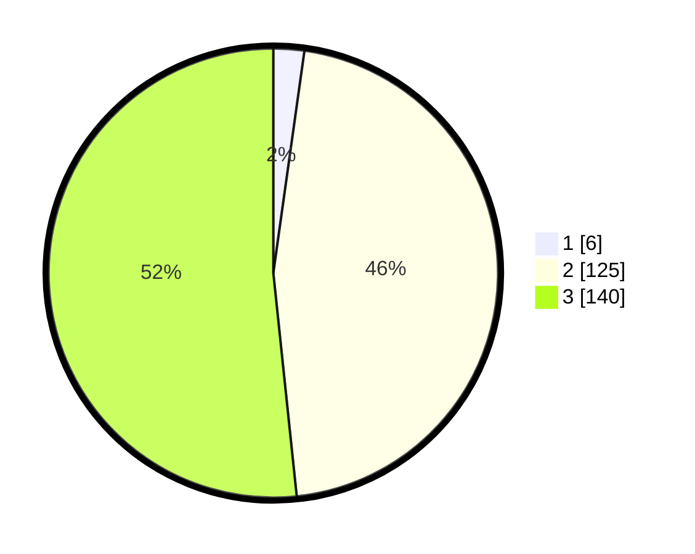

# Hasil

## Grafik

## Tabel

| No. | Nama Paslon    | Suara | Suara (raw) | Persentase |
|:--- |:-------------- | -----:| -----------:| ----------:|
| 1   | ANIES MUHAIMIN | 6     | [6][p-1]    | 2,21       |
| 2   | PRABOWO GIBRAN | 125   | [125][p-2]  | 46,13      |
| 3   | GANJAR MAHFUD  | 140   | [140][p-3]  | 51,66      |

[p-1]: https://github.com/gigit-pemilu/pemilu-2024-51-bali/blob/main/pilpres/hitung-suara/sub/51-bali/sub/03-badung/sub/02-mengwi/sub/1015-sading/sub/017-tps/sub/paslon-1.txt
[p-2]: https://github.com/gigit-pemilu/pemilu-2024-51-bali/blob/main/pilpres/hitung-suara/sub/51-bali/sub/03-badung/sub/02-mengwi/sub/1015-sading/sub/017-tps/sub/paslon-2.txt
[p-3]: https://github.com/gigit-pemilu/pemilu-2024-51-bali/blob/main/pilpres/hitung-suara/sub/51-bali/sub/03-badung/sub/02-mengwi/sub/1015-sading/sub/017-tps/sub/paslon-3.txt

## Foto C Plano

https://sirekap-obj-formc.kpu.go.id/d3f6/pemilu/ppwp/51/03/02/10/15/5103021015017-20240215-014745--7fbd5fd6-7b42-4a23-8b41-f13b17fc0cda.jpg

https://sirekap-obj-formc.kpu.go.id/d3f6/pemilu/ppwp/51/03/02/10/15/5103021015017-20240215-014522--63ad56dc-5117-47a4-b6b7-da6f8fed4b7c.jpg

https://sirekap-obj-formc.kpu.go.id/d3f6/pemilu/ppwp/51/03/02/10/15/5103021015017-20240215-015103--00c64380-c475-4001-a16d-83c8287d43b7.jpg

## Metadata

| Key        | Value               |
| ---------- | ------------------- |
| Time Stamp | 2024-02-25 00:00:00 |

