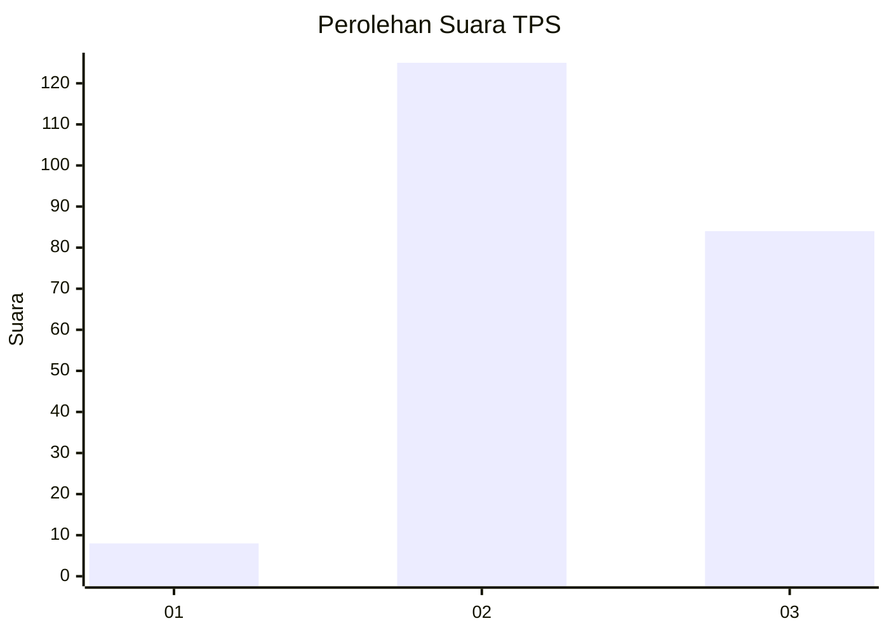
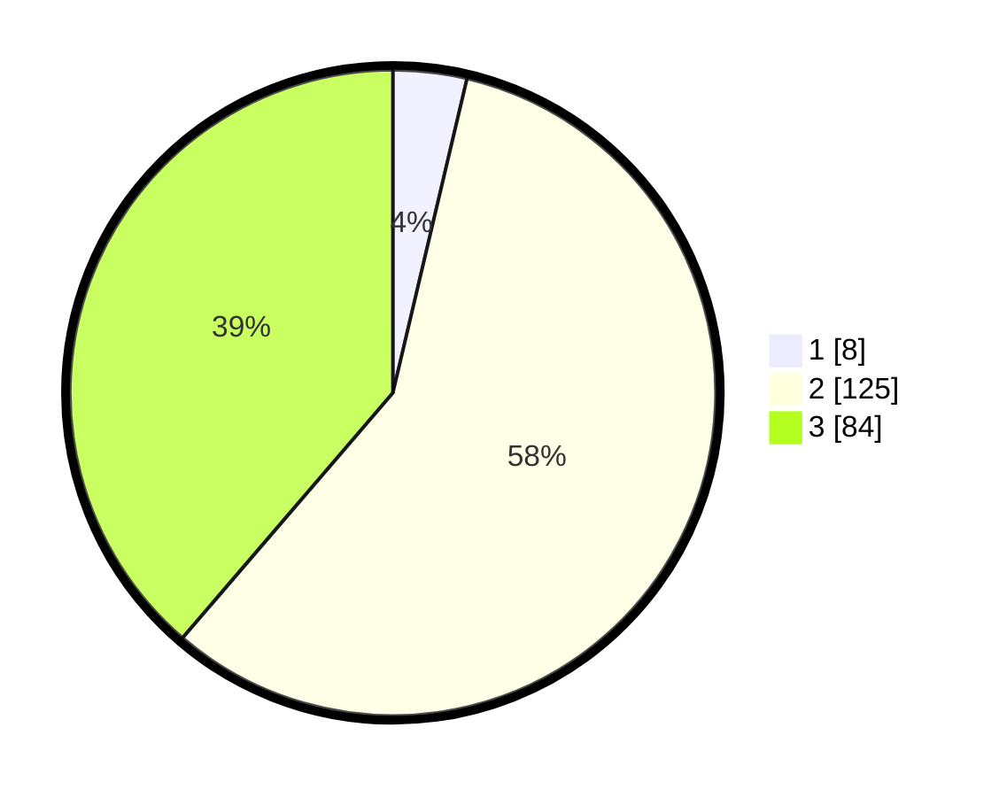

# Hasil

## Grafik

## Tabel

| No. | Nama Paslon    | Suara | Suara (raw) | Persentase |
|:--- |:-------------- | -----:| -----------:| ----------:|
| 1   | ANIES MUHAIMIN | 8     | [8][p-1]    | 3,69       |
| 2   | PRABOWO GIBRAN | 125   | [125][p-2]  | 57,60      |
| 3   | GANJAR MAHFUD  | 84    | [84][p-3]   | 38,71      |

[p-1]: https://github.com/gigit-pemilu/pemilu-2024-51-bali/blob/main/pilpres/hitung-suara/sub/51-bali/sub/03-badung/sub/02-mengwi/sub/1015-sading/sub/018-tps/sub/paslon-1.txt
[p-2]: https://github.com/gigit-pemilu/pemilu-2024-51-bali/blob/main/pilpres/hitung-suara/sub/51-bali/sub/03-badung/sub/02-mengwi/sub/1015-sading/sub/018-tps/sub/paslon-2.txt
[p-3]: https://github.com/gigit-pemilu/pemilu-2024-51-bali/blob/main/pilpres/hitung-suara/sub/51-bali/sub/03-badung/sub/02-mengwi/sub/1015-sading/sub/018-tps/sub/paslon-3.txt

## Foto C Plano

https://sirekap-obj-formc.kpu.go.id/5cd8/pemilu/ppwp/51/03/02/10/15/5103021015018-20240215-011222--69621a05-d9da-4e76-8966-2a764d126ebb.jpg

https://sirekap-obj-formc.kpu.go.id/5cd8/pemilu/ppwp/51/03/02/10/15/5103021015018-20240215-011535--79b902a1-e424-4e49-bcd4-fe393cb5db8c.jpg

https://sirekap-obj-formc.kpu.go.id/5cd8/pemilu/ppwp/51/03/02/10/15/5103021015018-20240215-011735--1ca80d4b-3f13-4c39-8bd8-7f9dc227a006.jpg

## Metadata

| Key        | Value               |
| ---------- | ------------------- |
| Time Stamp | 2024-02-24 22:31:28 |

