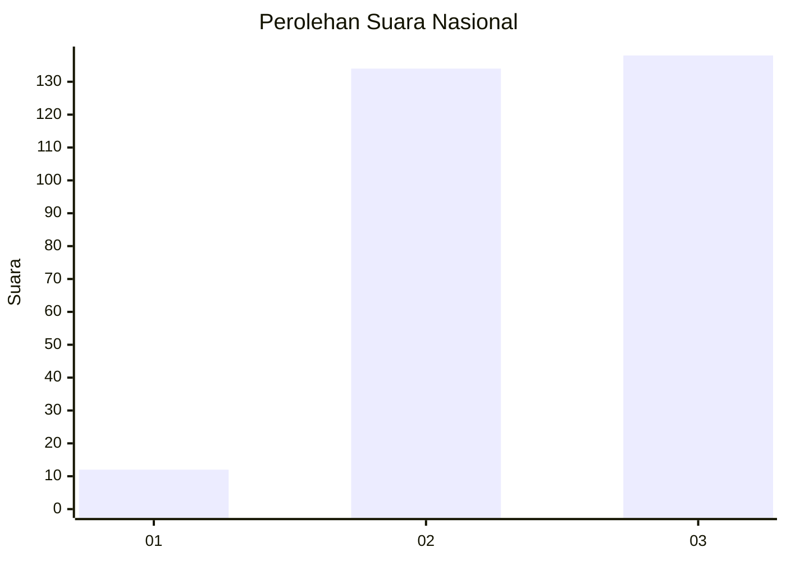
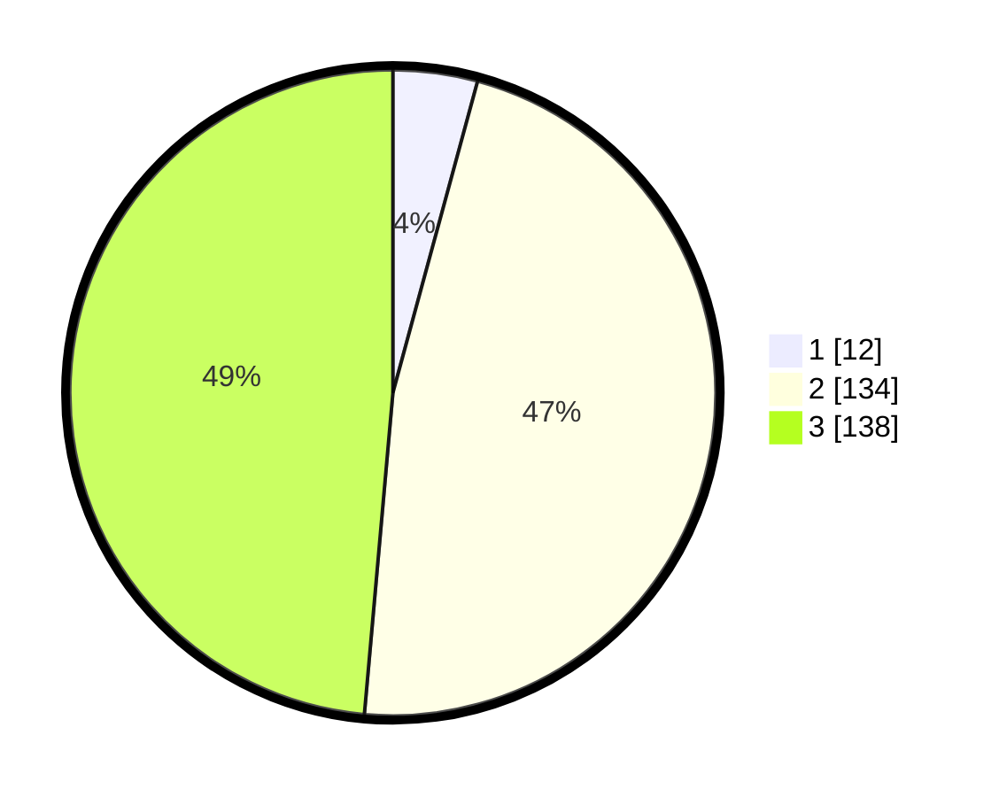

# Hasil

## Grafik

## Tabel

| No. | Nama Paslon    | Suara | Suara (raw) | Persentase |
|:--- |:-------------- | -----:| -----------:| ----------:|
| 1   | ANIES MUHAIMIN | 12    | [12][p-1]   | 4,23       |
| 2   | PRABOWO GIBRAN | 134   | [134][p-2]  | 47,18      |
| 3   | GANJAR MAHFUD  | 138   | [138][p-3]  | 48,59      |

[p-1]: https://github.com/gigit-pemilu/pemilu-2024/blob/main/pilpres/hitung-suara/sub/51-bali/sub/03-badung/sub/02-mengwi/sub/1015-sading/sub/019-tps/sub/paslon-1.txt
[p-2]: https://github.com/gigit-pemilu/pemilu-2024/blob/main/pilpres/hitung-suara/sub/51-bali/sub/03-badung/sub/02-mengwi/sub/1015-sading/sub/019-tps/sub/paslon-2.txt
[p-3]: https://github.com/gigit-pemilu/pemilu-2024/blob/main/pilpres/hitung-suara/sub/51-bali/sub/03-badung/sub/02-mengwi/sub/1015-sading/sub/019-tps/sub/paslon-3.txt

## Foto C Plano

https://sirekap-obj-formc.kpu.go.id/7484/pemilu/ppwp/51/03/02/10/15/5103021015019-20240216-125238--3fa11d83-cc72-41db-a5e4-a3606b416c96.jpg

https://sirekap-obj-formc.kpu.go.id/7484/pemilu/ppwp/51/03/02/10/15/5103021015019-20240218-132735--c317c7b3-08c9-4ea5-96db-df0718841a85.jpg

https://sirekap-obj-formc.kpu.go.id/7484/pemilu/ppwp/51/03/02/10/15/5103021015019-20240216-125518--340716fe-a658-4a7a-94b8-f76a69445c53.jpg

## Metadata

| Key        | Value               |
| ---------- | ------------------- |
| Time Stamp | 2024-02-24 22:31:28 |

## DATA PEMILIH TETAP

Jumlah pemilih dalam DPT: **290**.
 * L: **143**.
 * P: **147**.

## DATA PENGGUNA HAK PILIH

Jumlah pengguna hak pilih dalam DPT: **281**.
 * L: **138**.
 * P: **143**.

Jumlah pengguna hak pilih dalam DPTb: **4**.
 * L: **2**.
 * P: **2**.

Jumlah pengguna hak pilih dalam DPK: **1**.
 * L: **0**.
 * P: **1**.

Jumlah pengguna hak pilih: **286**.
 * L: **140**.
 * P: **146**.

## JUMLAH SUARA SAH DAN TIDAK SAH

JUMLAH SELURUH SUARA SAH: **284**.

JUMLAH SUARA TIDAK SAH: **2**.

JUMLAH SELURUH SUARA SAH DAN SUARA TIDAK SAH: **286**.

