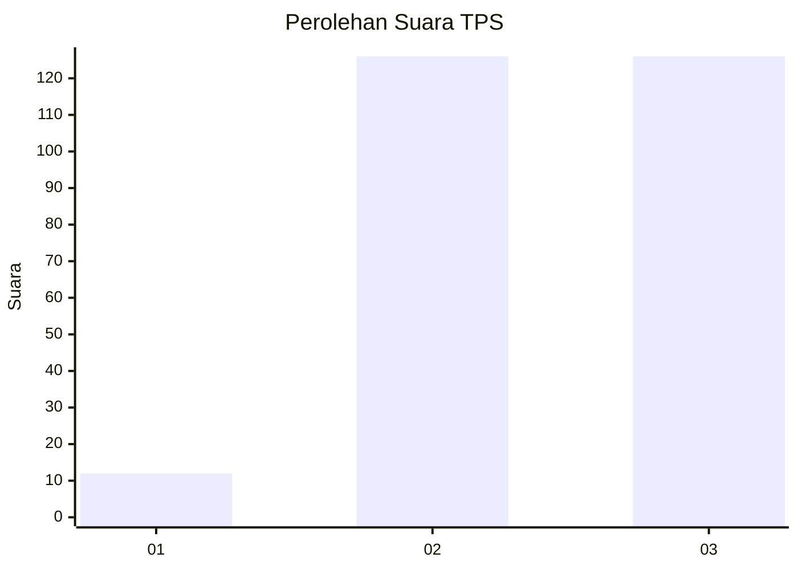
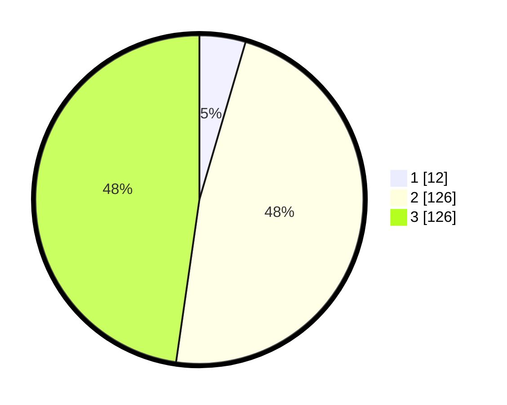

# Hasil

## Grafik

## Tabel

| No. | Nama Paslon    | Suara | Suara (raw) | Persentase |
|:--- |:-------------- | -----:| -----------:| ----------:|
| 1   | ANIES MUHAIMIN | 12    | [12][p-1]   | 4,55       |
| 2   | PRABOWO GIBRAN | 126   | [126][p-2]  | 47,73      |
| 3   | GANJAR MAHFUD  | 126   | [126][p-3]  | 47,73      |

[p-1]: https://github.com/gigit-pemilu/pemilu-2024-51-bali/blob/main/pilpres/hitung-suara/sub/51-bali/sub/03-badung/sub/02-mengwi/sub/1015-sading/sub/020-tps/sub/paslon-1.txt
[p-2]: https://github.com/gigit-pemilu/pemilu-2024-51-bali/blob/main/pilpres/hitung-suara/sub/51-bali/sub/03-badung/sub/02-mengwi/sub/1015-sading/sub/020-tps/sub/paslon-2.txt
[p-3]: https://github.com/gigit-pemilu/pemilu-2024-51-bali/blob/main/pilpres/hitung-suara/sub/51-bali/sub/03-badung/sub/02-mengwi/sub/1015-sading/sub/020-tps/sub/paslon-3.txt

## Foto C Plano

https://sirekap-obj-formc.kpu.go.id/cffc/pemilu/ppwp/51/03/02/10/15/5103021015020-20240214-192154--1a3d112f-acea-4d3a-b77f-fc40fd37057a.jpg

https://sirekap-obj-formc.kpu.go.id/cffc/pemilu/ppwp/51/03/02/10/15/5103021015020-20240214-192242--62081f50-ec92-44b2-9154-90e1cce0864c.jpg

https://sirekap-obj-formc.kpu.go.id/cffc/pemilu/ppwp/51/03/02/10/15/5103021015020-20240214-192051--55cf0d9a-da4e-4218-8951-6e0f8014cef5.jpg

## Metadata

| Key        | Value               |
| ---------- | ------------------- |
| Time Stamp | 2024-02-14 21:46:01 |

## DATA PEMILIH TETAP

Jumlah pemilih dalam DPT: **286**.
 * L: **147**.
 * P: **139**.

## DATA PENGGUNA HAK PILIH

Jumlah pengguna hak pilih dalam DPT: **261**.
 * L: **132**.
 * P: **129**.

Jumlah pengguna hak pilih dalam DPTb: **6**.
 * L: **2**.
 * P: **4**.

Jumlah pengguna hak pilih dalam DPK: **0**.
 * L: **0**.
 * P: **0**.

Jumlah pengguna hak pilih: **267**.
 * L: **134**.
 * P: **133**.

## JUMLAH SUARA SAH DAN TIDAK SAH

JUMLAH SELURUH SUARA SAH: **264**.

JUMLAH SUARA TIDAK SAH: **3**.

JUMLAH SELURUH SUARA SAH DAN SUARA TIDAK SAH: **267**.

