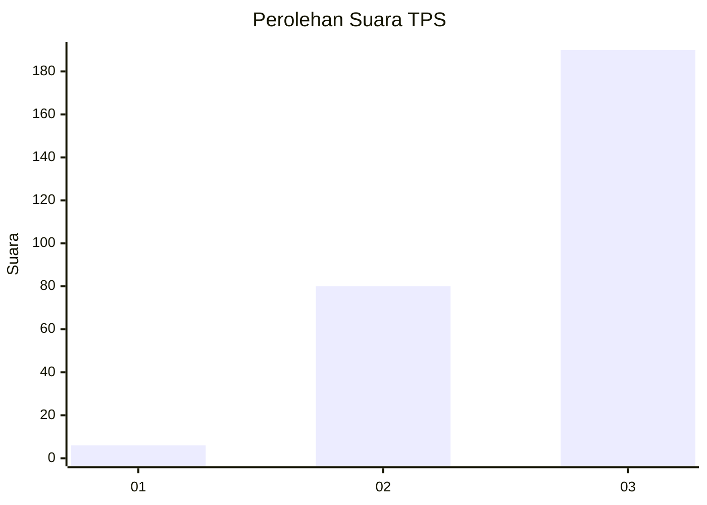
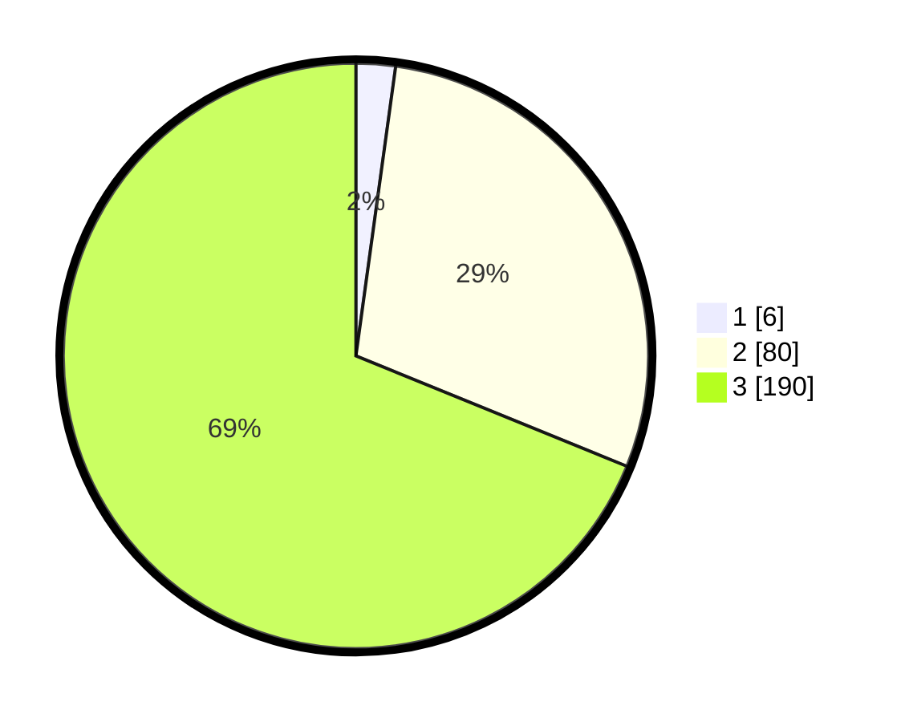

# Hasil

## Grafik

## Tabel

| No. | Nama Paslon    | Suara | Suara (raw) | Persentase |
|:--- |:-------------- | -----:| -----------:| ----------:|
| 1   | ANIES MUHAIMIN | 6     | [6][p-1]    | 2,17       |
| 2   | PRABOWO GIBRAN | 80    | [80][p-2]   | 28,99      |
| 3   | GANJAR MAHFUD  | 190   | [190][p-3]  | 68,84      |

[p-1]: https://github.com/gigit-pemilu/pemilu-2024-51-bali/blob/main/pilpres/hitung-suara/sub/51-bali/sub/03-badung/sub/02-mengwi/sub/1015-sading/sub/021-tps/sub/paslon-1.txt
[p-2]: https://github.com/gigit-pemilu/pemilu-2024-51-bali/blob/main/pilpres/hitung-suara/sub/51-bali/sub/03-badung/sub/02-mengwi/sub/1015-sading/sub/021-tps/sub/paslon-2.txt
[p-3]: https://github.com/gigit-pemilu/pemilu-2024-51-bali/blob/main/pilpres/hitung-suara/sub/51-bali/sub/03-badung/sub/02-mengwi/sub/1015-sading/sub/021-tps/sub/paslon-3.txt

## Foto C Plano

https://sirekap-obj-formc.kpu.go.id/43f7/pemilu/ppwp/51/03/02/10/15/5103021015021-20240220-193929--de4f6157-e4e7-44a9-9e84-6b78d0f9ffeb.jpg

https://sirekap-obj-formc.kpu.go.id/43f7/pemilu/ppwp/51/03/02/10/15/5103021015021-20240220-193930--970a7b9c-4d28-4611-84c1-1ae8706ddf96.jpg

https://sirekap-obj-formc.kpu.go.id/43f7/pemilu/ppwp/51/03/02/10/15/5103021015021-20240220-075654--293dc900-4a23-4613-9a23-c1bbaf9579a0.jpg

## Metadata

| Key        | Value               |
| ---------- | ------------------- |
| Time Stamp | 2024-02-24 22:31:28 |

## DATA PEMILIH TETAP

Jumlah pemilih dalam DPT: **292**.
 * L: **133**.
 * P: **159**.

## DATA PENGGUNA HAK PILIH

Jumlah pengguna hak pilih dalam DPT: **279**.
 * L: **128**.
 * P: **151**.

Jumlah pengguna hak pilih dalam DPTb: **3**.
 * L: **0**.
 * P: **3**.

Jumlah pengguna hak pilih dalam DPK: **2**.
 * L: **2**.
 * P: **0**.

Jumlah pengguna hak pilih: **284**.
 * L: **130**.
 * P: **154**.

## JUMLAH SUARA SAH DAN TIDAK SAH

JUMLAH SELURUH SUARA SAH: **276**.

JUMLAH SUARA TIDAK SAH: **8**.

JUMLAH SELURUH SUARA SAH DAN SUARA TIDAK SAH: **284**.

