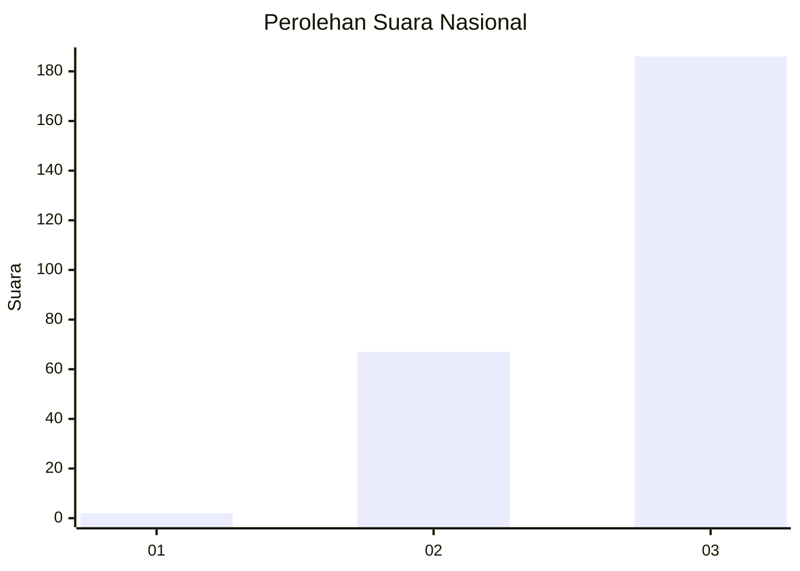
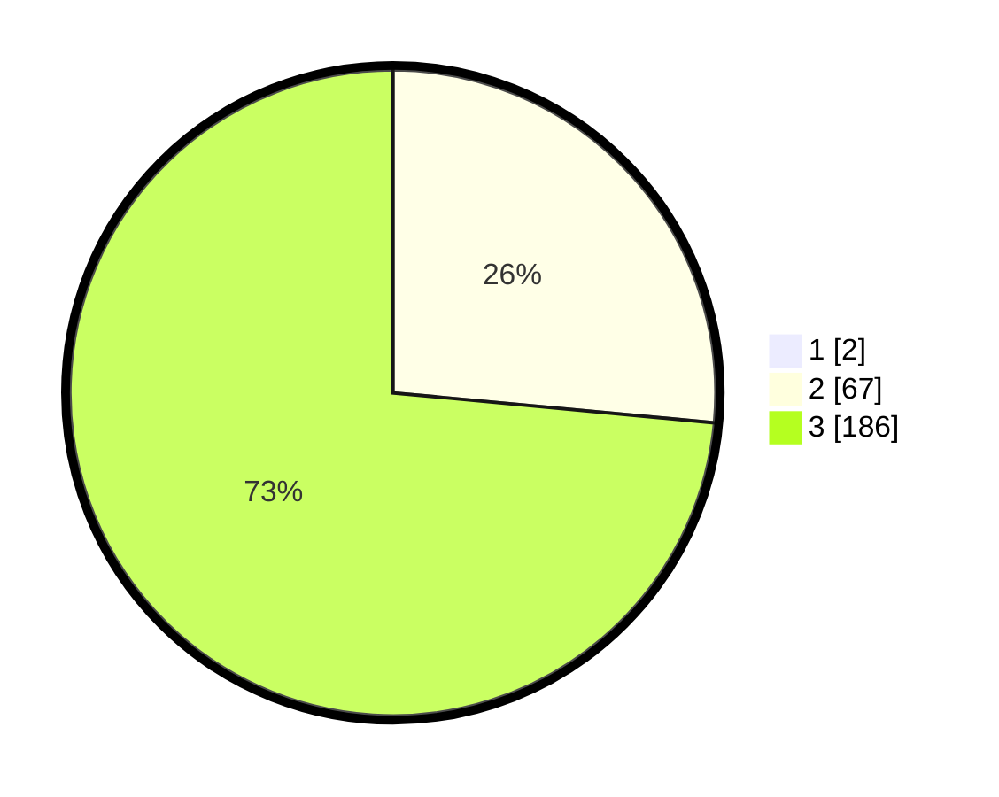

# Hasil

## Grafik

## Tabel

| No. | Nama Paslon    | Suara | Suara (raw) | Persentase |
|:--- |:-------------- | -----:| -----------:| ----------:|
| 1   | ANIES MUHAIMIN | 2     | [2][p-1]    | 0,78       |
| 2   | PRABOWO GIBRAN | 67    | [67][p-2]   | 26,27      |
| 3   | GANJAR MAHFUD  | 186   | [186][p-3]  | 72,94      |

[p-1]: https://github.com/gigit-pemilu/pemilu-2024/blob/main/pilpres/hitung-suara/sub/51-bali/sub/03-badung/sub/02-mengwi/sub/1015-sading/sub/022-tps/sub/paslon-1.txt
[p-2]: https://github.com/gigit-pemilu/pemilu-2024/blob/main/pilpres/hitung-suara/sub/51-bali/sub/03-badung/sub/02-mengwi/sub/1015-sading/sub/022-tps/sub/paslon-2.txt
[p-3]: https://github.com/gigit-pemilu/pemilu-2024/blob/main/pilpres/hitung-suara/sub/51-bali/sub/03-badung/sub/02-mengwi/sub/1015-sading/sub/022-tps/sub/paslon-3.txt

## Foto C Plano

https://sirekap-obj-formc.kpu.go.id/7ef7/pemilu/ppwp/51/03/02/10/15/5103021015022-20240214-232110--1cd95fe8-8838-41c2-b9ba-67bfa8b0530b.jpg

https://sirekap-obj-formc.kpu.go.id/7ef7/pemilu/ppwp/51/03/02/10/15/5103021015022-20240214-232205--e3c8cf9f-7eff-4dd8-b638-3384a4f03b0e.jpg

https://sirekap-obj-formc.kpu.go.id/7ef7/pemilu/ppwp/51/03/02/10/15/5103021015022-20240214-232218--f6506543-e2ec-4f4d-9829-43c6b6c8cde8.jpg

## Metadata

| Key        | Value               |
| ---------- | ------------------- |
| Time Stamp | 2024-02-24 22:31:28 |

