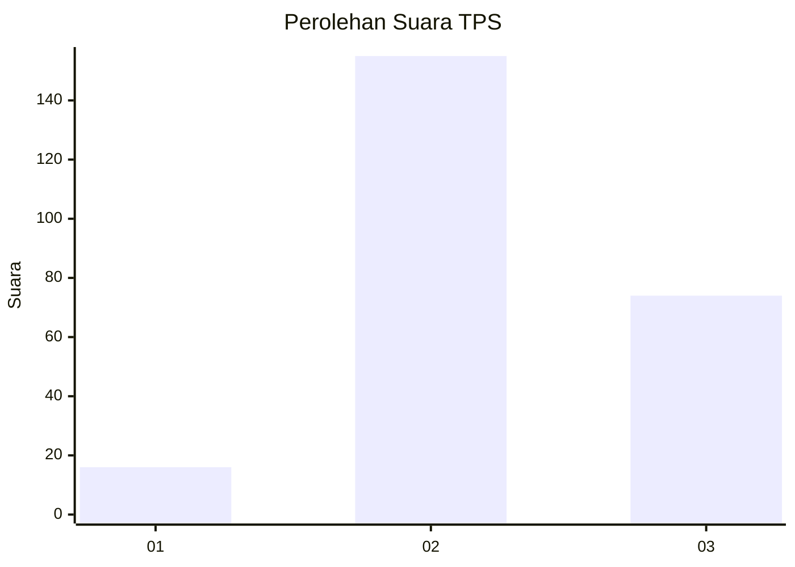
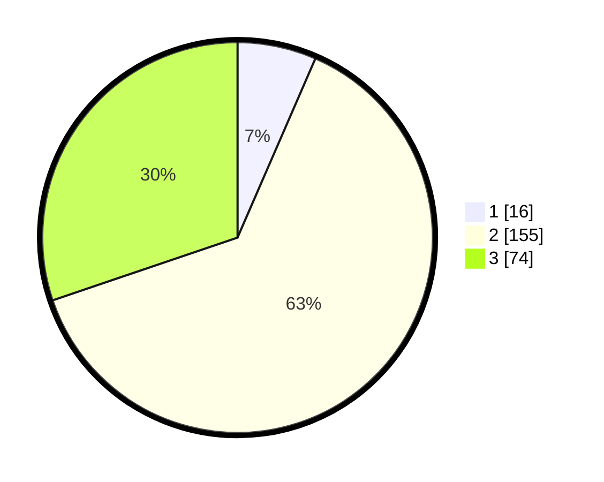

# Hasil

## Grafik

## Tabel

| No. | Nama Paslon    | Suara | Suara (raw) | Persentase |
|:--- |:-------------- | -----:| -----------:| ----------:|
| 1   | ANIES MUHAIMIN | 16    | [16][p-1]   | 6,53       |
| 2   | PRABOWO GIBRAN | 155   | [155][p-2]  | 63,27      |
| 3   | GANJAR MAHFUD  | 74    | [74][p-3]   | 30,20      |

[p-1]: https://github.com/gigit-pemilu/pemilu-2024-51-bali/blob/main/pilpres/hitung-suara/sub/51-bali/sub/03-badung/sub/02-mengwi/sub/1015-sading/sub/023-tps/sub/paslon-1.txt
[p-2]: https://github.com/gigit-pemilu/pemilu-2024-51-bali/blob/main/pilpres/hitung-suara/sub/51-bali/sub/03-badung/sub/02-mengwi/sub/1015-sading/sub/023-tps/sub/paslon-2.txt
[p-3]: https://github.com/gigit-pemilu/pemilu-2024-51-bali/blob/main/pilpres/hitung-suara/sub/51-bali/sub/03-badung/sub/02-mengwi/sub/1015-sading/sub/023-tps/sub/paslon-3.txt

## Foto C Plano

https://sirekap-obj-formc.kpu.go.id/bf74/pemilu/ppwp/51/03/02/10/15/5103021015023-20240214-155851--6beb7578-ccbd-4a0f-b2e7-e7ae748da80a.jpg

https://sirekap-obj-formc.kpu.go.id/bf74/pemilu/ppwp/51/03/02/10/15/5103021015023-20240214-155901--0f9cb93a-eb5f-4ece-bf01-53424bdc373e.jpg

https://sirekap-obj-formc.kpu.go.id/bf74/pemilu/ppwp/51/03/02/10/15/5103021015023-20240214-155907--3a3fd437-7ddb-4e96-8863-26a05eb5a126.jpg

## Metadata

| Key        | Value               |
| ---------- | ------------------- |
| Time Stamp | 2024-02-14 21:46:01 |

## DATA PEMILIH TETAP

Jumlah pemilih dalam DPT: **288**.
 * L: **139**.
 * P: **149**.

## DATA PENGGUNA HAK PILIH

Jumlah pengguna hak pilih dalam DPT: **243**.
 * L: **120**.
 * P: **123**.

Jumlah pengguna hak pilih dalam DPTb: **6**.
 * L: **4**.
 * P: **2**.

Jumlah pengguna hak pilih dalam DPK: **1**.
 * L: **0**.
 * P: **1**.

Jumlah pengguna hak pilih: **250**.
 * L: **124**.
 * P: **126**.

## JUMLAH SUARA SAH DAN TIDAK SAH

JUMLAH SELURUH SUARA SAH: **245**.

JUMLAH SUARA TIDAK SAH: **5**.

JUMLAH SELURUH SUARA SAH DAN SUARA TIDAK SAH: **250**.

