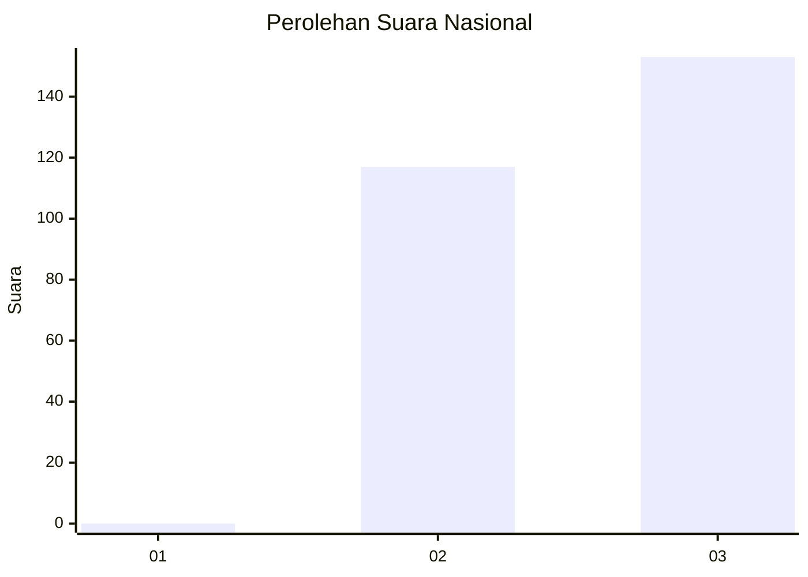
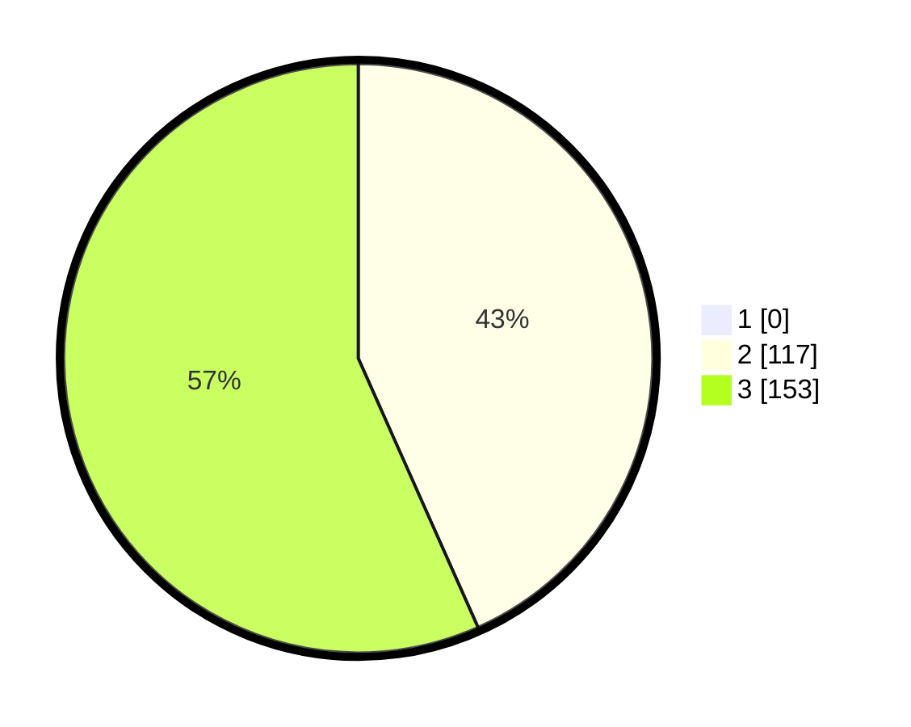

# Hasil

## Grafik

## Tabel

| No. | Nama Paslon    | Suara | Suara (raw) | Persentase |
|:--- |:-------------- | -----:| -----------:| ----------:|
| 1   | ANIES MUHAIMIN | 0     | [0][p-1]    | 0,00       |
| 2   | PRABOWO GIBRAN | 117   | [117][p-2]  | 43,33      |
| 3   | GANJAR MAHFUD  | 153   | [153][p-3]  | 56,67      |

[p-1]: https://github.com/gigit-pemilu/pemilu-2024/blob/main/pilpres/hitung-suara/sub/51-bali/sub/03-badung/sub/02-mengwi/sub/1016-lukluk/sub/001-tps/sub/paslon-1.txt
[p-2]: https://github.com/gigit-pemilu/pemilu-2024/blob/main/pilpres/hitung-suara/sub/51-bali/sub/03-badung/sub/02-mengwi/sub/1016-lukluk/sub/001-tps/sub/paslon-2.txt
[p-3]: https://github.com/gigit-pemilu/pemilu-2024/blob/main/pilpres/hitung-suara/sub/51-bali/sub/03-badung/sub/02-mengwi/sub/1016-lukluk/sub/001-tps/sub/paslon-3.txt

## Foto C Plano

https://sirekap-obj-formc.kpu.go.id/8e82/pemilu/ppwp/51/03/02/10/16/5103021016001-20240218-162500--6b337220-d5c0-4eac-9a9c-202b027f749e.jpg

https://sirekap-obj-formc.kpu.go.id/8e82/pemilu/ppwp/51/03/02/10/16/5103021016001-20240218-162837--5d50f9b6-140b-4b11-bbfe-68c9b0ebb21a.jpg

https://sirekap-obj-formc.kpu.go.id/8e82/pemilu/ppwp/51/03/02/10/16/5103021016001-20240218-162919--72ab8732-b721-4306-8fda-98dd25aa1f64.jpg

## Metadata

| Key        | Value               |
| ---------- | ------------------- |
| Time Stamp | 2024-02-24 22:31:28 |

