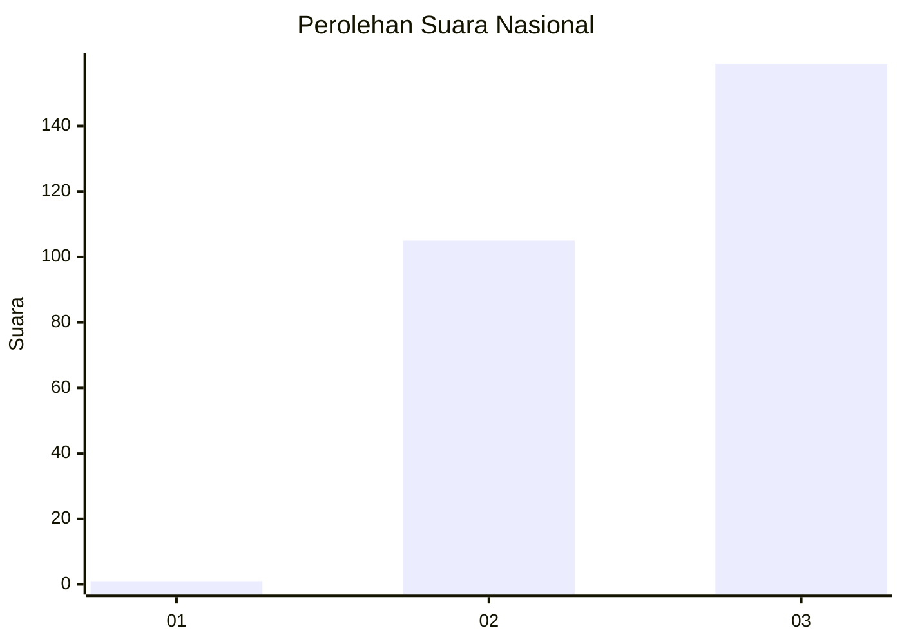
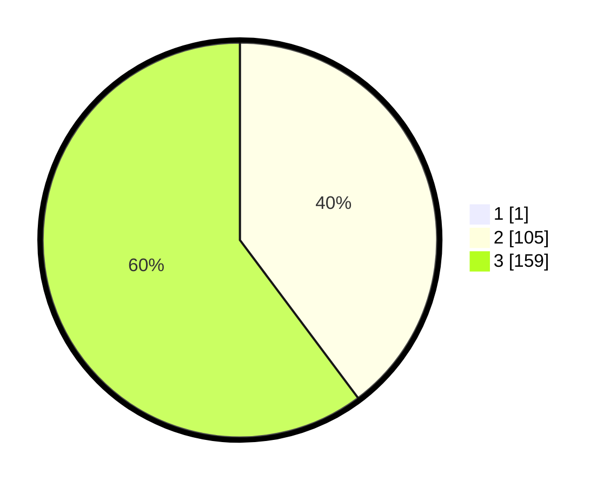

# Hasil

## Grafik

## Tabel

| No. | Nama Paslon    | Suara | Suara (raw) | Persentase |
|:--- |:-------------- | -----:| -----------:| ----------:|
| 1   | ANIES MUHAIMIN | 1     | [1][p-1]    | 0,38       |
| 2   | PRABOWO GIBRAN | 105   | [105][p-2]  | 39,62      |
| 3   | GANJAR MAHFUD  | 159   | [159][p-3]  | 60,00      |

[p-1]: https://github.com/gigit-pemilu/pemilu-2024/blob/main/pilpres/hitung-suara/sub/51-bali/sub/03-badung/sub/02-mengwi/sub/1016-lukluk/sub/002-tps/sub/paslon-1.txt
[p-2]: https://github.com/gigit-pemilu/pemilu-2024/blob/main/pilpres/hitung-suara/sub/51-bali/sub/03-badung/sub/02-mengwi/sub/1016-lukluk/sub/002-tps/sub/paslon-2.txt
[p-3]: https://github.com/gigit-pemilu/pemilu-2024/blob/main/pilpres/hitung-suara/sub/51-bali/sub/03-badung/sub/02-mengwi/sub/1016-lukluk/sub/002-tps/sub/paslon-3.txt

## Foto C Plano

https://sirekap-obj-formc.kpu.go.id/0c43/pemilu/ppwp/51/03/02/10/16/5103021016002-20240215-010850--bdf8dcd7-a258-4c41-a65b-8d9ed0a4d9e1.jpg

https://sirekap-obj-formc.kpu.go.id/0c43/pemilu/ppwp/51/03/02/10/16/5103021016002-20240215-011109--07b94e2e-b90e-418d-88de-c9f14139628f.jpg

https://sirekap-obj-formc.kpu.go.id/0c43/pemilu/ppwp/51/03/02/10/16/5103021016002-20240215-011223--8a604764-a7f7-4d37-8ec2-d2f734cc4291.jpg

## Metadata

| Key        | Value               |
| ---------- | ------------------- |
| Time Stamp | 2024-02-15 15:00:29 |

## DATA PEMILIH TETAP

Jumlah pemilih dalam DPT: **290**.
 * L: **136**.
 * P: **154**.

## DATA PENGGUNA HAK PILIH

Jumlah pengguna hak pilih dalam DPT: **275**.
 * L: **128**.
 * P: **147**.

Jumlah pengguna hak pilih dalam DPTb: **0**.
 * L: **0**.
 * P: **0**.

Jumlah pengguna hak pilih dalam DPK: **0**.
 * L: **0**.
 * P: **0**.

Jumlah pengguna hak pilih: **275**.
 * L: **128**.
 * P: **147**.

## JUMLAH SUARA SAH DAN TIDAK SAH

JUMLAH SELURUH SUARA SAH: **265**.

JUMLAH SUARA TIDAK SAH: **10**.

JUMLAH SELURUH SUARA SAH DAN SUARA TIDAK SAH: **275**.

