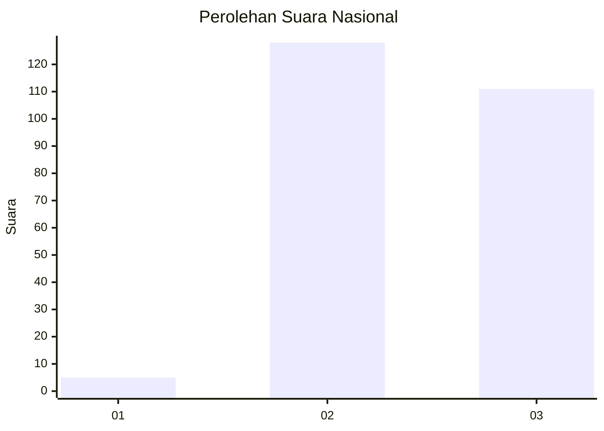
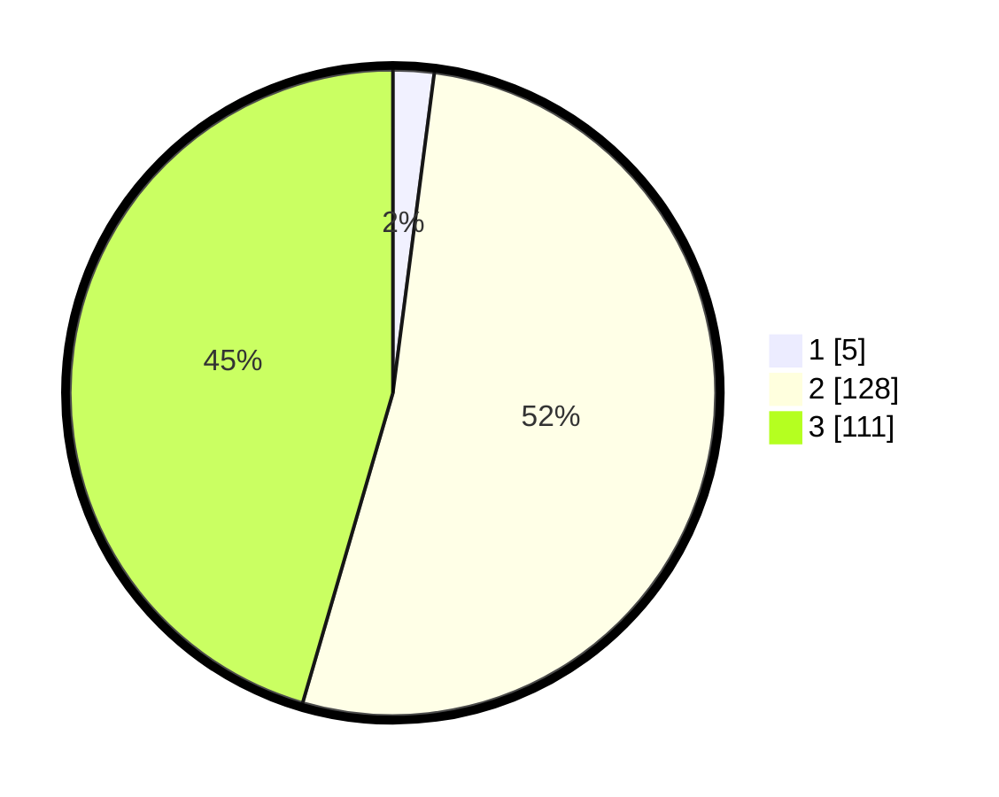

# Hasil

## Grafik

## Tabel

| No. | Nama Paslon    | Suara | Suara (raw) | Persentase |
|:--- |:-------------- | -----:| -----------:| ----------:|
| 1   | ANIES MUHAIMIN | 5     | [5][p-1]    | 2,05       |
| 2   | PRABOWO GIBRAN | 128   | [128][p-2]  | 52,46      |
| 3   | GANJAR MAHFUD  | 111   | [111][p-3]  | 45,49      |

[p-1]: https://github.com/gigit-pemilu/pemilu-2024/blob/main/pilpres/hitung-suara/sub/51-bali/sub/03-badung/sub/02-mengwi/sub/1016-lukluk/sub/003-tps/sub/paslon-1.txt
[p-2]: https://github.com/gigit-pemilu/pemilu-2024/blob/main/pilpres/hitung-suara/sub/51-bali/sub/03-badung/sub/02-mengwi/sub/1016-lukluk/sub/003-tps/sub/paslon-2.txt
[p-3]: https://github.com/gigit-pemilu/pemilu-2024/blob/main/pilpres/hitung-suara/sub/51-bali/sub/03-badung/sub/02-mengwi/sub/1016-lukluk/sub/003-tps/sub/paslon-3.txt

## Foto C Plano

https://sirekap-obj-formc.kpu.go.id/5058/pemilu/ppwp/51/03/02/10/16/5103021016003-20240214-194328--4410d3b6-7fc4-402a-ac7e-4ae3e98f36f2.jpg

https://sirekap-obj-formc.kpu.go.id/5058/pemilu/ppwp/51/03/02/10/16/5103021016003-20240214-194356--1af3af35-f6db-4c7f-a258-c95cbbfe6e0a.jpg

https://sirekap-obj-formc.kpu.go.id/5058/pemilu/ppwp/51/03/02/10/16/5103021016003-20240214-194415--98458332-c8d3-4e87-8f8b-e2e62825ca07.jpg

## Metadata

| Key        | Value               |
| ---------- | ------------------- |
| Time Stamp | 2024-02-21 21:00:04 |

## DATA PEMILIH TETAP

Jumlah pemilih dalam DPT: **268**.
 * L: **120**.
 * P: **148**.

## DATA PENGGUNA HAK PILIH

Jumlah pengguna hak pilih dalam DPT: **244**.
 * L: **113**.
 * P: **131**.

Jumlah pengguna hak pilih dalam DPTb: **2**.
 * L: **1**.
 * P: **1**.

Jumlah pengguna hak pilih dalam DPK: **1**.
 * L: **1**.
 * P: **0**.

Jumlah pengguna hak pilih: **247**.
 * L: **115**.
 * P: **132**.

## JUMLAH SUARA SAH DAN TIDAK SAH

JUMLAH SELURUH SUARA SAH: **244**.

JUMLAH SUARA TIDAK SAH: **3**.

JUMLAH SELURUH SUARA SAH DAN SUARA TIDAK SAH: **247**.

