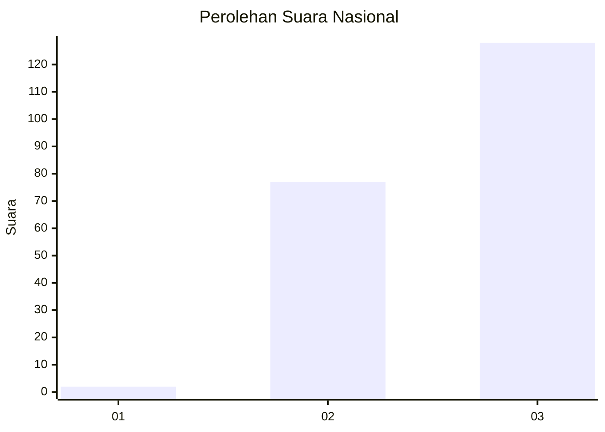
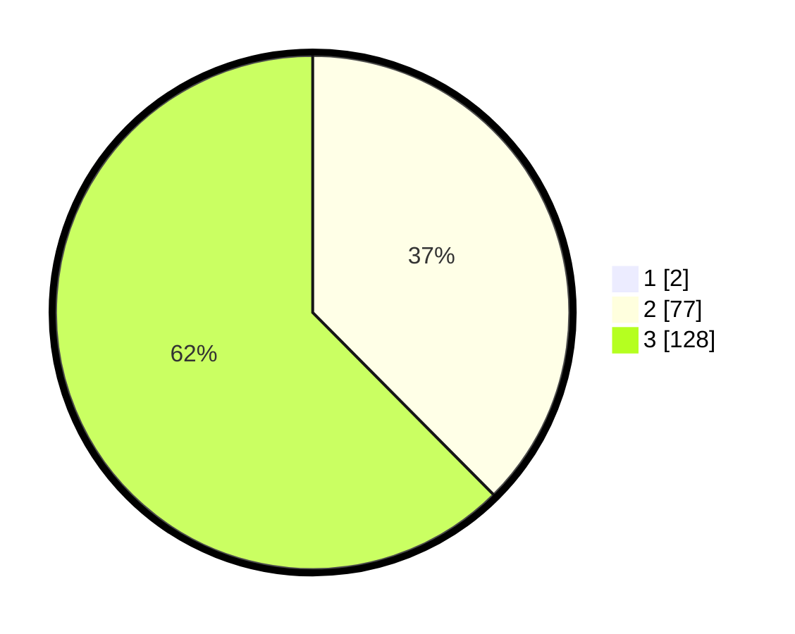

# Hasil

## Grafik

## Tabel

| No. | Nama Paslon    | Suara | Suara (raw) | Persentase |
|:--- |:-------------- | -----:| -----------:| ----------:|
| 1   | ANIES MUHAIMIN | 2     | [2][p-1]    | 0,97       |
| 2   | PRABOWO GIBRAN | 77    | [77][p-2]   | 37,20      |
| 3   | GANJAR MAHFUD  | 128   | [128][p-3]  | 61,84      |

[p-1]: https://github.com/gigit-pemilu/pemilu-2024/blob/main/pilpres/hitung-suara/sub/51-bali/sub/03-badung/sub/02-mengwi/sub/1016-lukluk/sub/004-tps/sub/paslon-1.txt
[p-2]: https://github.com/gigit-pemilu/pemilu-2024/blob/main/pilpres/hitung-suara/sub/51-bali/sub/03-badung/sub/02-mengwi/sub/1016-lukluk/sub/004-tps/sub/paslon-2.txt
[p-3]: https://github.com/gigit-pemilu/pemilu-2024/blob/main/pilpres/hitung-suara/sub/51-bali/sub/03-badung/sub/02-mengwi/sub/1016-lukluk/sub/004-tps/sub/paslon-3.txt

## Foto C Plano

https://sirekap-obj-formc.kpu.go.id/c3b9/pemilu/ppwp/51/03/02/10/16/5103021016004-20240214-190117--f542cbc2-3191-4746-a2a0-02828d5da220.jpg

https://sirekap-obj-formc.kpu.go.id/c3b9/pemilu/ppwp/51/03/02/10/16/5103021016004-20240214-190221--dc3b855a-d4a3-41d2-820c-19c8a18c3539.jpg

https://sirekap-obj-formc.kpu.go.id/c3b9/pemilu/ppwp/51/03/02/10/16/5103021016004-20240214-190311--9c7da90b-a2b8-4e41-bbdb-44525def4d98.jpg

## Metadata

| Key        | Value               |
| ---------- | ------------------- |
| Time Stamp | 2024-02-14 21:46:01 |

## DATA PEMILIH TETAP

Jumlah pemilih dalam DPT: **217**.
 * L: **105**.
 * P: **112**.

## DATA PENGGUNA HAK PILIH

Jumlah pengguna hak pilih dalam DPT: **206**.
 * L: **97**.
 * P: **109**.

Jumlah pengguna hak pilih dalam DPTb: **1**.
 * L: **0**.
 * P: **1**.

Jumlah pengguna hak pilih dalam DPK: **1**.
 * L: **1**.
 * P: **0**.

Jumlah pengguna hak pilih: **208**.
 * L: **98**.
 * P: **110**.

## JUMLAH SUARA SAH DAN TIDAK SAH

JUMLAH SELURUH SUARA SAH: **207**.

JUMLAH SUARA TIDAK SAH: **1**.

JUMLAH SELURUH SUARA SAH DAN SUARA TIDAK SAH: **208**.

