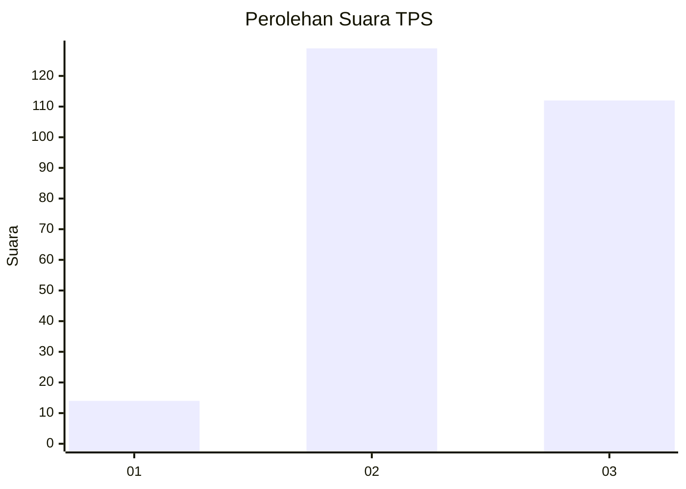
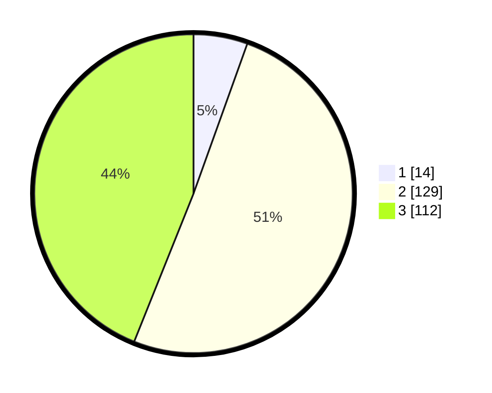

# Hasil

## Grafik

## Tabel

| No. | Nama Paslon    | Suara | Suara (raw) | Persentase |
|:--- |:-------------- | -----:| -----------:| ----------:|
| 1   | ANIES MUHAIMIN | 14    | [14][p-1]   | 5,49       |
| 2   | PRABOWO GIBRAN | 129   | [129][p-2]  | 50,59      |
| 3   | GANJAR MAHFUD  | 112   | [112][p-3]  | 43,92      |

[p-1]: https://github.com/gigit-pemilu/pemilu-2024-51-bali/blob/main/pilpres/hitung-suara/sub/51-bali/sub/03-badung/sub/02-mengwi/sub/1016-lukluk/sub/008-tps/sub/paslon-1.txt
[p-2]: https://github.com/gigit-pemilu/pemilu-2024-51-bali/blob/main/pilpres/hitung-suara/sub/51-bali/sub/03-badung/sub/02-mengwi/sub/1016-lukluk/sub/008-tps/sub/paslon-2.txt
[p-3]: https://github.com/gigit-pemilu/pemilu-2024-51-bali/blob/main/pilpres/hitung-suara/sub/51-bali/sub/03-badung/sub/02-mengwi/sub/1016-lukluk/sub/008-tps/sub/paslon-3.txt

## Foto C Plano

https://sirekap-obj-formc.kpu.go.id/6db1/pemilu/ppwp/51/03/02/10/16/5103021016008-20240214-220157--aaeccb7c-026f-488e-bc71-cc1e25eac0f7.jpg

https://sirekap-obj-formc.kpu.go.id/6db1/pemilu/ppwp/51/03/02/10/16/5103021016008-20240214-220204--45993227-3fd1-4e9f-908e-1c9ec9823bd6.jpg

https://sirekap-obj-formc.kpu.go.id/6db1/pemilu/ppwp/51/03/02/10/16/5103021016008-20240215-020854--83563af8-a508-45fc-9c9f-d6ea0f905dd9.jpg

## Metadata

| Key        | Value               |
| ---------- | ------------------- |
| Time Stamp | 2024-02-21 21:00:04 |

