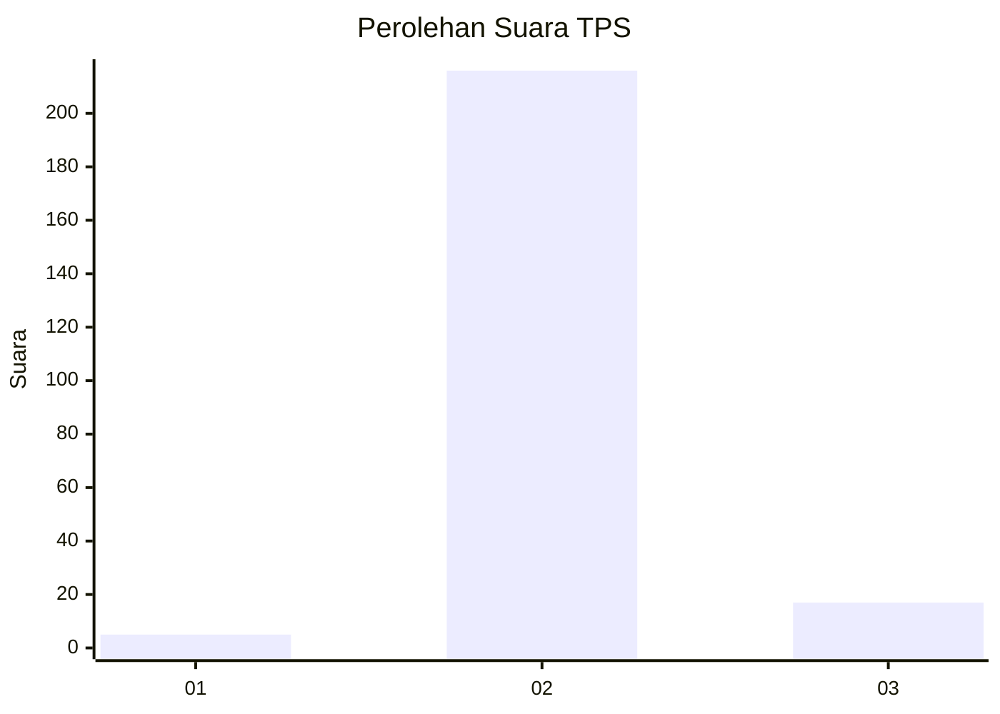
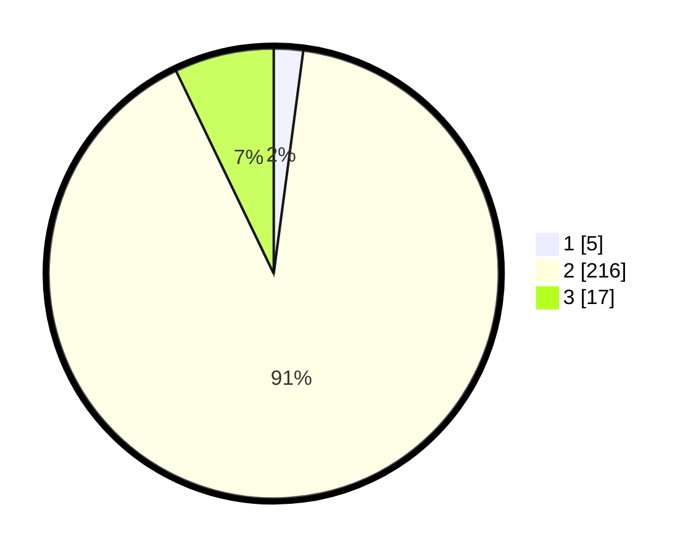

# Hasil

## Grafik

## Tabel

| No. | Nama Paslon    | Suara | Suara (raw) | Persentase |
|:--- |:-------------- | -----:| -----------:| ----------:|
| 1   | ANIES MUHAIMIN | 5     | [5][p-1]    | 2,10       |
| 2   | PRABOWO GIBRAN | 216   | [216][p-2]  | 90,76      |
| 3   | GANJAR MAHFUD  | 17    | [17][p-3]   | 7,14       |

[p-1]: https://github.com/gigit-pemilu/pemilu-2024-51-bali/blob/main/pilpres/hitung-suara/sub/51-bali/sub/03-badung/sub/02-mengwi/sub/1016-lukluk/sub/009-tps/sub/paslon-1.txt
[p-2]: https://github.com/gigit-pemilu/pemilu-2024-51-bali/blob/main/pilpres/hitung-suara/sub/51-bali/sub/03-badung/sub/02-mengwi/sub/1016-lukluk/sub/009-tps/sub/paslon-2.txt
[p-3]: https://github.com/gigit-pemilu/pemilu-2024-51-bali/blob/main/pilpres/hitung-suara/sub/51-bali/sub/03-badung/sub/02-mengwi/sub/1016-lukluk/sub/009-tps/sub/paslon-3.txt

## Foto C Plano

https://sirekap-obj-formc.kpu.go.id/12f9/pemilu/ppwp/51/03/02/10/16/5103021016009-20240214-155737--300c3251-ca20-4361-a9d9-35aaab4ea9c0.jpg

https://sirekap-obj-formc.kpu.go.id/12f9/pemilu/ppwp/51/03/02/10/16/5103021016009-20240214-190150--1649b3f9-282a-456e-a6a9-9b10cf2e4966.jpg

https://sirekap-obj-formc.kpu.go.id/12f9/pemilu/ppwp/51/03/02/10/16/5103021016009-20240214-200348--c4a9f770-9919-4d8f-8dda-d48ce24f9d40.jpg

## Metadata

| Key        | Value               |
| ---------- | ------------------- |
| Time Stamp | 2024-02-21 18:00:00 |

## DATA PEMILIH TETAP

Jumlah pemilih dalam DPT: **242**.
 * L: **115**.
 * P: **127**.

## DATA PENGGUNA HAK PILIH

Jumlah pengguna hak pilih dalam DPT: **232**.
 * L: **110**.
 * P: **122**.

Jumlah pengguna hak pilih dalam DPTb: **2**.
 * L: **1**.
 * P: **1**.

Jumlah pengguna hak pilih dalam DPK: **7**.
 * L: **2**.
 * P: **5**.

Jumlah pengguna hak pilih: **241**.
 * L: **113**.
 * P: **128**.

## JUMLAH SUARA SAH DAN TIDAK SAH

JUMLAH SELURUH SUARA SAH: **238**.

JUMLAH SUARA TIDAK SAH: **3**.

JUMLAH SELURUH SUARA SAH DAN SUARA TIDAK SAH: **241**.

