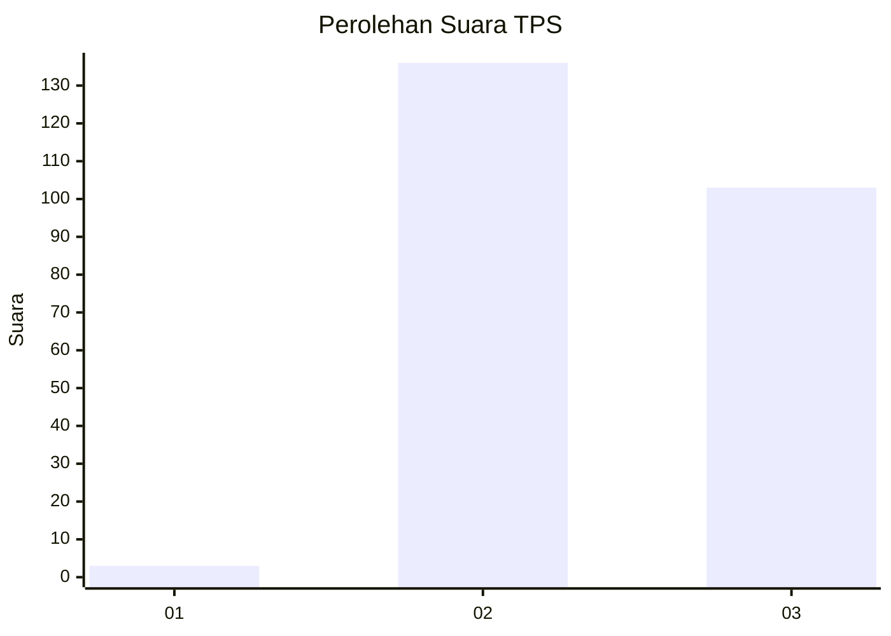
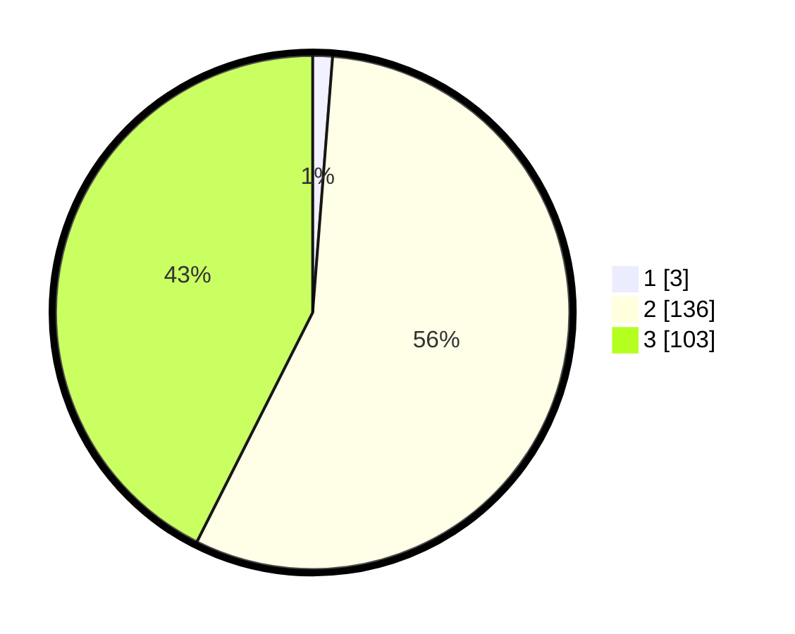

# Hasil

## Grafik

## Tabel

| No. | Nama Paslon    | Suara | Suara (raw) | Persentase |
|:--- |:-------------- | -----:| -----------:| ----------:|
| 1   | ANIES MUHAIMIN | 3     | [3][p-1]    | 1,24       |
| 2   | PRABOWO GIBRAN | 136   | [136][p-2]  | 56,20      |
| 3   | GANJAR MAHFUD  | 103   | [103][p-3]  | 42,56      |

[p-1]: https://github.com/gigit-pemilu/pemilu-2024-51-bali/blob/main/pilpres/hitung-suara/sub/51-bali/sub/03-badung/sub/02-mengwi/sub/1016-lukluk/sub/013-tps/sub/paslon-1.txt
[p-2]: https://github.com/gigit-pemilu/pemilu-2024-51-bali/blob/main/pilpres/hitung-suara/sub/51-bali/sub/03-badung/sub/02-mengwi/sub/1016-lukluk/sub/013-tps/sub/paslon-2.txt
[p-3]: https://github.com/gigit-pemilu/pemilu-2024-51-bali/blob/main/pilpres/hitung-suara/sub/51-bali/sub/03-badung/sub/02-mengwi/sub/1016-lukluk/sub/013-tps/sub/paslon-3.txt

## Foto C Plano

https://sirekap-obj-formc.kpu.go.id/2c0c/pemilu/ppwp/51/03/02/10/16/5103021016013-20240219-112032--267ce9bc-d79b-4de6-bd18-8e269c07071f.jpg

https://sirekap-obj-formc.kpu.go.id/2c0c/pemilu/ppwp/51/03/02/10/16/5103021016013-20240219-105419--3d6c75ab-1cf5-41db-b23a-41e0364722b8.jpg

https://sirekap-obj-formc.kpu.go.id/2c0c/pemilu/ppwp/51/03/02/10/16/5103021016013-20240219-111638--04a22149-a8d8-4acf-8bf4-b3b2f875cdce.jpg

## Metadata

| Key        | Value               |
| ---------- | ------------------- |
| Time Stamp | 2024-02-21 18:00:00 |

## DATA PEMILIH TETAP

Jumlah pemilih dalam DPT: **273**.
 * L: **129**.
 * P: **144**.

## DATA PENGGUNA HAK PILIH

Jumlah pengguna hak pilih dalam DPT: **253**.
 * L: **120**.
 * P: **133**.

Jumlah pengguna hak pilih dalam DPTb: **0**.
 * L: **0**.
 * P: **0**.

Jumlah pengguna hak pilih dalam DPK: **1**.
 * L: **1**.
 * P: **0**.

Jumlah pengguna hak pilih: **254**.
 * L: **121**.
 * P: **133**.

## JUMLAH SUARA SAH DAN TIDAK SAH

JUMLAH SELURUH SUARA SAH: **242**.

JUMLAH SUARA TIDAK SAH: **12**.

JUMLAH SELURUH SUARA SAH DAN SUARA TIDAK SAH: **254**.

