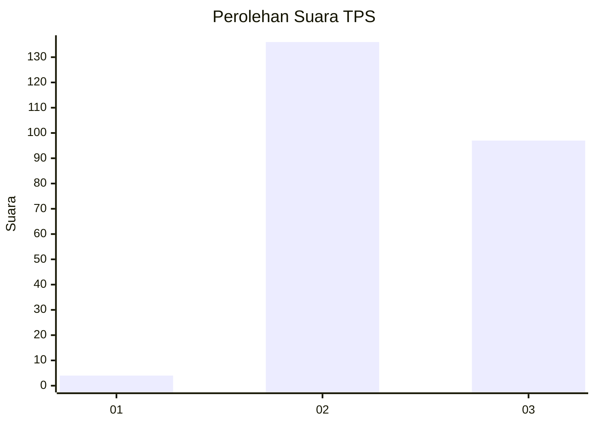
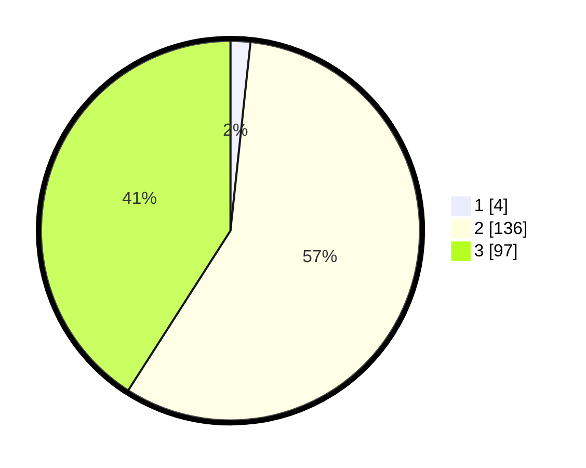

# Hasil

## Grafik

## Tabel

| No. | Nama Paslon    | Suara | Suara (raw) | Persentase |
|:--- |:-------------- | -----:| -----------:| ----------:|
| 1   | ANIES MUHAIMIN | 4     | [4][p-1]    | 1,69       |
| 2   | PRABOWO GIBRAN | 136   | [136][p-2]  | 57,38      |
| 3   | GANJAR MAHFUD  | 97    | [97][p-3]   | 40,93      |

[p-1]: https://github.com/gigit-pemilu/pemilu-2024-51-bali/blob/main/pilpres/hitung-suara/sub/51-bali/sub/03-badung/sub/02-mengwi/sub/1016-lukluk/sub/014-tps/sub/paslon-1.txt
[p-2]: https://github.com/gigit-pemilu/pemilu-2024-51-bali/blob/main/pilpres/hitung-suara/sub/51-bali/sub/03-badung/sub/02-mengwi/sub/1016-lukluk/sub/014-tps/sub/paslon-2.txt
[p-3]: https://github.com/gigit-pemilu/pemilu-2024-51-bali/blob/main/pilpres/hitung-suara/sub/51-bali/sub/03-badung/sub/02-mengwi/sub/1016-lukluk/sub/014-tps/sub/paslon-3.txt

## Foto C Plano

https://sirekap-obj-formc.kpu.go.id/af79/pemilu/ppwp/51/03/02/10/16/5103021016014-20240218-084537--b494fed8-e6d1-47c7-ae79-ec4ce21f753b.jpg

https://sirekap-obj-formc.kpu.go.id/af79/pemilu/ppwp/51/03/02/10/16/5103021016014-20240215-000849--caad677e-efcc-4d8c-af91-d216add946ad.jpg

https://sirekap-obj-formc.kpu.go.id/af79/pemilu/ppwp/51/03/02/10/16/5103021016014-20240215-000909--352ee2a1-b0bc-4081-bc89-8afb670739d8.jpg

## Metadata

| Key        | Value               |
| ---------- | ------------------- |
| Time Stamp | 2024-02-19 06:16:00 |

## DATA PEMILIH TETAP

Jumlah pemilih dalam DPT: **279**.
 * L: **141**.
 * P: **138**.

## DATA PENGGUNA HAK PILIH

Jumlah pengguna hak pilih dalam DPT: **249**.
 * L: **121**.
 * P: **128**.

Jumlah pengguna hak pilih dalam DPTb: **0**.
 * L: **0**.
 * P: **0**.

Jumlah pengguna hak pilih dalam DPK: **0**.
 * L: **0**.
 * P: **0**.

Jumlah pengguna hak pilih: **249**.
 * L: **121**.
 * P: **128**.

## JUMLAH SUARA SAH DAN TIDAK SAH

JUMLAH SELURUH SUARA SAH: **237**.

JUMLAH SUARA TIDAK SAH: **12**.

JUMLAH SELURUH SUARA SAH DAN SUARA TIDAK SAH: **249**.

