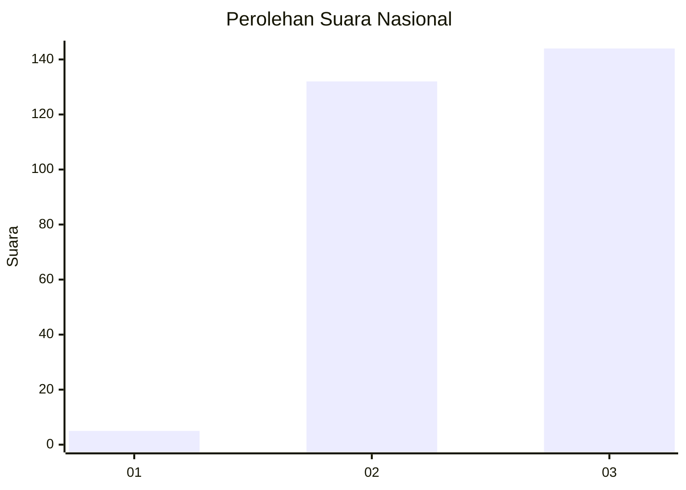
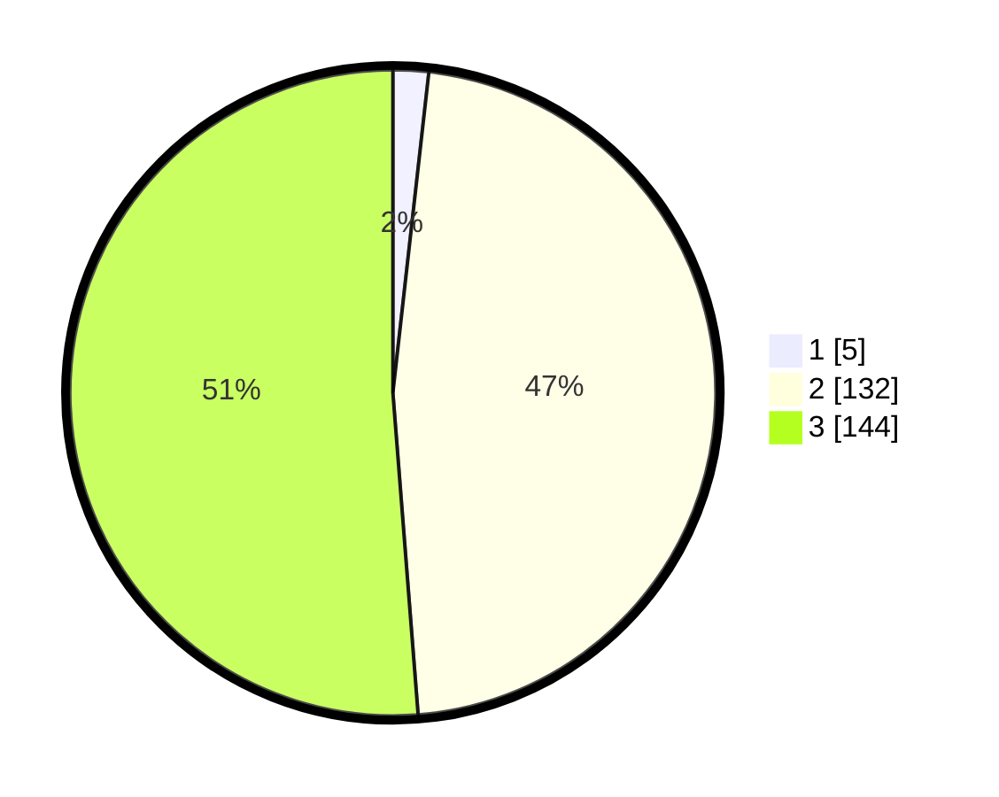

# Hasil

## Grafik

## Tabel

| No. | Nama Paslon    | Suara | Suara (raw) | Persentase |
|:--- |:-------------- | -----:| -----------:| ----------:|
| 1   | ANIES MUHAIMIN | 5     | [5][p-1]    | 1,78       |
| 2   | PRABOWO GIBRAN | 132   | [132][p-2]  | 46,98      |
| 3   | GANJAR MAHFUD  | 144   | [144][p-3]  | 51,25      |

[p-1]: https://github.com/gigit-pemilu/pemilu-2024/blob/main/pilpres/hitung-suara/sub/51-bali/sub/03-badung/sub/02-mengwi/sub/1016-lukluk/sub/018-tps/sub/paslon-1.txt
[p-2]: https://github.com/gigit-pemilu/pemilu-2024/blob/main/pilpres/hitung-suara/sub/51-bali/sub/03-badung/sub/02-mengwi/sub/1016-lukluk/sub/018-tps/sub/paslon-2.txt
[p-3]: https://github.com/gigit-pemilu/pemilu-2024/blob/main/pilpres/hitung-suara/sub/51-bali/sub/03-badung/sub/02-mengwi/sub/1016-lukluk/sub/018-tps/sub/paslon-3.txt

## Foto C Plano

https://sirekap-obj-formc.kpu.go.id/aca6/pemilu/ppwp/51/03/02/10/16/5103021016018-20240216-152353--eb49f31e-c495-49fb-8613-331d0e05fe58.jpg

https://sirekap-obj-formc.kpu.go.id/aca6/pemilu/ppwp/51/03/02/10/16/5103021016018-20240216-152354--913a876e-ad31-483e-bc61-21413ea894b9.jpg

https://sirekap-obj-formc.kpu.go.id/aca6/pemilu/ppwp/51/03/02/10/16/5103021016018-20240216-152354--ccddaecc-474d-490f-b1d6-2be9e7a00eb5.jpg

## Metadata

| Key        | Value               |
| ---------- | ------------------- |
| Time Stamp | 2024-02-21 10:00:00 |

## DATA PEMILIH TETAP

Jumlah pemilih dalam DPT: **293**.
 * L: **139**.
 * P: **154**.

## DATA PENGGUNA HAK PILIH

Jumlah pengguna hak pilih dalam DPT: **282**.
 * L: **134**.
 * P: **148**.

Jumlah pengguna hak pilih dalam DPTb: **1**.
 * L: **1**.
 * P: **0**.

Jumlah pengguna hak pilih dalam DPK: **0**.
 * L: **0**.
 * P: **0**.

Jumlah pengguna hak pilih: **283**.
 * L: **135**.
 * P: **148**.

## JUMLAH SUARA SAH DAN TIDAK SAH

JUMLAH SELURUH SUARA SAH: **231**.

JUMLAH SUARA TIDAK SAH: **2**.

JUMLAH SELURUH SUARA SAH DAN SUARA TIDAK SAH: **283**.

