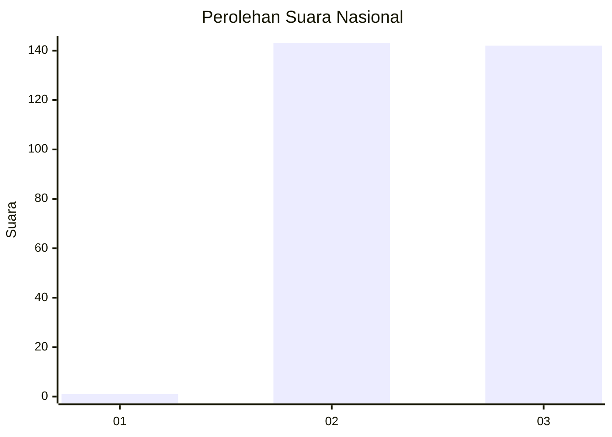
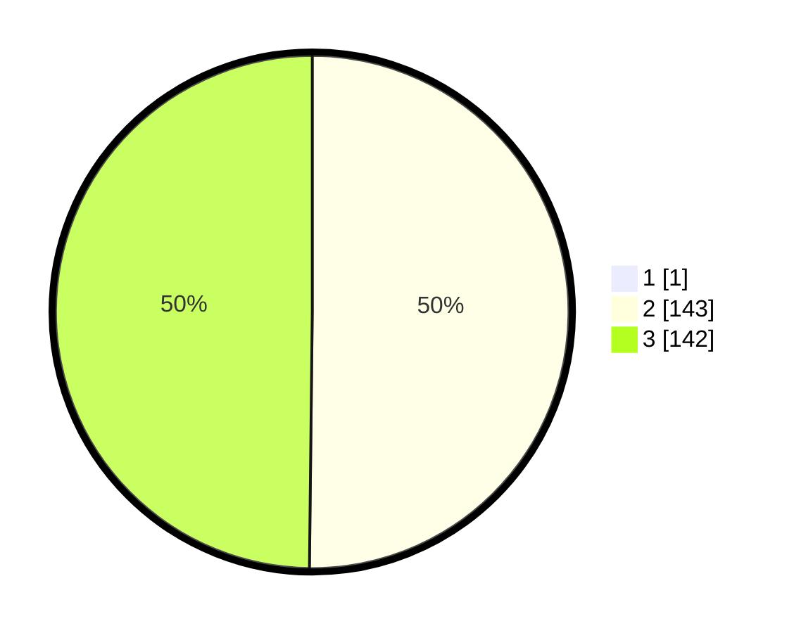

# Hasil

## Grafik

## Tabel

| No. | Nama Paslon    | Suara | Suara (raw) | Persentase |
|:--- |:-------------- | -----:| -----------:| ----------:|
| 1   | ANIES MUHAIMIN | 1     | [1][p-1]    | 0,35       |
| 2   | PRABOWO GIBRAN | 143   | [143][p-2]  | 50,00      |
| 3   | GANJAR MAHFUD  | 142   | [142][p-3]  | 49,65      |

[p-1]: https://github.com/gigit-pemilu/pemilu-2024/blob/main/pilpres/hitung-suara/sub/51-bali/sub/03-badung/sub/02-mengwi/sub/1016-lukluk/sub/019-tps/sub/paslon-1.txt
[p-2]: https://github.com/gigit-pemilu/pemilu-2024/blob/main/pilpres/hitung-suara/sub/51-bali/sub/03-badung/sub/02-mengwi/sub/1016-lukluk/sub/019-tps/sub/paslon-2.txt
[p-3]: https://github.com/gigit-pemilu/pemilu-2024/blob/main/pilpres/hitung-suara/sub/51-bali/sub/03-badung/sub/02-mengwi/sub/1016-lukluk/sub/019-tps/sub/paslon-3.txt

## Foto C Plano

https://sirekap-obj-formc.kpu.go.id/89b9/pemilu/ppwp/51/03/02/10/16/5103021016019-20240214-141722--2ac67b7b-7f7e-4e12-9921-e194c8271550.jpg

https://sirekap-obj-formc.kpu.go.id/89b9/pemilu/ppwp/51/03/02/10/16/5103021016019-20240214-201601--d1d25040-b591-4d2b-90a9-4b1647c47cf5.jpg

https://sirekap-obj-formc.kpu.go.id/89b9/pemilu/ppwp/51/03/02/10/16/5103021016019-20240214-201609--435432e0-59fd-498a-a96b-5002253f75ad.jpg

## Metadata

| Key        | Value               |
| ---------- | ------------------- |
| Time Stamp | 2024-02-15 00:41:44 |

## DATA PEMILIH TETAP

Jumlah pemilih dalam DPT: **300**.
 * L: **148**.
 * P: **152**.

## DATA PENGGUNA HAK PILIH

Jumlah pengguna hak pilih dalam DPT: **291**.
 * L: **143**.
 * P: **148**.

Jumlah pengguna hak pilih dalam DPTb: **0**.
 * L: **0**.
 * P: **0**.

Jumlah pengguna hak pilih dalam DPK: **3**.
 * L: **2**.
 * P: **1**.

Jumlah pengguna hak pilih: **294**.
 * L: **145**.
 * P: **149**.

## JUMLAH SUARA SAH DAN TIDAK SAH

JUMLAH SELURUH SUARA SAH: **286**.

JUMLAH SUARA TIDAK SAH: **8**.

JUMLAH SELURUH SUARA SAH DAN SUARA TIDAK SAH: **294**.

